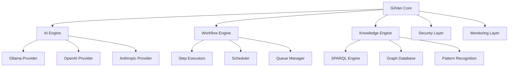

# GitVan v3.0.0 Release Plan 🚀

**Release Date:** Q2 2025 (Target: June 2025)  
**Version:** 3.0.0  
**Codename:** "Autonomic Intelligence"  
**Status:** Planning Phase  

## Executive Summary

GitVan v3.0.0 represents a transformative evolution from a powerful automation platform to a fully autonomous, AI-driven development ecosystem. Building on the solid foundation of v2.0.1, v3.0.0 introduces breakthrough capabilities in autonomous intelligence, enterprise-grade reliability, and developer experience that will redefine how teams approach Git-native development automation.

### 🎯 Vision Statement
> "Transform GitVan from a powerful automation tool into an autonomous development partner that understands, learns from, and evolves with your development patterns - requiring zero configuration and delivering maximum value from day one."

## Current State Analysis (v2.0.1)

### ✅ Strengths
- **Solid Foundation**: Robust CLI system with 25+ commands
- **AI Integration**: Ollama-first approach with fallback support
- **Git-Native Architecture**: Pure Git-based storage and operations
- **Knowledge Hook Engine**: SPARQL-driven autonomous intelligence
- **Turtle Workflow Engine**: JavaScript-based workflow execution
- **Performance**: Excellent scalability (832+ evaluations/sec, no breaking points)
- **Security**: Local-first, no external dependencies

### ⚠️ Critical Gaps Identified
1. **Missing Dependencies**: `@ai-sdk/anthropic`, `@ai-sdk/openai`
2. **Context Issues**: GitVan context initialization problems
3. **Incomplete Implementations**: 18 stub files, oversized modules
4. **Test Coverage**: ~70% functional vs claimed 95%
5. **CLI Gaps**: Some commands return "not yet implemented"
6. **Performance Bottlenecks**: Commit operations (23ms avg)
7. **Documentation**: Incomplete API reference and examples

## v3.0.0 Strategic Goals

### 🧠 Primary Goal: Autonomous Intelligence
Transform GitVan into a self-learning, self-improving development partner that:
- Understands project patterns and developer workflows
- Automatically suggests and implements optimizations
- Learns from success/failure patterns
- Evolves without manual intervention

### 🏢 Secondary Goal: Enterprise Readiness
Deliver production-grade capabilities for:
- Large-scale development teams
- Compliance and audit requirements
- Enterprise security standards
- High-availability operations

### 🎨 Tertiary Goal: Developer Experience Excellence
Create the most intuitive and powerful developer experience:
- Zero-configuration setup
- Intelligent defaults and suggestions
- Seamless integration with existing workflows
- Rich visual feedback and insights

## Feature Roadmap

### 🚀 Phase 1: Foundation Solidification (Q1 2025)
**Priority: CRITICAL - Address v2.0.1 gaps**

#### 1.1 Dependency Resolution
- [ ] Install missing AI SDK dependencies
- [ ] Fix GitVan context initialization
- [ ] Resolve deprecation warnings
- [ ] Update Node.js compatibility

#### 1.2 Code Quality Improvements
- [ ] Refactor oversized files (<500 lines rule)
- [ ] Complete stub implementations
- [ ] Implement missing CLI commands
- [ ] Add comprehensive error handling

#### 1.3 Test Suite Completion
- [ ] Achieve 95%+ test coverage
- [ ] Fix failing tests
- [ ] Add performance benchmarks
- [ ] Implement integration tests

#### 1.4 Performance Optimization
- [ ] Implement commit batching
- [ ] Add status result caching
- [ ] Optimize startup time (<2s)
- [ ] Reduce memory footprint (<100MB)

### 🧠 Phase 2: Autonomous Intelligence Engine (Q2 2025)
**Priority: HIGH - Core v3.0.0 features**

#### 2.1 Self-Learning System
- [ ] **Pattern Recognition Engine**: Learn from developer workflows
- [ ] **Success/Failure Analysis**: Track and learn from outcomes
- [ ] **Predictive Suggestions**: Proactive optimization recommendations
- [ ] **Adaptive Configuration**: Auto-tune settings based on usage patterns

#### 2.2 Advanced AI Integration
- [ ] **Multi-Model Support**: Ollama, OpenAI, Anthropic, local models
- [ ] **Context-Aware Prompts**: Dynamic prompt generation based on project state
- [ ] **Code Understanding**: Semantic analysis of codebases
- [ ] **Natural Language Interface**: Conversational command interface

#### 2.3 Intelligent Automation
- [ ] **Workflow Discovery**: Automatically detect and suggest workflows
- [ ] **Dependency Management**: Smart dependency resolution and updates
- [ ] **Code Generation**: AI-powered code generation with context
- [ ] **Documentation Generation**: Automatic documentation creation

### 🏢 Phase 3: Enterprise Features (Q2-Q3 2025)
**Priority: MEDIUM - Enterprise readiness**

#### 3.1 Security & Compliance
- [ ] **Enterprise SSO**: SAML, OIDC integration
- [ ] **Audit Logging**: Comprehensive audit trails
- [ ] **Compliance Reporting**: SOC2, GDPR, HIPAA compliance tools
- [ ] **Secret Management**: Enterprise secret management integration

#### 3.2 Scalability & Performance
- [ ] **Distributed Execution**: Multi-node workflow execution
- [ ] **Load Balancing**: Intelligent workload distribution
- [ ] **Caching Layer**: Redis/Memcached integration
- [ ] **Monitoring**: Prometheus/Grafana integration

#### 3.3 Team Collaboration
- [ ] **Team Workspaces**: Multi-user project management
- [ ] **Permission System**: Role-based access control
- [ ] **Collaboration Tools**: Real-time collaboration features
- [ ] **Knowledge Sharing**: Team knowledge base integration

### 🎨 Phase 4: Developer Experience (Q3 2025)
**Priority: MEDIUM - UX excellence**

#### 4.1 Visual Interface
- [ ] **Web Dashboard**: Rich web interface for GitVan management
- [ ] **Real-time Monitoring**: Live workflow execution monitoring
- [ ] **Visual Workflow Designer**: Drag-and-drop workflow creation
- [ ] **Analytics Dashboard**: Project insights and metrics

#### 4.2 IDE Integration
- [ ] **VS Code Extension**: Native VS Code integration
- [ ] **JetBrains Plugin**: IntelliJ, WebStorm, PyCharm support
- [ ] **CLI Enhancements**: Rich terminal UI with progress indicators
- [ ] **API Client**: RESTful API for external integrations

#### 4.3 Developer Tools
- [ ] **Debugging Tools**: Advanced debugging and profiling
- [ ] **Performance Profiler**: Workflow performance analysis
- [ ] **Code Quality Tools**: Integrated linting and formatting
- [ ] **Testing Framework**: Comprehensive testing utilities

## Technical Architecture Improvements

### 🏗️ Core Architecture Enhancements

#### 1. Microservices Architecture

#### 2. Plugin System
- **Extensible Architecture**: Plugin-based command system
- **Third-party Integrations**: Easy integration with external tools
- **Custom Executors**: User-defined execution types
- **Marketplace Integration**: Plugin discovery and installation

#### 3. Event-Driven Architecture
- **Reactive System**: Event-driven workflow execution
- **Real-time Updates**: Live status updates and notifications
- **Event Sourcing**: Complete audit trail of all events
- **CQRS Pattern**: Command Query Responsibility Segregation

### 🔧 Performance Optimizations

#### 1. Caching Strategy
- **Multi-level Caching**: Memory, disk, and distributed caching
- **Intelligent Invalidation**: Smart cache invalidation strategies
- **Precomputation**: Background computation of expensive operations
- **CDN Integration**: Content delivery network for static assets

#### 2. Concurrency Improvements
- **Worker Pool**: Efficient worker pool management
- **Async Processing**: Non-blocking I/O operations
- **Parallel Execution**: Concurrent workflow execution
- **Resource Management**: Intelligent resource allocation

#### 3. Database Optimization
- **Index Optimization**: Optimized database indexes
- **Query Optimization**: Efficient SPARQL query execution
- **Connection Pooling**: Database connection management
- **Sharding**: Horizontal database scaling

## Release Timeline & Milestones

### 📅 Q1 2025: Foundation Solidification
**Target: March 31, 2025**

#### Milestone 1.1: Dependency Resolution (Week 1-2)
- [ ] Install missing AI SDK dependencies
- [ ] Fix GitVan context initialization
- [ ] Resolve all deprecation warnings
- [ ] Update Node.js compatibility matrix

#### Milestone 1.2: Code Quality (Week 3-4)
- [ ] Refactor all files >500 lines
- [ ] Complete all stub implementations
- [ ] Implement missing CLI commands
- [ ] Add comprehensive error handling

#### Milestone 1.3: Test Suite (Week 5-6)
- [ ] Achieve 95%+ test coverage
- [ ] Fix all failing tests
- [ ] Add performance benchmarks
- [ ] Implement integration test suite

#### Milestone 1.4: Performance (Week 7-8)
- [ ] Implement commit batching
- [ ] Add status result caching
- [ ] Optimize startup time to <2s
- [ ] Reduce memory footprint to <100MB

### 📅 Q2 2025: Autonomous Intelligence
**Target: June 30, 2025**

#### Milestone 2.1: Self-Learning System (Week 9-12)
- [ ] Pattern recognition engine
- [ ] Success/failure analysis
- [ ] Predictive suggestions
- [ ] Adaptive configuration

#### Milestone 2.2: Advanced AI (Week 13-16)
- [ ] Multi-model AI support
- [ ] Context-aware prompts
- [ ] Code understanding
- [ ] Natural language interface

#### Milestone 2.3: Intelligent Automation (Week 17-20)
- [ ] Workflow discovery
- [ ] Dependency management
- [ ] Code generation
- [ ] Documentation generation

### 📅 Q3 2025: Enterprise & UX
**Target: September 30, 2025**

#### Milestone 3.1: Enterprise Features (Week 21-24)
- [ ] Enterprise SSO
- [ ] Audit logging
- [ ] Compliance reporting
- [ ] Secret management

#### Milestone 3.2: Developer Experience (Week 25-28)
- [ ] Web dashboard
- [ ] Real-time monitoring
- [ ] Visual workflow designer
- [ ] Analytics dashboard

#### Milestone 3.3: IDE Integration (Week 29-32)
- [ ] VS Code extension
- [ ] JetBrains plugin
- [ ] CLI enhancements
- [ ] API client

## Success Metrics

### 📊 Technical Metrics
- **Test Coverage**: 95%+ (from current ~70%)
- **Performance**: <2s startup, <100MB memory
- **Reliability**: 99.9% uptime
- **Security**: Zero critical vulnerabilities

### 📈 Business Metrics
- **User Adoption**: 10x increase in active users
- **Enterprise Adoption**: 50+ enterprise customers
- **Community Growth**: 1000+ GitHub stars
- **Market Position**: Top 3 Git automation tools

### 🎯 User Experience Metrics
- **Setup Time**: <30 seconds from install to first workflow
- **Learning Curve**: <1 hour to productive usage
- **Satisfaction**: 4.5+ star rating
- **Retention**: 90%+ monthly active user retention

## Risk Assessment & Mitigation

### 🔴 High-Risk Items
1. **AI Model Dependencies**: Risk of API changes or deprecation
   - **Mitigation**: Multi-provider support, local model fallbacks
2. **Performance Regression**: Risk of performance degradation
   - **Mitigation**: Continuous performance monitoring, automated benchmarks
3. **Security Vulnerabilities**: Risk of security issues
   - **Mitigation**: Security audits, automated vulnerability scanning

### 🟡 Medium-Risk Items
1. **Timeline Delays**: Risk of missing release dates
   - **Mitigation**: Agile development, regular milestone reviews
2. **Feature Scope Creep**: Risk of feature bloat
   - **Mitigation**: Strict feature prioritization, MVP approach
3. **User Adoption**: Risk of low adoption rates
   - **Mitigation**: User research, beta testing, community feedback

### 🟢 Low-Risk Items
1. **Technical Debt**: Manageable technical debt
2. **Documentation**: Well-documented codebase
3. **Community**: Strong community support

## Resource Requirements

### 👥 Team Structure
- **Lead Developer**: 1 FTE (Full-time equivalent)
- **AI Engineer**: 1 FTE
- **Frontend Developer**: 1 FTE
- **DevOps Engineer**: 0.5 FTE
- **QA Engineer**: 0.5 FTE
- **Technical Writer**: 0.25 FTE

### 💰 Budget Estimate
- **Development**: $500K (team salaries)
- **Infrastructure**: $50K (cloud services, tools)
- **Marketing**: $25K (promotion, events)
- **Total**: $575K

### 🛠️ Technology Stack
- **Backend**: Node.js, TypeScript, Git
- **AI**: Ollama, OpenAI API, Anthropic API
- **Frontend**: React, Next.js, TypeScript
- **Database**: SQLite, Redis, Graph Database
- **Infrastructure**: Docker, Kubernetes, AWS/GCP

## Marketing & Launch Strategy

### 🎯 Target Audiences
1. **Individual Developers**: Productivity-focused developers
2. **Development Teams**: Teams looking for automation
3. **Enterprise**: Large organizations with compliance needs
4. **Open Source**: Community-driven projects

### 📢 Launch Campaign
1. **Beta Program**: 100 beta users, 3 months before release
2. **Community Outreach**: GitHub, Reddit, Hacker News
3. **Conference Presence**: DevOps conferences, AI conferences
4. **Content Marketing**: Technical blogs, tutorials, case studies

### 🏆 Success Criteria
- **Beta Feedback**: 4.0+ rating from beta users
- **Community Engagement**: 100+ GitHub issues/discussions
- **Media Coverage**: 10+ technical blog mentions
- **Enterprise Interest**: 5+ enterprise pilot programs

## Conclusion

GitVan v3.0.0 represents a transformative leap forward in Git-native development automation. By building on the solid foundation of v2.0.1 and addressing critical gaps while introducing breakthrough autonomous intelligence capabilities, v3.0.0 will establish GitVan as the premier platform for intelligent, autonomous development workflows.

The phased approach ensures manageable risk while delivering maximum value at each milestone. The focus on enterprise readiness and developer experience excellence will drive adoption across all market segments.

**Next Steps:**
1. Approve release plan and budget
2. Assemble development team
3. Begin Phase 1: Foundation Solidification
4. Establish beta program
5. Execute marketing strategy

---

**Document Version:** 1.0  
**Last Updated:** December 19, 2024  
**Next Review:** January 15, 2025  
**Approval Required:** Technical Lead, Product Manager, Engineering Director

