# StepRunner Architecture - Sequence Diagrams

This document provides sequence diagrams breaking down the StepRunner into its component parts, showing the flow and interactions between different step types.

## 0. Graph Composable Architecture Overview

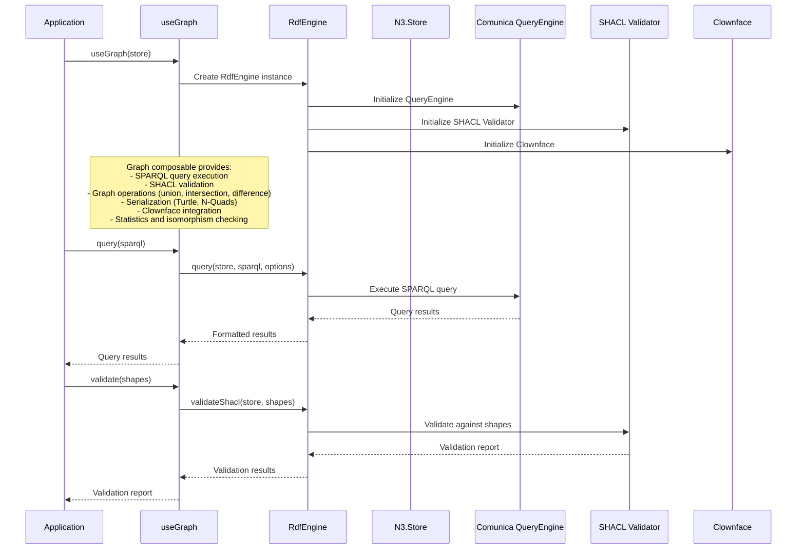

## 1. Main StepRunner Execution Flow

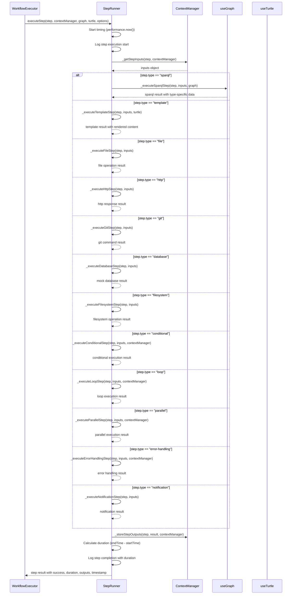

## 2. SPARQL Step Execution Flow

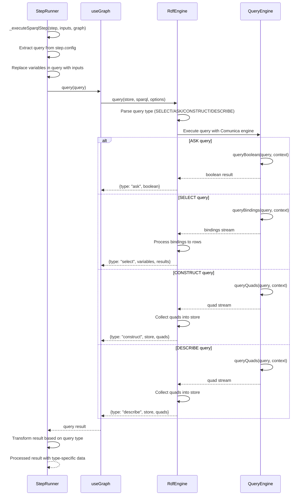

## 2.1. RdfEngine Query Processing Detail

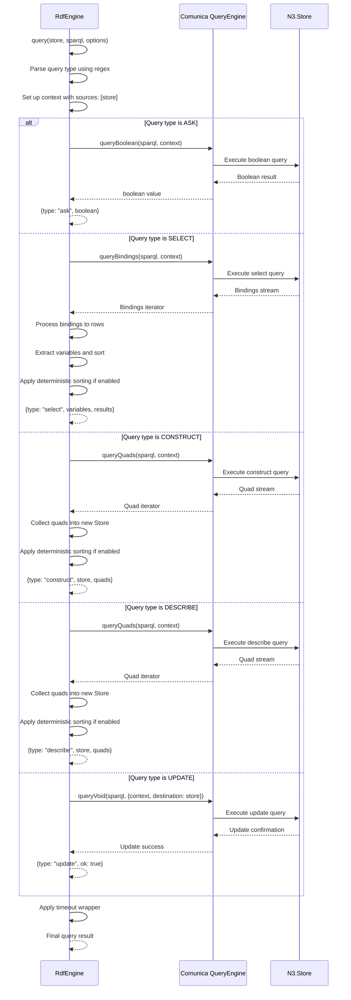

## 3. Template Step Execution Flow

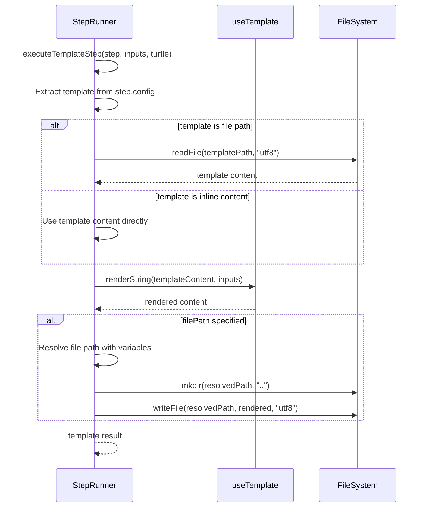

## 4. File Step Execution Flow

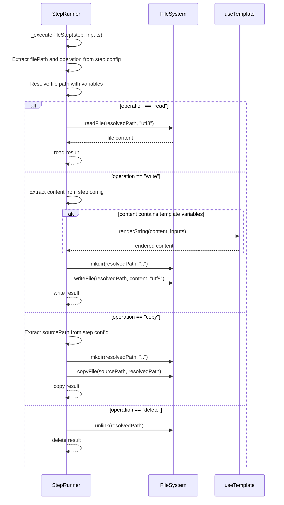

## 5. HTTP Step Execution Flow

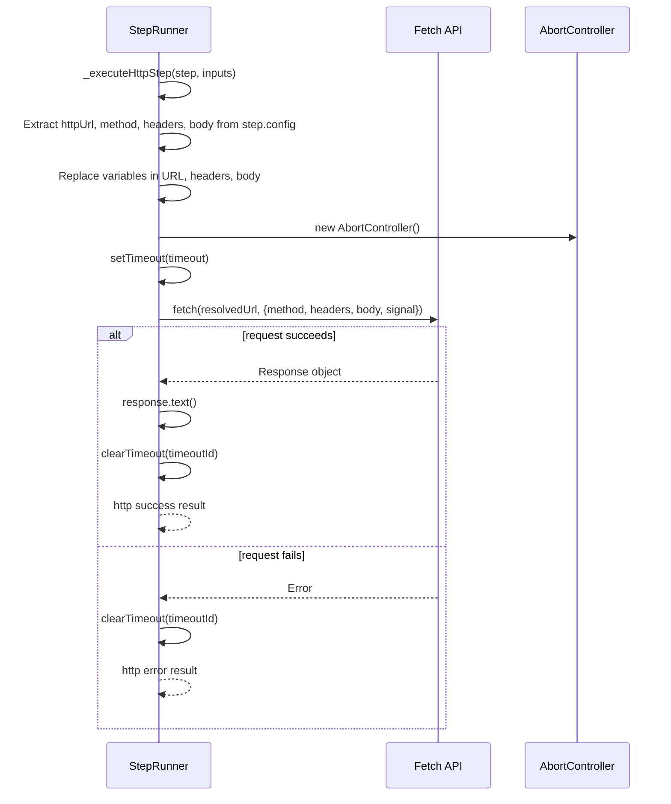

## 6. Git Step Execution Flow

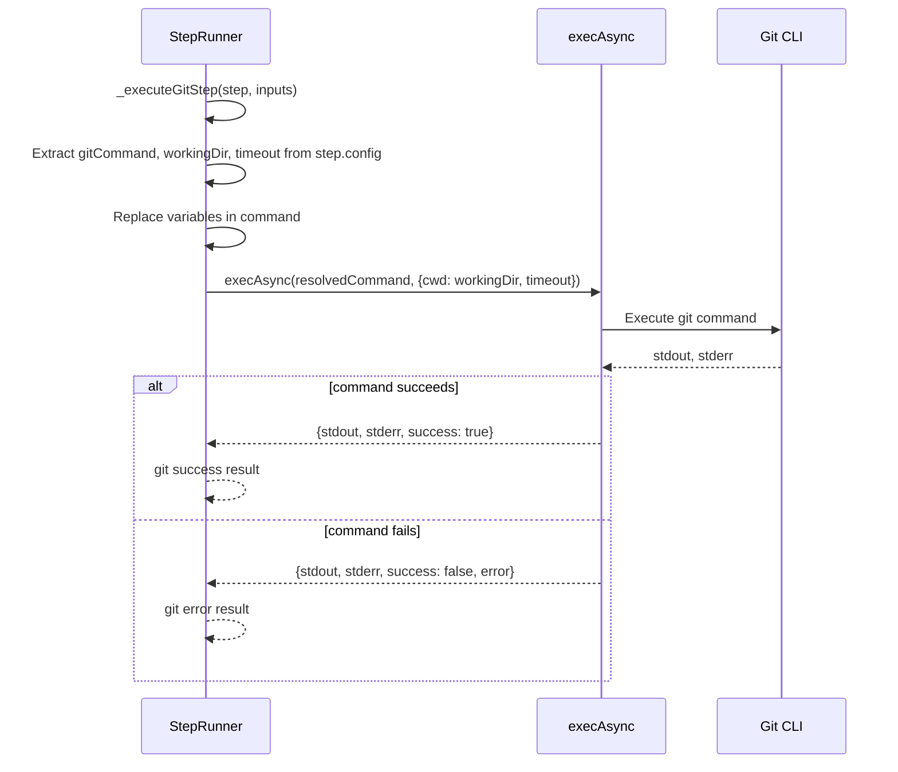

## 7. Database Step Execution Flow

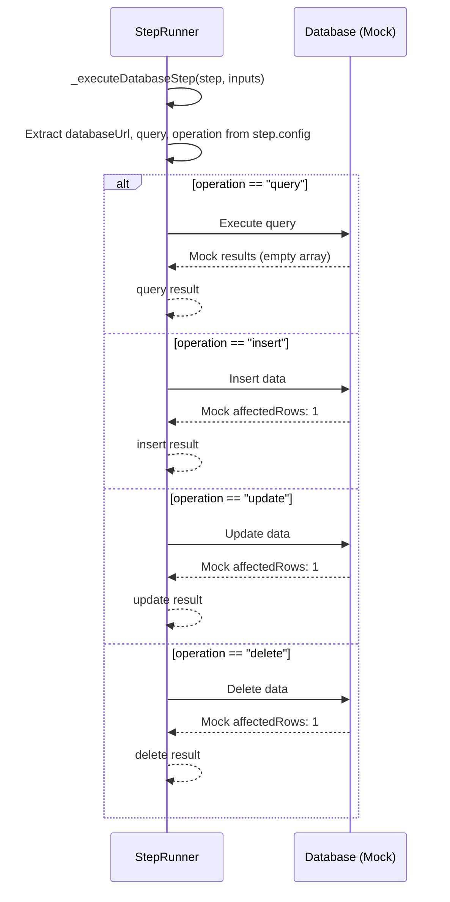

## 8. Filesystem Step Execution Flow

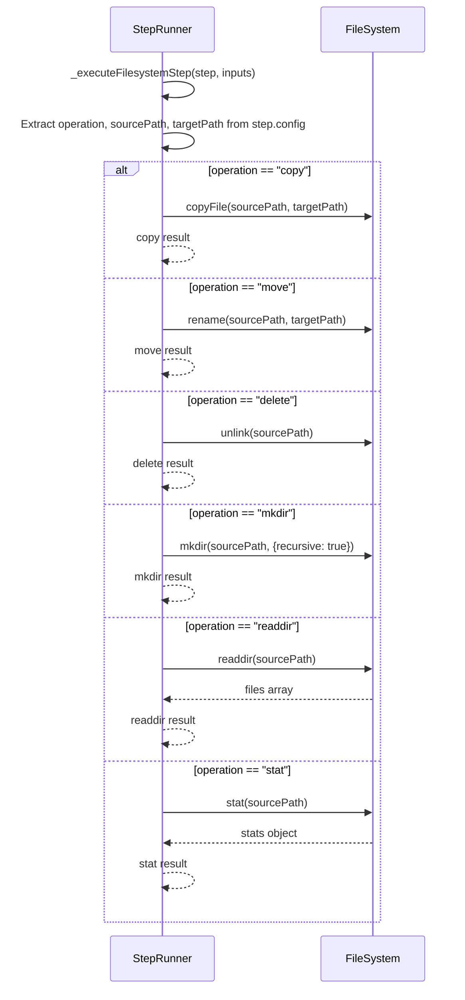

## 9. Conditional Step Execution Flow

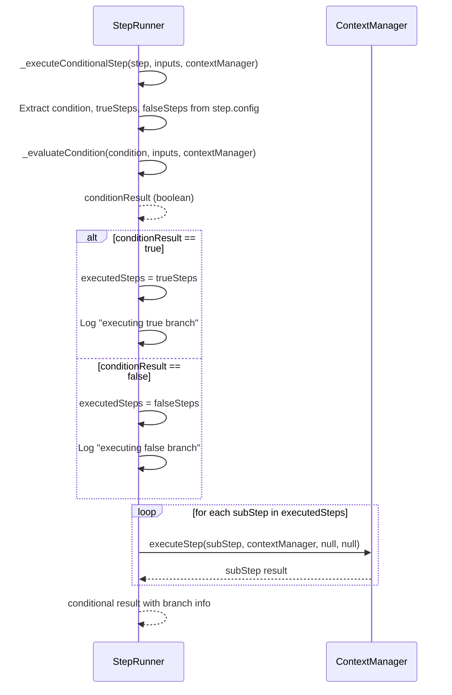

## 10. Loop Step Execution Flow

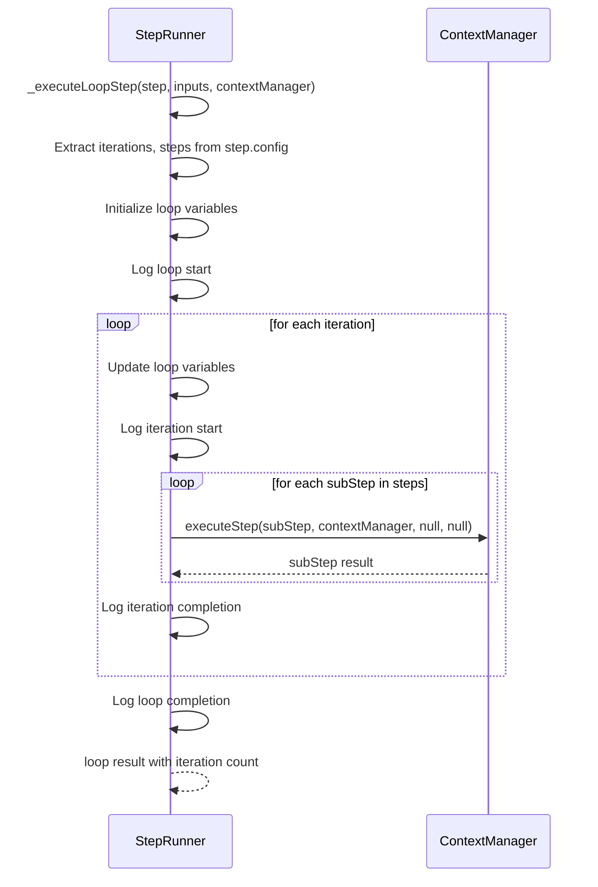

## 11. Parallel Step Execution Flow

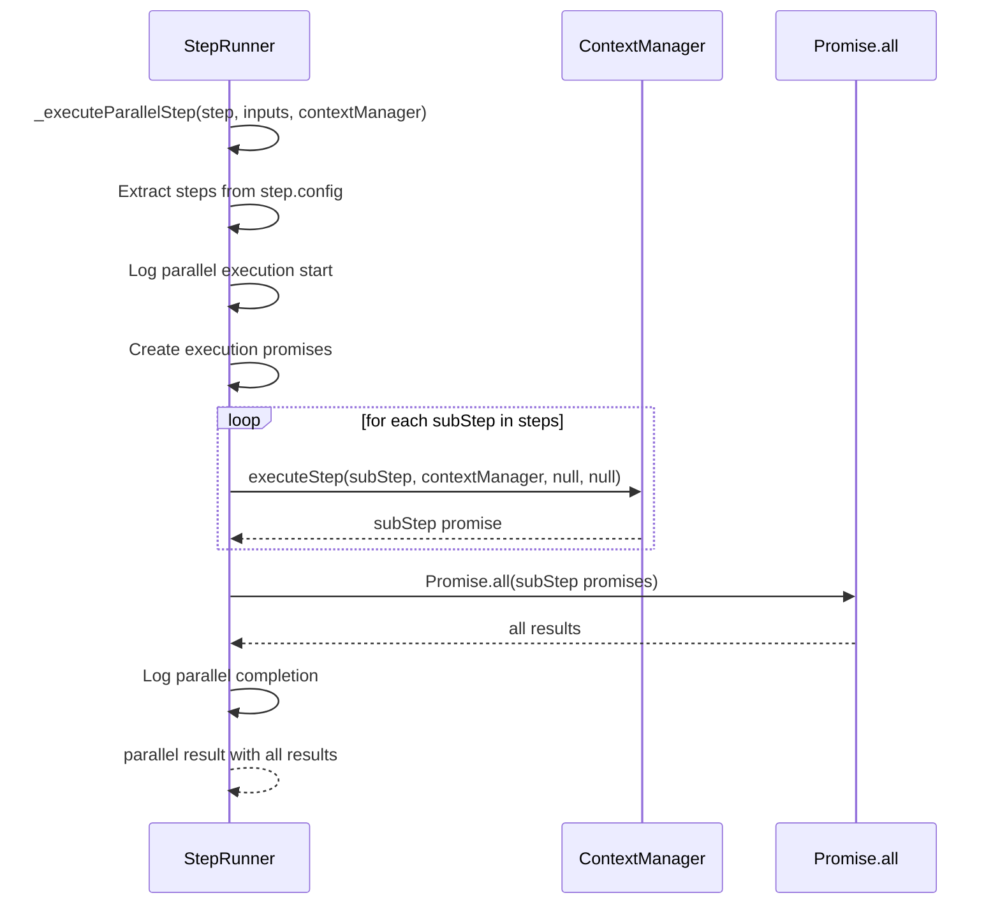

## 12. Context Management Flow

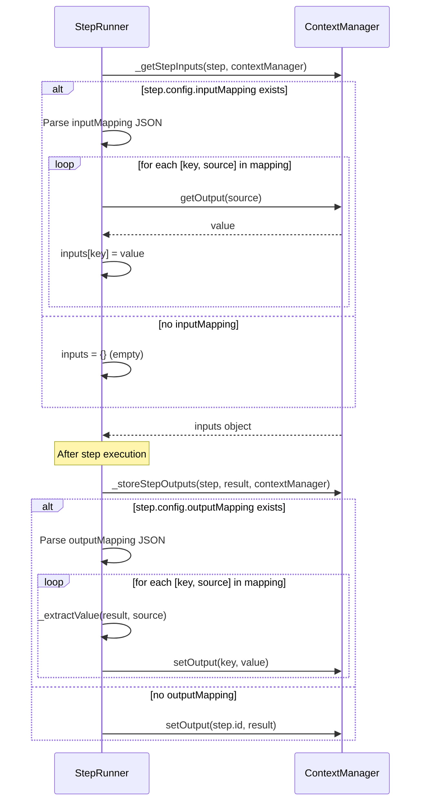

## 13. Error Handling Flow

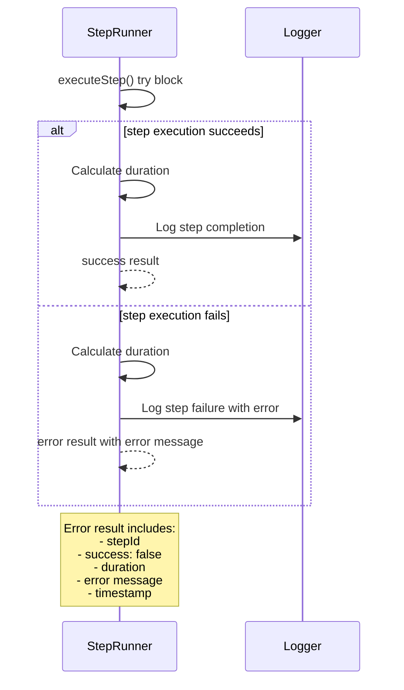

## Component Breakdown Summary

The StepRunner can be broken down into these main components:

### Core Components:
1. **Main Execution Engine** - Orchestrates step execution with timing and logging
2. **Input/Output Management** - Handles context data flow via ContextManager
3. **Step Type Dispatcher** - Routes to appropriate step handlers via switch statement
4. **Error Handling** - Manages failures and timeouts with comprehensive error reporting

### Step Type Handlers:
1. **SPARQL Step Handler** - Executes RDF queries via useGraph composable
2. **Template Step Handler** - Renders templates with data via useTemplate composable
3. **File Step Handler** - File system operations (read/write/copy/delete)
4. **HTTP Step Handler** - Web API calls with timeout and abort control
5. **Git Step Handler** - Git command execution via execAsync
6. **Database Step Handler** - Database operations (currently mock implementation)
7. **Filesystem Step Handler** - Advanced file operations (copy/move/delete/mkdir/readdir/stat)
8. **Conditional Step Handler** - Branching logic with sub-step execution
9. **Loop Step Handler** - Iteration logic with sub-step execution
10. **Parallel Step Handler** - Concurrent execution with Promise.all
11. **Error Handling Step Handler** - Error recovery and handling
12. **Notification Step Handler** - Notification delivery

### Supporting Integrations:
1. **Context Manager Integration** - Data flow between steps via inputMapping/outputMapping
2. **Template Engine Integration** - Nunjucks rendering with variable substitution
3. **Graph Integration** - RDF/SPARQL operations via RdfEngine and Comunica QueryEngine
4. **File System Integration** - Node.js fs.promises operations
5. **Git Integration** - Command execution via child_process.exec
6. **HTTP Integration** - Fetch API calls with AbortController timeout
7. **RdfEngine Integration** - Production-grade RDF processing with SHACL validation
8. **Comunica QueryEngine Integration** - SPARQL 1.1 query execution

### Key Architectural Features:
- **Extensible Design** - Easy to add new step types by implementing new handlers
- **Consistent Pattern** - All step types follow the same execution pattern
- **Comprehensive Error Handling** - Robust error handling across all step types
- **Performance Monitoring** - Built-in timing and duration tracking
- **Context Management** - Sophisticated input/output mapping system
- **Production-Grade RDF** - Real SPARQL execution with Comunica engine
- **Template Integration** - Real Nunjucks template rendering
- **File Operations** - Real file system operations with directory creation
- **Git Integration** - Real Git command execution
- **HTTP Operations** - Real web API calls with timeout handling

### Implementation Quality:
- **Real vs Mock**: Most implementations are real, only database operations are mock
- **Production Ready**: Core components are production-ready with proper error handling
- **Extensible**: Architecture supports easy addition of new step types
- **Maintainable**: Clear separation of concerns and consistent patterns
- **Testable**: Each component can be tested independently

This architecture provides a solid foundation for workflow execution with real implementations for most operations, making it suitable for production use with the exception of database operations which need real database drivers.
