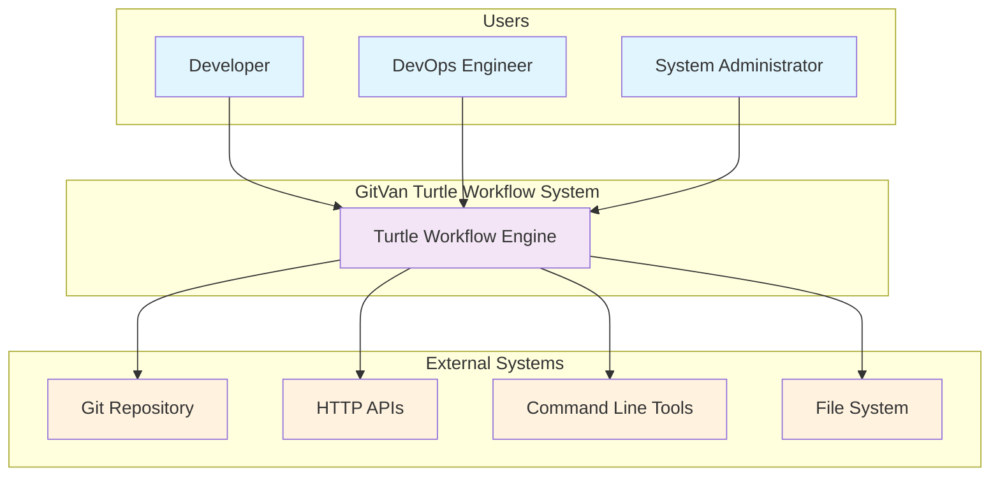
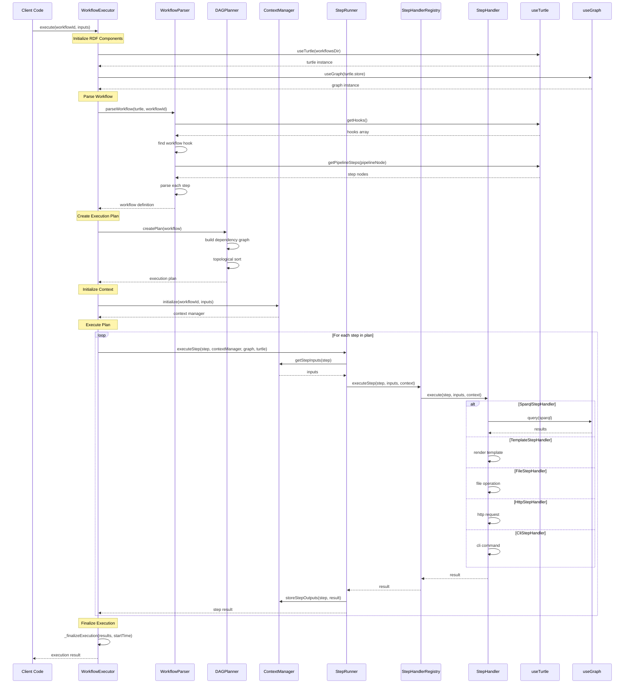

# Turtle Workflow System - C4 Architecture Diagrams

## Overview
This document provides comprehensive C4 (Context, Container, Component, Code) diagrams to guide the definitive implementation of the GitVan Turtle Workflow System. These diagrams serve as the architectural blueprint for implementing a fully functional workflow engine.

## C4 Level 1: System Context Diagram



**Purpose**: Shows the Turtle Workflow System in its environment, including users and external systems it interacts with.

**Key Interactions**:
- **Developers** define workflows in Turtle (.ttl) files
- **DevOps Engineers** execute workflows for automation
- **System Administrators** monitor and manage workflow execution
- **External Systems** provide data sources and execution targets

## C4 Level 2: Container Diagram

```mermaid
graph TB
    subgraph "GitVan Turtle Workflow System"
        subgraph "Workflow Execution Layer"
            WorkflowExecutor[WorkflowExecutor<br/>Main Orchestrator]
            WorkflowParser[WorkflowParser<br/>Turtle File Parser]
            DAGPlanner[DAGPlanner<br/>Execution Planner]
        end
        
        subgraph "Step Execution Layer"
            StepRunner[StepRunner<br/>Step Executor]
            StepHandlerRegistry[StepHandlerRegistry<br/>Handler Manager]
        end
        
        subgraph "Step Handlers"
            SparqlHandler[SparqlStepHandler]
            TemplateHandler[TemplateStepHandler]
            FileHandler[FileStepHandler]
            HttpHandler[HttpStepHandler]
            CliHandler[CliStepHandler]
        end
        
        subgraph "RDF Processing Layer"
            TurtleComposable[useTurtle<br/>RDF Data Loader]
            GraphComposable[useGraph<br/>RDF Query Engine]
        end
        
        subgraph "Supporting Services"
            ContextManager[ContextManager<br/>State Management]
            TemplateEngine[useTemplate<br/>Template Rendering]
            Logger[Logger<br/>Logging Service]
        end
        
        subgraph "External Integrations"
            N3Store[N3.Store<br/>RDF Storage]
            Nunjucks[Nunjucks<br/>Template Engine]
            NodeFS[Node.js FS<br/>File Operations]
            FetchAPI[Fetch API<br/>HTTP Client]
            ChildProcess[Child Process<br/>CLI Execution]
        end
    end
    
    subgraph "External Systems"
        TurtleFiles[Turtle (.ttl) Files]
        GitRepo[Git Repository]
        HTTPAPIs[HTTP APIs]
        FileSystem[File System]
        CommandLine[Command Line Tools]
    end
    
    %% Main execution flow
    WorkflowExecutor --> WorkflowParser
    WorkflowExecutor --> DAGPlanner
    WorkflowExecutor --> StepRunner
    WorkflowExecutor --> ContextManager
    
    %% Parsing flow
    WorkflowParser --> TurtleComposable
    TurtleComposable --> N3Store
    
    %% Step execution flow
    StepRunner --> StepHandlerRegistry
    StepHandlerRegistry --> SparqlHandler
    StepHandlerRegistry --> TemplateHandler
    StepHandlerRegistry --> FileHandler
    StepHandlerRegistry --> HttpHandler
    StepHandlerRegistry --> CliHandler
    
    %% Handler dependencies
    SparqlHandler --> GraphComposable
    TemplateHandler --> TemplateEngine
    FileHandler --> NodeFS
    HttpHandler --> FetchAPI
    CliHandler --> ChildProcess
    
    %% Supporting services
    GraphComposable --> N3Store
    TemplateEngine --> Nunjucks
    ContextManager --> Logger
    
    %% External integrations
    TurtleComposable --> TurtleFiles
    FileHandler --> FileSystem
    HttpHandler --> HTTPAPIs
    CliHandler --> CommandLine
    ContextManager --> GitRepo
    
    classDef orchestrator fill:#e8f5e8
    classDef processor fill:#fff2cc
    classDef handler fill:#dae8fc
    classDef service fill:#f8cecc
    classDef external fill:#e1d5e7
    
    class WorkflowExecutor,DAGPlanner orchestrator
    class WorkflowParser,StepRunner,StepHandlerRegistry processor
    class SparqlHandler,TemplateHandler,FileHandler,HttpHandler,CliHandler handler
    class TurtleComposable,GraphComposable,ContextManager,TemplateEngine,Logger service
    class N3Store,Nunjucks,NodeFS,FetchAPI,ChildProcess,TurtleFiles,GitRepo,HTTPAPIs,FileSystem,CommandLine external
```

**Purpose**: Shows the high-level shape of the Turtle Workflow System and how responsibilities are distributed across containers.

**Key Containers**:
- **Workflow Execution Layer**: Orchestrates workflow lifecycle
- **Step Execution Layer**: Manages individual step execution
- **Step Handlers**: Implements specific step types
- **RDF Processing Layer**: Handles Turtle/RDF operations
- **Supporting Services**: Provides cross-cutting concerns

## C4 Level 3: Component Diagram - WorkflowExecutor

```mermaid
graph TB
    subgraph "WorkflowExecutor Container"
        subgraph "Public API"
            ExecuteMethod[execute(workflowId, inputs)]
            ListWorkflowsMethod[listWorkflows()]
            ValidateMethod[validate(workflowId)]
        end
        
        subgraph "Core Components"
            RDFInitializer[_initializeRDFComponents()]
            WorkflowParser[WorkflowParser]
            ExecutionPlanner[DAGPlanner]
            ContextManager[ContextManager]
            StepRunner[StepRunner]
        end
        
        subgraph "Private Methods"
            ParseWorkflow[_parseWorkflow(workflowId)]
            CreatePlan[_createExecutionPlan(workflow)]
            InitializeContext[_initializeContext(workflowId, inputs)]
            ExecutePlan[_executePlan(plan)]
            FinalizeExecution[_finalizeExecution(results, startTime)]
        end
        
        subgraph "Dependencies"
            TurtleComposable[useTurtle]
            GraphComposable[useGraph]
            Logger[Logger]
        end
    end
    
    %% Public API connections
    ExecuteMethod --> ParseWorkflow
    ExecuteMethod --> CreatePlan
    ExecuteMethod --> InitializeContext
    ExecuteMethod --> ExecutePlan
    ExecuteMethod --> FinalizeExecution
    
    ListWorkflowsMethod --> RDFInitializer
    
    %% Core component connections
    ParseWorkflow --> WorkflowParser
    CreatePlan --> ExecutionPlanner
    InitializeContext --> ContextManager
    ExecutePlan --> StepRunner
    
    %% Dependency connections
    RDFInitializer --> TurtleComposable
    RDFInitializer --> GraphComposable
    WorkflowParser --> TurtleComposable
    ExecutionPlanner --> Logger
    ContextManager --> Logger
    StepRunner --> Logger
    
    classDef api fill:#e8f5e8
    classDef core fill:#fff2cc
    classDef private fill:#dae8fc
    classDef dependency fill:#f8cecc
    
    class ExecuteMethod,ListWorkflowsMethod,ValidateMethod api
    class WorkflowParser,ExecutionPlanner,ContextManager,StepRunner core
    class ParseWorkflow,CreatePlan,InitializeContext,ExecutePlan,FinalizeExecution,RDFInitializer private
    class TurtleComposable,GraphComposable,Logger dependency
```

**Purpose**: Shows the internal structure of the WorkflowExecutor container and how its components interact.

**Key Components**:
- **Public API**: Main entry points for workflow operations
- **Core Components**: Specialized components for specific responsibilities
- **Private Methods**: Internal orchestration logic
- **Dependencies**: External services and composables

## C4 Level 3: Component Diagram - StepRunner

```mermaid
graph TB
    subgraph "StepRunner Container"
        subgraph "Public API"
            ExecuteStepMethod[executeStep(step, contextManager, graph, turtle, options)]
            GetRegisteredTypes[getRegisteredStepTypes()]
            IsStepTypeSupported[isStepTypeSupported(stepType)]
        end
        
        subgraph "Core Components"
            HandlerRegistry[StepHandlerRegistry]
            InputProcessor[_getStepInputs(step, contextManager)]
            OutputProcessor[_storeStepOutputs(step, result, contextManager)]
        end
        
        subgraph "Step Handlers"
            SparqlHandler[SparqlStepHandler]
            TemplateHandler[TemplateStepHandler]
            FileHandler[FileStepHandler]
            HttpHandler[HttpStepHandler]
            CliHandler[CliStepHandler]
        end
        
        subgraph "Dependencies"
            Logger[Logger]
            ContextManager[ContextManager]
            GraphComposable[useGraph]
            TurtleComposable[useTurtle]
        end
    end
    
    %% Public API connections
    ExecuteStepMethod --> HandlerRegistry
    ExecuteStepMethod --> InputProcessor
    ExecuteStepMethod --> OutputProcessor
    
    GetRegisteredTypes --> HandlerRegistry
    IsStepTypeSupported --> HandlerRegistry
    
    %% Handler registry connections
    HandlerRegistry --> SparqlHandler
    HandlerRegistry --> TemplateHandler
    HandlerRegistry --> FileHandler
    HandlerRegistry --> HttpHandler
    HandlerRegistry --> CliHandler
    
    %% Handler dependencies
    SparqlHandler --> GraphComposable
    TemplateHandler --> TurtleComposable
    FileHandler --> Logger
    HttpHandler --> Logger
    CliHandler --> Logger
    
    %% Processing connections
    InputProcessor --> ContextManager
    OutputProcessor --> ContextManager
    
    classDef api fill:#e8f5e8
    classDef core fill:#fff2cc
    classDef handler fill:#dae8fc
    classDef dependency fill:#f8cecc
    
    class ExecuteStepMethod,GetRegisteredTypes,IsStepTypeSupported api
    class HandlerRegistry,InputProcessor,OutputProcessor core
    class SparqlHandler,TemplateHandler,FileHandler,HttpHandler,CliHandler handler
    class Logger,ContextManager,GraphComposable,TurtleComposable dependency
```

**Purpose**: Shows the internal structure of the StepRunner container and its modular step handler architecture.

**Key Components**:
- **Public API**: Step execution and management interface
- **Core Components**: Input/output processing and handler management
- **Step Handlers**: Specialized handlers for each step type
- **Dependencies**: External services and composables

## C4 Level 3: Component Diagram - Step Handler Architecture

```mermaid
graph TB
    subgraph "Step Handler Architecture"
        subgraph "Base Handler"
            BaseStepHandler[BaseStepHandler]
            ValidateMethod[validate(step)]
            CreateResult[createResult(data, success, error)]
            ReplaceVariables[replaceVariables(template, inputs)]
        end
        
        subgraph "Specific Handlers"
            SparqlHandler[SparqlStepHandler]
            TemplateHandler[TemplateStepHandler]
            FileHandler[FileStepHandler]
            HttpHandler[HttpStepHandler]
            CliHandler[CliStepHandler]
        end
        
        subgraph "Handler Methods"
            GetStepType[getStepType()]
            ExecuteMethod[execute(step, inputs, context)]
        end
        
        subgraph "Dependencies"
            Logger[Logger]
            TemplateEngine[useTemplate]
            GraphComposable[useGraph]
            FileSystem[File System API]
            FetchAPI[Fetch API]
            ChildProcess[Child Process]
        end
    end
    
    %% Inheritance relationships
    SparqlHandler -.-> BaseStepHandler
    TemplateHandler -.-> BaseStepHandler
    FileHandler -.-> BaseStepHandler
    HttpHandler -.-> BaseStepHandler
    CliHandler -.-> BaseStepHandler
    
    %% Handler implementations
    SparqlHandler --> GetStepType
    SparqlHandler --> ExecuteMethod
    TemplateHandler --> GetStepType
    TemplateHandler --> ExecuteMethod
    FileHandler --> GetStepType
    FileHandler --> ExecuteMethod
    HttpHandler --> GetStepType
    HttpHandler --> ExecuteMethod
    CliHandler --> GetStepType
    CliHandler --> ExecuteMethod
    
    %% Dependencies
    SparqlHandler --> GraphComposable
    SparqlHandler --> TemplateEngine
    TemplateHandler --> TemplateEngine
    FileHandler --> FileSystem
    HttpHandler --> FetchAPI
    CliHandler --> ChildProcess
    
    %% Base handler dependencies
    BaseStepHandler --> Logger
    BaseStepHandler --> TemplateEngine
    
    classDef base fill:#e8f5e8
    classDef handler fill:#fff2cc
    classDef method fill:#dae8fc
    classDef dependency fill:#f8cecc
    
    class BaseStepHandler,ValidateMethod,CreateResult,ReplaceVariables base
    class SparqlHandler,TemplateHandler,FileHandler,HttpHandler,CliHandler handler
    class GetStepType,ExecuteMethod method
    class Logger,TemplateEngine,GraphComposable,FileSystem,FetchAPI,ChildProcess dependency
```

**Purpose**: Shows the step handler architecture with inheritance and specialization patterns.

**Key Components**:
- **Base Handler**: Common functionality for all step handlers
- **Specific Handlers**: Specialized implementations for each step type
- **Handler Methods**: Standard interface methods
- **Dependencies**: External services used by handlers

## C4 Level 4: Code Diagram - Workflow Execution Flow



**Purpose**: Shows the detailed code-level interaction flow for workflow execution.

**Key Interactions**:
- **Initialization**: RDF components setup
- **Parsing**: Workflow definition extraction
- **Planning**: Execution order determination
- **Execution**: Step-by-step processing
- **Finalization**: Result aggregation

## Implementation Guidelines

### 1. **Turtle File Structure Requirements**

Based on the C4 analysis, the correct Turtle file structure should be:

```turtle
@prefix ex: <http://example.org/> .
@prefix rdf: <http://www.w3.org/1999/02/22-rdf-syntax-ns#> .
@prefix dct: <http://purl.org/dc/terms/> .
@prefix gh: <https://gitvan.dev/graph-hook#> .
@prefix gv: <https://gitvan.dev/ontology#> .
@prefix op: <https://gitvan.dev/op#> .

# Workflow Hook
ex:workflowId rdf:type gh:Hook ;
    dct:title "Workflow Title" ;
    gh:hasPredicate ex:predicate ;
    gh:orderedPipelines ex:pipeline .

# Pipeline
ex:pipeline rdf:type op:Pipeline ;
    op:steps ex:step1, ex:step2, ex:step3 .

# Steps with specific types
ex:step1 rdf:type gv:SparqlStep ;
    gv:text "SELECT ?s ?p ?o WHERE { ?s ?p ?o }" ;
    gv:outputMapping '{"results": "results"}' .

ex:step2 rdf:type gv:TemplateStep ;
    gv:text "Template content: {{ results }}" ;
    gv:filePath "output/report.md" ;
    gv:dependsOn ex:step1 .

ex:step3 rdf:type gv:FileStep ;
    gv:filePath "output/data.json" ;
    gv:operation "write" ;
    gv:content '{"status": "completed"}' ;
    gv:dependsOn ex:step2 .
```

### 2. **Step Handler Implementation Pattern**

Each step handler should follow this pattern:

```javascript
export class CustomStepHandler extends BaseStepHandler {
  getStepType() {
    return "custom";
  }

  validate(step) {
    // Validate step configuration
    if (!step.config || !step.config.requiredProperty) {
      throw new Error("Custom step missing required property");
    }
    return true;
  }

  async execute(step, inputs, context) {
    // Execute step logic
    const result = await this._performCustomOperation(step, inputs, context);
    return this.createResult(result);
  }

  async _performCustomOperation(step, inputs, context) {
    // Implementation details
  }
}
```

### 3. **Integration Test Requirements**

The integration test should:
1. Use correct Turtle file structure
2. Test all step handlers working together
3. Validate file creation and content
4. Verify data flow between steps
5. Check error handling and recovery

### 4. **Error Handling Strategy**

- **Validation Errors**: Fail fast with clear error messages
- **Execution Errors**: Return failed results with error details
- **Context Errors**: Handle missing dependencies gracefully
- **External Errors**: Wrap external service failures appropriately

## Next Steps for Implementation

1. **Fix Integration Test Turtle File**: Update structure to match expected format
2. **Update WorkflowParser**: Add support for missing step types
3. **Run Integration Test**: Validate all components work together
4. **Create Additional Examples**: Build comprehensive workflow examples
5. **Documentation**: Update user guides with working examples

This C4 architecture provides the definitive blueprint for implementing a fully functional Turtle Workflow System.
