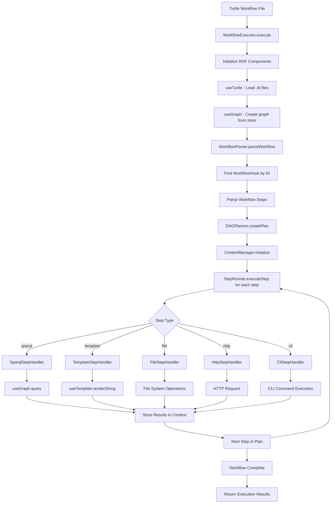

# GitVan Workflow System Architecture

## Complete Workflow Execution Process

## Detailed Component Interactions

### 1. WorkflowExecutor (Main Orchestrator)
- **Purpose**: Coordinates the entire workflow lifecycle
- **Key Methods**:
  - `execute(workflowId, inputs)` - Main entry point
  - `listWorkflows()` - List available workflows
  - `_initializeRDFComponents()` - Setup turtle and graph
  - `_parseWorkflow(workflowId)` - Parse workflow definition
  - `_createExecutionPlan(workflow)` - Create execution order
  - `_executePlan(plan)` - Execute steps in order

### 2. useTurtle (RDF Data Loader)
- **Purpose**: Load and parse Turtle (.ttl) files into N3.Store
- **Key Methods**:
  - `useTurtle(options)` - Load .ttl files from directory
  - Returns: `{ store, files, config, getHooks() }`
  - `getHooks()` - Extract workflow hooks from RDF data

### 3. useGraph (RDF Query Engine)
- **Purpose**: Execute SPARQL queries on RDF data
- **Key Methods**:
  - `useGraph(store)` - Create graph interface
  - `query(sparql)` - Execute SPARQL queries
  - `validate(shacl)` - SHACL validation
  - `setOperations()` - Graph set operations

### 4. WorkflowParser (Definition Parser)
- **Purpose**: Parse workflow definitions from RDF data
- **Key Methods**:
  - `parseWorkflow(turtle, workflowId)` - Parse specific workflow
  - `_parseWorkflowSteps()` - Extract step definitions
  - `_validateWorkflow()` - Validate workflow structure

### 5. DAGPlanner (Execution Planner)
- **Purpose**: Create execution order based on dependencies
- **Key Methods**:
  - `createPlan(workflow)` - Create execution plan
  - `_buildDependencyGraph()` - Build dependency graph
  - `_topologicalSort()` - Order steps for execution

### 6. ContextManager (State Management)
- **Purpose**: Manage workflow state and data flow
- **Key Methods**:
  - `initialize(workflowId, inputs)` - Setup initial context
  - `getStepInputs(step)` - Get inputs for step
  - `storeStepOutputs(step, result)` - Store step results

### 7. StepRunner (Step Executor)
- **Purpose**: Execute individual workflow steps
- **Key Methods**:
  - `executeStep(step, contextManager, graph, turtle)` - Execute step
  - Uses `StepHandlerRegistry` to delegate to specific handlers

### 8. StepHandlerRegistry (Handler Management)
- **Purpose**: Manage and delegate to step handlers
- **Key Methods**:
  - `executeStep(step, inputs, context)` - Delegate to handler
  - `validateStep(step)` - Validate step definition
  - Registered handlers: SparqlStepHandler, TemplateStepHandler, FileStepHandler, HttpStepHandler, CliStepHandler

## Step Handler Details

### SparqlStepHandler
- **Purpose**: Execute SPARQL queries on RDF data
- **Process**: 
  1. Use `useTemplate` for variable replacement in query
  2. Use `useGraph.query()` to execute SPARQL
  3. Process results based on query type (SELECT, ASK, CONSTRUCT)
  4. Return structured results

### TemplateStepHandler
- **Purpose**: Render templates with data
- **Process**:
  1. Use `useTemplate` for template rendering
  2. Support file-based and inline templates
  3. Handle Nunjucks filters and functions
  4. Write output to specified path

### FileStepHandler
- **Purpose**: Perform file system operations
- **Process**:
  1. Support read, write, copy, move, delete operations
  2. Use test environment `files` API or Node.js `fs.promises`
  3. Handle template rendering in file content
  4. Create directories as needed

### HttpStepHandler
- **Purpose**: Make HTTP requests
- **Process**:
  1. Use `useTemplate` for variable replacement in URL/headers/body
  2. Execute HTTP request with fetch
  3. Handle different response types (JSON, text)
  4. Process error responses appropriately

### CliStepHandler
- **Purpose**: Execute command line interface commands
- **Process**:
  1. Use `useTemplate` for variable replacement in command
  2. Use `spawn` for command execution
  3. Handle stdout, stderr, and exit codes
  4. Support timeout and environment variables

## Data Flow

1. **Input**: Turtle workflow file (.ttl)
2. **Parse**: WorkflowParser extracts workflow definition
3. **Plan**: DAGPlanner creates execution order
4. **Execute**: StepRunner executes each step using appropriate handler
5. **Context**: ContextManager manages data flow between steps
6. **Output**: Final results with step outputs and metadata

## Key Integration Points

- **useTurtle** ↔ **useGraph**: Turtle loads RDF data, Graph queries it
- **WorkflowParser** ↔ **useTurtle**: Parser uses turtle.getHooks() to find workflows
- **StepRunner** ↔ **StepHandlerRegistry**: Runner delegates to registry for step execution
- **ContextManager** ↔ **All Handlers**: Manages data flow between steps
- **useTemplate** ↔ **All Handlers**: Provides variable replacement functionality
