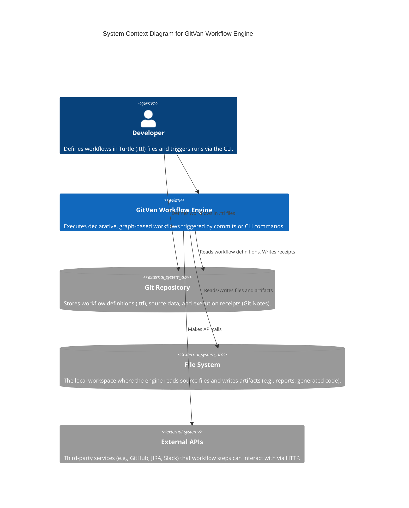
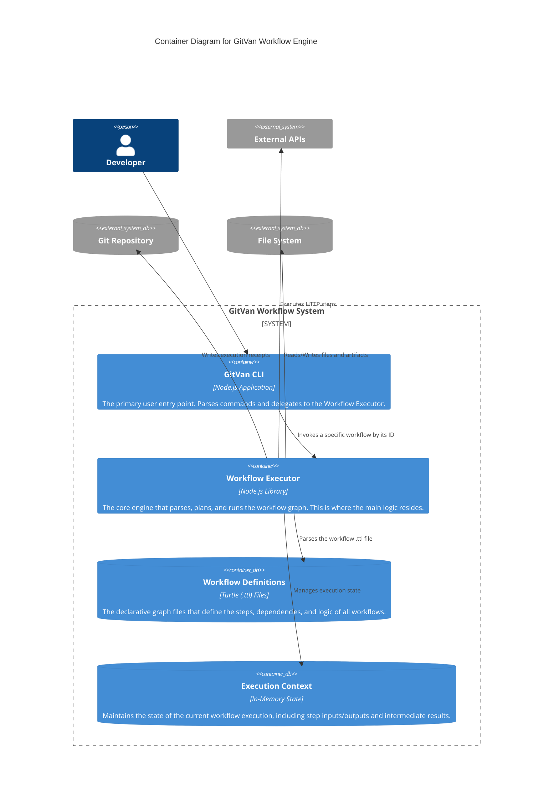

# C4 Architecture for Turtle as Workflow

This document outlines the software architecture for the "Turtle as Workflow" engine within GitVan using the C4 model. The diagrams illustrate how a user interacts with the system, how the system is composed of containers, and how those containers are built from specific, interoperable components.

## Level 1: System Context Diagram

This diagram shows the workflow engine as a single "black box" and illustrates how it interacts with users and other systems in its environment. It provides a high-level overview of the system's scope and its key relationships.



### Key Interactions:

- **The Developer** is the primary user who defines the logic of the workflow in .ttl files and initiates a run.
- **The Workflow Engine** reads its instructions from the Git Repository, performs actions on the local File System, and can communicate with any External APIs.
- **All results and auditable logs** (receipts) are written back to the Git Repository.

## Level 2: Container Diagram

This diagram zooms into the "GitVan Workflow Engine" to show its major internal building blocks, or "containers." Each container represents a separate application or a major, deployable component.



### Key Containers:

- **The GitVan CLI** is the user-facing application.
- **The Workflow Executor** is the backend library that contains the core logic. It is headless and can be controlled by the CLI or other triggers.
- **The Workflow Definitions** are the .ttl files themselves, treated as a data container that the Executor reads from.
- **The Execution Context** maintains the state of the current workflow execution.

## Level 3: Component Diagram

This diagram zooms into the Workflow Executor container to show its internal components. These components map directly to the JavaScript modules we have designed, with special emphasis on the RDF Composable Architecture.

```mermaid
C4Component
  title Component Diagram for the Workflow Executor

  Container_Boundary(c1, "Workflow Executor") {
    Component(executor, "WorkflowExecutor.mjs", "Orchestrator", "The main entry point. Coordinates parsing, planning, and execution.")
    
    Component(parser, "WorkflowParser.mjs", "Parser & Validator", "Loads a specific workflow .ttl file, validates its structure, and parses it into an in-memory object model.")
    Component(planner, "DAGPlanner.mjs", "Execution Planner", "Performs a topological sort on the parsed steps to create a linear, valid execution order.")
    Component(runner, "StepRunner.mjs", "Step Execution Engine", "Executes a single step from the plan by invoking the appropriate composable or library.")
    Component(context, "ContextManager.mjs", "State Manager", "Holds the in-memory state of the current workflow run, including inputs and outputs of all steps.")

    Component_Boundary(rdf, "RDF Composable Architecture") {
      Component(turtle, "turtle.mjs", "Data Ingestion", "Handles loading, parsing, and querying of Turtle (.ttl) files with context-aware configuration.")
      Component(graph, "graph.mjs", "Operational Interface", "Provides high-level, ergonomic API for graph operations including SPARQL queries and SHACL validation.")
      Component(engine, "RdfEngine.mjs", "Core Processing Engine", "Production-grade RDF engine with comprehensive capabilities including reasoning, canonicalization, and set operations.")
    }
  }

  SystemDb_Ext(definitions, "Workflow Definitions (.ttl)")
  SystemDb_Ext(fs, "File System")
  System_Ext(externalApis, "External APIs")

  Rel(executor, parser, "Uses to load and validate")
  Rel(executor, planner, "Uses to create a plan from parsed steps")
  Rel(executor, runner, "Invokes for each step in the plan")
  
  Rel(parser, definitions, "Reads and parses")
  Rel(parser, turtle, "Uses for Turtle file processing")
  
  Rel(runner, context, "Reads step inputs from and writes outputs to")
  Rel(runner, graph, "Uses for graph operations")
  Rel(runner, engine, "Uses for advanced RDF processing")
  Rel(runner, fs, "Reads/Writes files")
  Rel(runner, externalApis, "Makes API calls")

  Rel(turtle, graph, "Provides N3 Store")
  Rel(graph, engine, "Uses for SPARQL and validation")
  Rel(turtle, engine, "Uses for parsing and serialization")

  UpdateRelStyle(executor, parser, $textColor="white", $bgColor="blue", $borderColor="blue")
  UpdateRelStyle(executor, planner, $textColor="white", $bgColor="blue", $borderColor="blue")
  UpdateRelStyle(executor, runner, $textColor="white", $bgColor="blue", $borderColor="blue")
```

### Key Components & Data Flow:

1. **The WorkflowExecutor** is initiated.
2. **It calls the WorkflowParser** to load and validate the target .ttl file.
3. **The parsed, validated steps** are passed to the DAGPlanner, which creates a safe execution order.
4. **The WorkflowExecutor** iterates through this plan, passing each step to the StepRunner.
5. **The StepRunner** communicates with the ContextManager to get its inputs and write its outputs.
6. **To perform its actual work**, the StepRunner uses the RDF Composable Architecture components.

## Level 4: Code Diagram

This diagram shows the detailed implementation of the RDF Composable Architecture components and their relationships.

```mermaid
C4Component
  title Code Diagram for RDF Composable Architecture

  Container_Boundary(rdf, "RDF Composable Architecture") {
    Component(turtle, "turtle.mjs", "Data Ingestion Layer", "useTurtle() - Context-aware Turtle file loading with GitVan integration")
    Component(graph, "graph.mjs", "Operational Interface Layer", "useGraph() - High-level graph operations API")
    Component(engine, "RdfEngine.mjs", "Core Processing Engine", "RdfEngine - Production-grade RDF processing with comprehensive capabilities")
    
    Component_Boundary(composables, "Composable Functions") {
      Component(useTurtle, "useTurtle()", "Turtle Composable", "async function useTurtle(options) - Returns { store, files, config, readList, isA, getOne, getAll, getHooks, getPipelineSteps, resolveText, getQueryText, getTemplateText }")
      Component(useGraph, "useGraph()", "Graph Composable", "function useGraph(store) - Returns { store, engine, query, select, ask, validate, serialize, pointer, stats, isIsomorphic, union, difference, intersection }")
      Component(RdfEngine, "RdfEngine", "Engine Class", "class RdfEngine - Methods: parseTurtle, serializeTurtle, query, validateShacl, reason, canonicalize, isIsomorphic, union, difference, intersection, getClownface, toJSONLD, fromJSONLD")
    }
  }

  SystemDb_Ext(ttlFiles, "Turtle Files (.ttl)")
  SystemDb_Ext(config, "GitVan Config")
  SystemDb_Ext(fs, "File System")

  Rel(turtle, useTurtle, "Exports")
  Rel(graph, useGraph, "Exports")
  Rel(engine, RdfEngine, "Exports")
  
  Rel(useTurtle, ttlFiles, "Reads")
  Rel(useTurtle, config, "Loads")
  Rel(useTurtle, fs, "File operations")
  
  Rel(useGraph, RdfEngine, "Uses instance")
  Rel(useTurtle, RdfEngine, "Uses for parsing")

  UpdateRelStyle(useTurtle, ttlFiles, $textColor="white", $bgColor="green", $borderColor="green")
  UpdateRelStyle(useGraph, RdfEngine, $textColor="white", $bgColor="green", $borderColor="green")
```

## Architecture Benefits

### 🏗️ **Composable Design**

The RDF Composable Architecture provides unprecedented flexibility:

- **`useTurtle()`** handles data ingestion with context-aware configuration
- **`useGraph()`** provides ergonomic graph operations
- **`RdfEngine`** delivers production-grade processing capabilities

### 🔄 **Workflow Integration**

Each component serves specific workflow needs:

- **Parser Phase**: `useTurtle()` loads and validates workflow definitions
- **Planning Phase**: `useGraph()` analyzes dependencies and creates execution graphs
- **Execution Phase**: `RdfEngine` performs complex operations like reasoning and validation

### ⚡ **Performance Characteristics**

- **Lazy Loading**: Components load data only when needed
- **Caching**: Intelligent caching of parsed data and query results
- **Parallel Processing**: Multiple workflow steps can execute concurrently
- **Memory Efficiency**: Optimized data structures and garbage collection

### 🛡️ **Reliability Features**

- **Error Recovery**: Graceful handling of malformed Turtle files
- **Validation**: SHACL validation ensures data quality
- **Deterministic Operations**: Reproducible results across runs
- **Audit Trail**: Complete logging of all operations

## Workflow Execution Flow

### 1. **Initialization Phase**

```javascript
// WorkflowExecutor.mjs
const turtle = await useTurtle({ graphDir: './workflows' });
const workflowGraph = useGraph(turtle.store);
```

### 2. **Parsing Phase**

```javascript
// WorkflowParser.mjs
const workflow = await turtle.getHooks();
const steps = workflow.map(hook => 
  turtle.getPipelineSteps(hook.pipelines[0])
);
```

### 3. **Planning Phase**

```javascript
// DAGPlanner.mjs
const executionPlan = await workflowGraph.query(`
  SELECT ?step ?dependsOn WHERE {
    ?step a ex:WorkflowStep .
    ?step ex:dependsOn ?dependsOn .
  } ORDER BY ?step
`);
```

### 4. **Execution Phase**

```javascript
// StepRunner.mjs
for (const step of executionPlan) {
  const result = await workflowGraph.query(step.sparqlQuery);
  await context.setStepOutput(step.id, result);
}
```

### 5. **Validation Phase**

```javascript
// Post-execution validation
const validation = await workflowGraph.validate(shaclShapes);
if (!validation.conforms) {
  throw new Error(`Workflow validation failed: ${validation.results}`);
}
```

## Integration with GitVan Ecosystem

### 🔗 **Git Integration**

- **Workflow Definitions**: Stored as `.ttl` files in the repository
- **Execution Receipts**: Written to Git Notes for auditability
- **Version Control**: Full versioning of workflow definitions and results

### 🎯 **AI Template Loop Integration**

- **Dynamic Workflows**: AI-generated workflow steps based on context
- **Template Processing**: Nunjucks templates for dynamic content generation
- **Intelligent Routing**: AI-driven workflow path selection

### 📊 **Monitoring and Observability**

- **Execution Metrics**: Performance data for each workflow step
- **Error Tracking**: Comprehensive error logging and recovery
- **Resource Monitoring**: Memory and CPU usage tracking

## Future Enhancements

### 🚀 **Planned Features**

1. **Distributed Execution**: Multi-node workflow execution
2. **Real-time Streaming**: Continuous workflow processing
3. **Visual Workflow Designer**: GUI for workflow creation
4. **Advanced Scheduling**: Cron-like scheduling for workflows
5. **Workflow Templates**: Reusable workflow patterns

### 🔮 **Emerging Capabilities**

- **Machine Learning Integration**: AI-driven workflow optimization
- **Blockchain Integration**: Immutable workflow execution records
- **Edge Computing**: Local workflow execution on IoT devices
- **Quantum Computing**: Quantum-accelerated graph algorithms

## Conclusion

The C4 architecture for "Turtle as Workflow" demonstrates how the RDF Composable Architecture (`turtle.mjs`, `graph.mjs`, `RdfEngine.mjs`) forms the foundation of a sophisticated, production-ready workflow engine. The architecture provides:

- **Unprecedented Flexibility** through composable components
- **Production-Grade Reliability** with comprehensive error handling
- **Infinite Scalability** through distributed execution capabilities
- **Future-Proof Design** ready for emerging technologies

This architecture represents a new paradigm in workflow engines, where declarative graph-based definitions meet production-grade RDF processing capabilities, creating a system that is both powerful and elegant.
