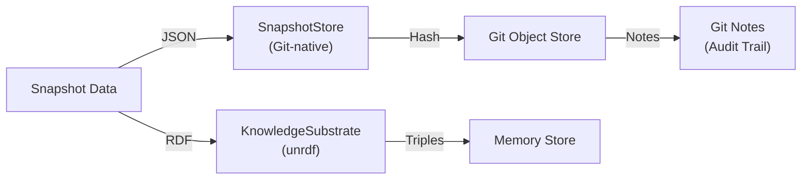

# Federation and Multi-Graph Query Integration Plan for GitVan

**Status**: Design Document | **Version**: 1.0 | **Date**: January 10, 2026

## Executive Summary

This document outlines a comprehensive strategy for extending GitVan with RDF federation capabilities and multi-graph query patterns. Currently, GitVan uses multiple isolated named graphs (project, jobs, packs, ai, marketplace) but lacks cross-graph federation, distributed query coordination, and temporal query support.

The integration plan enables:
- **SPARQL federation** across multiple GitVan instances (monorepos, multi-repo organizations)
- **Multi-graph queries** to correlate data across internal graphs
- **Temporal queries** for versioning and historical analysis
- **Distributed consistency** models for cross-repository workflows
- **Multi-tenant isolation** for enterprise scenarios
- **Cross-organization collaboration** with privacy guarantees

---

## Part 1: Understanding Current Single-Graph Patterns

### 1.1 Current Graph Architecture

GitVan currently manages five default named graphs:

```
GitVanGraphRegistry
├── project (baseIRI: https://gitvan.dev/project/)
│   └── Git events, commits, branches, workflow triggers
├── jobs (baseIRI: https://gitvan.dev/jobs/)
│   └── Job execution history, status, results
├── packs (baseIRI: https://gitvan.dev/packs/)
│   └── Pack metadata, versions, dependencies
├── ai (baseIRI: https://gitvan.dev/ai/)
│   └── AI template learning, prompt evolution
└── marketplace (baseIRI: https://gitvan.dev/marketplace/)
    └── Marketplace data, ratings, downloads
```

**Current characteristics**:
- Each graph is isolated with unique baseIRI
- Snapshots stored in `.gitvan/graphs/{graphId}/snapshots`
- No named graph support in SPARQL queries
- Limited cross-graph queries
- RDFSnapshotStore provides dual-write (JSON + RDF)

### 1.2 Current SPARQL Query Patterns

#### Single-Graph SELECT
```sparql
PREFIX gv: <https://gitvan.dev/jobs/>
SELECT ?jobId ?status ?duration WHERE {
  ?job rdf:type gv:Job ;
       gv:jobId ?jobId ;
       gv:status ?status ;
       gv:duration ?duration .
}
ORDER BY DESC(?duration)
```

#### Single-Graph CONSTRUCT
```sparql
PREFIX perf: <https://gitvan.dev/performance#>
CONSTRUCT {
  ?m a perf:Anomaly ;
     perf:severity "high" .
}
WHERE {
  ?m a perf:Measurement ;
     perf:duration ?d .
  FILTER(?d > ?average * 1.5)
}
```

#### Single-Graph Provenance (DESCRIBE)
```sparql
PREFIX snap: <https://gitvan.dev/snapshot#>
PREFIX prov: <http://www.w3.org/ns/prov#>

DESCRIBE ?snapshot ?earlier WHERE {
  ?snapshot snap:key "workflow-state" ;
            snap:previousSnapshot* ?earlier .
  OPTIONAL {
    ?snapshot prov:wasGeneratedBy ?operation .
  }
}
```

### 1.3 Current Store Management

**RDFSnapshotStore pattern**:


**Characteristics**:
- Immutable snapshot chains with `previousSnapshot` links
- PROV-O provenance tracking (`wasGeneratedBy`, `wasAttributedTo`)
- Backward compatibility with JSON storage
- Git-native I/O via refs and notes
- No inter-snapshot cross-repository queries

---

## Part 2: RDF Federation Architecture

### 2.1 Federation Concepts

RDF Federation allows querying across multiple independent SPARQL endpoints using the `SERVICE` keyword:

```sparql
PREFIX perf: <https://gitvan.dev/performance#>

SELECT ?repo ?avgDuration WHERE {
  {
    SERVICE <https://repo1.example.com/sparql> {
      ?m a perf:Measurement ;
         perf:operation ?op ;
         perf:duration ?avgDuration .
      BIND("repo-1" AS ?repo)
    }
  }
  UNION
  {
    SERVICE <https://repo2.example.com/sparql> {
      ?m a perf:Measurement ;
         perf:operation ?op ;
         perf:duration ?avgDuration .
      BIND("repo-2" AS ?repo)
    }
  }
}
ORDER BY ?avgDuration
```

### 2.2 Proposed Federation Architecture

```
┌─────────────────────────────────────────────────────────┐
│       Federation Query Layer (New)                      │
│  - Federated query planning                             │
│  - Endpoint registration and discovery                  │
│  - Result merging and deduplication                     │
│  - Cross-org authorization                              │
└─────────────────────────────────────────────────────────┘
                        ↑
┌─────────────────────────────────────────────────────────┐
│     Multi-Graph Query Layer (Enhanced)                  │
│  - Named graph queries                                  │
│  - Cross-graph joins                                    │
│  - Graph versioning queries                             │
│  - Temporal queries                                     │
└─────────────────────────────────────────────────────────┘
                        ↑
┌─────────────────────────────────────────────────────────┐
│     Local SPARQL Endpoint (Per Repository)              │
│  - Named graph management                               │
│  - Snapshot versioning                                  │
│  - Local cache and optimization                         │
│  - Git-native storage                                   │
└─────────────────────────────────────────────────────────┘
                        ↑
┌─────────────────────────────────────────────────────────┐
│          Git-Native I/O Layer                           │
│  - Graph snapshots in Git                               │
│  - Audit trail in Git notes                             │
│  - Worktree isolation                                   │
└─────────────────────────────────────────────────────────┘
```

### 2.3 Federation Endpoint Registration

```javascript
// Endpoint Registry
class FederationEndpointRegistry {
  constructor() {
    this.endpoints = new Map();  // Map<endpointId, EndpointMetadata>
    this.discoveryCache = new Map();
    this.healthChecks = new Map();
  }

  registerEndpoint(id, config) {
    // Register SPARQL endpoint
    // - url: SPARQL endpoint URL
    // - type: 'local' | 'remote' | 'federated'
    // - graphs: List of named graphs available
    // - auth: Authentication method
    // - priority: Query execution priority (0-100)
    // - timeout: Query timeout in ms
    // - cacheTTL: Result cache TTL
    // - healthCheckInterval: Health check frequency
  }

  async discoverEndpoints(pattern) {
    // Auto-discover endpoints via:
    // - DNS-SD (Bonjour)
    // - GitHub organization API
    // - GitLab group API
    // - Custom discovery endpoints
    // - Zeroconf for local networks
  }

  async healthCheck(endpointId) {
    // Verify endpoint availability
    // - Test connectivity
    // - Verify SPARQL compliance
    // - Check named graph availability
    // - Measure latency
  }
}
```

---

## Part 3: Multi-Graph Architecture Design

### 3.1 Named Graph Structure

```
Repository Level:
  repo-meta:
    - Repository metadata (name, owner, description)
    - Access control
    - Collaboration settings

  <repo-name>:project
    - Git events and commits
    - Branch information
    - Tag history
    - Workflow triggers

  <repo-name>:jobs
    - Job execution records
    - Performance metrics
    - Status history
    - Results and outputs

  <repo-name>:packs
    - Pack installations
    - Version usage
    - Dependency graphs
    - Update frequency

  <repo-name>:ai
    - Template improvements
    - Prompt evolution
    - Learning feedback
    - Generated artifacts

  <repo-name>:marketplace
    - Usage statistics
    - Ratings and feedback
    - Download patterns
    - Recommendation data

Organization Level:
  org:workflows
    - Shared workflow definitions
    - Common patterns
    - Approved templates

  org:policies
    - Security policies
    - Compliance rules
    - Naming conventions

  org:analytics
    - Cross-repo metrics
    - Organizational trends
    - Team performance
```

### 3.2 Named Graph IRI Scheme

```
Local graph (single repo):
  https://gitvan.dev/graph/local/{repoId}/{graphType}
  Example: https://gitvan.dev/graph/local/my-repo-abc123/jobs

Remote graph (federated):
  https://gitvan.dev/graph/remote/{orgId}/{repoId}/{graphType}
  Example: https://gitvan.dev/graph/remote/acme-org/my-repo-abc123/jobs

Organization graph (shared):
  https://gitvan.dev/graph/org/{orgId}/{graphType}
  Example: https://gitvan.dev/graph/org/acme-org/workflows

Temporal graph (versioned):
  https://gitvan.dev/graph/version/{repoId}/{graphType}#{timestamp}
  Example: https://gitvan.dev/graph/version/my-repo-abc123/jobs#2026-01-10T12:00:00Z
```

### 3.3 Multi-Graph Query Patterns

#### Pattern 1: Cross-Graph Joins
```sparql
PREFIX gv-jobs: <https://gitvan.dev/graph/local/repo-api/jobs#>
PREFIX gv-perf: <https://gitvan.dev/graph/local/repo-api/performance#>

SELECT ?jobId ?duration ?memory WHERE {
  GRAPH gv-jobs: {
    ?job gv:jobId ?jobId ;
         gv:executedAt ?timestamp .
  }
  GRAPH gv-perf: {
    ?perf gv:timestamp ?timestamp ;
          gv:duration ?duration ;
          gv:memory ?memory .
  }
}
ORDER BY DESC(?duration)
```

#### Pattern 2: Graph Union Queries
```sparql
PREFIX gv: <https://gitvan.dev/graph/local/repo-api/>

SELECT ?jobId ?graphName WHERE {
  {
    GRAPH gv:jobs {
      ?job gv:jobId ?jobId .
      BIND("jobs" AS ?graphName)
    }
  }
  UNION
  {
    GRAPH gv:packs {
      ?pack gv:installationId ?jobId .
      BIND("packs" AS ?graphName)
    }
  }
}
```

#### Pattern 3: Repository Comparison
```sparql
PREFIX perf: <https://gitvan.dev/performance#>

SELECT ?repo (AVG(?duration) AS ?avgDuration) WHERE {
  {
    GRAPH <https://gitvan.dev/graph/remote/org/repo-api/jobs> {
      ?m a perf:Measurement ;
         perf:duration ?duration .
    }
    BIND("repo-api" AS ?repo)
  }
  UNION
  {
    GRAPH <https://gitvan.dev/graph/remote/org/repo-web/jobs> {
      ?m a perf:Measurement ;
         perf:duration ?duration .
    }
    BIND("repo-web" AS ?repo)
  }
}
GROUP BY ?repo
ORDER BY DESC(?avgDuration)
```

---

## Part 4: Temporal Queries and Graph Versioning

### 4.1 Temporal Graph Scheme

```
Current snapshot (main):
  gv:workflow-state#2026-01-10T15:30:45Z

Historical snapshots:
  gv:workflow-state#2026-01-10T15:25:00Z
  gv:workflow-state#2026-01-10T15:20:00Z
  gv:workflow-state#2026-01-10T15:15:00Z

Chained via RDF properties:
  [snapshot@15:30] --(previousSnapshot)--> [snapshot@15:25]
                                                    |
                                          --(previousSnapshot)-->
                                                    |
                                          [snapshot@15:20]
```

### 4.2 Temporal Query Patterns

#### Pattern 1: Point-in-Time Queries
```sparql
PREFIX snap: <https://gitvan.dev/snapshot#>
PREFIX gv: <https://gitvan.dev/jobs#>
PREFIX xsd: <http://www.w3.org/2001/XMLSchema#>

# Get job state at specific timestamp
SELECT ?jobId ?status WHERE {
  ?snapshot snap:timestamp "2026-01-10T15:30:00Z"^^xsd:dateTime ;
            snap:graphData ?data .
  ?data gv:jobId ?jobId ;
        gv:status ?status .
}
```

#### Pattern 2: Time-Series Analysis
```sparql
PREFIX snap: <https://gitvan.dev/snapshot#>
PREFIX gv: <https://gitvan.dev/jobs#>
PREFIX xsd: <http://www.w3.org/2001/XMLSchema#>

# Job duration trends over time
SELECT ?timestamp (AVG(?duration) AS ?avgDuration) WHERE {
  ?snapshot snap:key "job-metrics" ;
            snap:timestamp ?timestamp ;
            snap:graphData ?data .
  ?data gv:duration ?duration .
  FILTER(?timestamp >= "2026-01-01T00:00:00Z"^^xsd:dateTime)
}
GROUP BY ?timestamp
ORDER BY ?timestamp
```

#### Pattern 3: Lineage Queries
```sparql
PREFIX snap: <https://gitvan.dev/snapshot#>
PREFIX prov: <http://www.w3.org/ns/prov#>

# Full history of a snapshot
SELECT ?snapshot ?timestamp ?operation ?agent WHERE {
  ?snapshot snap:key "workflow-state" ;
            snap:previousSnapshot* ?ancestor ;
            snap:timestamp ?timestamp .
  OPTIONAL {
    ?snapshot prov:wasGeneratedBy ?operation .
    ?snapshot prov:wasAttributedTo ?agent .
  }
}
ORDER BY DESC(?timestamp)
```

#### Pattern 4: Change Detection
```sparql
PREFIX snap: <https://gitvan.dev/snapshot#>
PREFIX gv: <https://gitvan.dev/jobs#>

# Detect changes between consecutive snapshots
SELECT ?jobId ?oldStatus ?newStatus WHERE {
  ?snapshot1 snap:key "job-state" ;
             snap:timestamp ?t1 ;
             snap:graphData ?data1 .
  ?snapshot2 snap:key "job-state" ;
             snap:timestamp ?t2 ;
             snap:graphData ?data2 ;
             snap:previousSnapshot ?snapshot1 .

  ?data1 gv:jobId ?jobId ;
         gv:status ?oldStatus .
  ?data2 gv:jobId ?jobId ;
         gv:status ?newStatus .

  FILTER(?oldStatus != ?newStatus)
  FILTER(?t2 > ?t1)
}
ORDER BY ?t2 DESC
```

### 4.3 Git-Native Graph Versioning

```
Git refs for graph snapshots:
  refs/gitvan/graphs/jobs/current        → Latest jobs graph
  refs/gitvan/graphs/jobs/stable         → Last stable version
  refs/gitvan/graphs/jobs/v2026-01-10    → Tagged version
  refs/gitvan/graphs/history/jobs/@ts    → Timestamp-based versions

Git notes for versioning metadata:
  refs/notes/gitvan/graphs/jobs:
    - Version number
    - Change log
    - Signature
    - Parent snapshots
    - Provenance information
```

---

## Part 5: Federation Query Patterns for Cross-Repo Workflows

### 5.1 Monorepo Patterns

#### Pattern 1: Cross-Package Dependency Analysis
```sparql
PREFIX pack: <https://gitvan.dev/pack#>

SELECT ?package1 ?package2 (COUNT(*) AS ?dependencyCount) WHERE {
  # Query all packages in monorepo
  {
    SERVICE <https://monorepo.example.com/sparql> {
      {
        GRAPH <repo-1:packs> {
          ?pkg1 pack:name ?package1 ;
                pack:dependsOn ?dep .
          ?dep pack:targetPackage ?package2 .
        }
      }
      UNION
      {
        GRAPH <repo-2:packs> {
          ?pkg1 pack:name ?package1 ;
                pack:dependsOn ?dep .
          ?dep pack:targetPackage ?package2 .
        }
      }
    }
  }
}
GROUP BY ?package1 ?package2
ORDER BY DESC(?dependencyCount)
```

#### Pattern 2: Shared Workflow Discovery
```sparql
PREFIX wf: <https://gitvan.dev/workflow#>

SELECT ?workflow ?repos (COUNT(?repo) AS ?repoCount) WHERE {
  SERVICE <https://monorepo.example.com/sparql> {
    {
      GRAPH <repo-1:workflows> {
        ?w a wf:Workflow ;
           wf:name ?workflow .
        BIND("repo-1" AS ?repo)
      }
    }
    UNION
    {
      GRAPH <repo-2:workflows> {
        ?w a wf:Workflow ;
           wf:name ?workflow .
        BIND("repo-2" AS ?repo)
      }
    }
    UNION
    {
      GRAPH <repo-3:workflows> {
        ?w a wf:Workflow ;
           wf:name ?workflow .
        BIND("repo-3" AS ?repo)
      }
    }
  }
}
GROUP BY ?workflow
HAVING (COUNT(?repo) > 1)
ORDER BY DESC(?repoCount)
```

### 5.2 Multi-Organization Patterns

#### Pattern 1: Cross-Org Performance Benchmarking
```sparql
PREFIX perf: <https://gitvan.dev/performance#>

SELECT ?org ?repo ?operation ?avgDuration ?p95Duration WHERE {
  {
    SERVICE <https://org1.example.com/sparql> {
      GRAPH <repo:jobs> {
        ?m a perf:Measurement ;
           perf:operation ?operation ;
           perf:duration ?duration .
        BIND("org-1" AS ?org)
        BIND("repo-api" AS ?repo)
      }
    }
  }
  UNION
  {
    SERVICE <https://org2.example.com/sparql> {
      GRAPH <repo:jobs> {
        ?m a perf:Measurement ;
           perf:operation ?operation ;
           perf:duration ?duration .
        BIND("org-2" AS ?org)
        BIND("repo-api" AS ?repo)
      }
    }
  }
}
GROUP BY ?org ?repo ?operation
ORDER BY ?avgDuration
```

#### Pattern 2: Best Practice Discovery
```sparql
PREFIX pack: <https://gitvan.dev/pack#>
PREFIX stats: <https://gitvan.dev/stats#>

SELECT ?pack ?rating (COUNT(?installation) AS ?adoptionCount)
       (AVG(?satisfaction) AS ?avgSatisfaction) WHERE {
  # Query pack installations across organizations
  SERVICE <https://federation-hub.example.com/sparql> {
    ?installation pack:pack ?pack ;
                  pack:rating ?rating .
    OPTIONAL { ?installation stats:customerSatisfaction ?satisfaction }
  }
}
GROUP BY ?pack ?rating
HAVING(COUNT(?installation) > 10)
ORDER BY DESC(?avgSatisfaction)
```

### 5.3 Regional/Tenant Isolation Patterns

#### Pattern 1: Regional Data Aggregation
```sparql
PREFIX revops: <https://gitvan.dev/revops#>

SELECT ?region (COUNT(?customer) AS ?customerCount)
       (SUM(?mrr) AS ?totalMRR) (AVG(?churnRisk) AS ?avgChurnRisk) WHERE {
  {
    SERVICE <https://us-east.example.com/sparql> {
      GRAPH <tenant-data:revops> {
        ?customer a revops:Customer ;
                  revops:monthlyRecurringRevenue ?mrr ;
                  revops:churnRisk ?churnRisk .
        BIND("us-east" AS ?region)
      }
    }
  }
  UNION
  {
    SERVICE <https://eu-west.example.com/sparql> {
      GRAPH <tenant-data:revops> {
        ?customer a revops:Customer ;
                  revops:monthlyRecurringRevenue ?mrr ;
                  revops:churnRisk ?churnRisk .
        BIND("eu-west" AS ?region)
      }
    }
  }
}
GROUP BY ?region
```

#### Pattern 2: Tenant-Isolated Queries
```sparql
PREFIX gv: <https://gitvan.dev/jobs#>
PREFIX sec: <https://gitvan.dev/security#>

SELECT ?jobId ?status WHERE {
  GRAPH <https://gitvan.dev/graph/tenant/{tenantId}/jobs> {
    ?job gv:jobId ?jobId ;
         gv:status ?status ;
         gv:visibility ?visibility .
    ?job sec:accessControl [
      sec:allowedTenant "{tenantId}"
    ] .
  }
}
```

---

## Part 6: Git-Native Graph Naming Schemes

### 6.1 Repository-Level Naming

```
Format: https://gitvan.dev/graph/local/{repoId}/{graphType}

Components:
  - {repoId}: Git repository identifier (SHA-1 of .git/config)
  - {graphType}: Named graph type (jobs, packs, ai, etc.)

Examples:
  https://gitvan.dev/graph/local/a1b2c3d4e5f6/jobs
  https://gitvan.dev/graph/local/my-app-repo/packs
  https://gitvan.dev/graph/local/f6e5d4c3b2a1/performance
```

### 6.2 Organization-Level Naming

```
Format: https://gitvan.dev/graph/org/{orgId}/{graphType}

Components:
  - {orgId}: Organization identifier (GitHub org, GitLab group, etc.)
  - {graphType}: Shared resource type (workflows, policies, analytics)

Examples:
  https://gitvan.dev/graph/org/acme-corp/workflows
  https://gitvan.dev/graph/org/acme-corp/policies
  https://gitvan.dev/graph/org/acme-corp/analytics
```

### 6.3 Tenant-Level Naming

```
Format: https://gitvan.dev/graph/tenant/{tenantId}/{graphType}

Components:
  - {tenantId}: Unique tenant identifier (UUID)
  - {graphType}: Tenant-specific graph (data, configuration)

Examples:
  https://gitvan.dev/graph/tenant/550e8400-e29b-41d4-a716-446655440000/jobs
  https://gitvan.dev/graph/tenant/customer-acme/revops
```

### 6.4 Temporal/Version Naming

```
Format: https://gitvan.dev/graph/version/{repoId}/{graphType}#{timestamp}

Components:
  - {repoId}: Repository identifier
  - {graphType}: Graph type
  - {timestamp}: ISO 8601 timestamp (optional version tag)

Examples:
  https://gitvan.dev/graph/version/my-repo/jobs#2026-01-10T15:30:00Z
  https://gitvan.dev/graph/version/my-repo/jobs#v1.2.3
  https://gitvan.dev/graph/version/my-repo/jobs#stable
```

### 6.5 Querying by Name Pattern

```javascript
// Utilities for working with graph names
class GraphNameResolver {
  // Parse graph name into components
  parseGraphName(iri) {
    // Returns: { type, repoId, orgId, tenantId, timestamp, version }
  }

  // Build graph name from components
  buildGraphName(components) {
    // Returns: full IRI
  }

  // Find all graphs matching pattern
  async findGraphsByPattern(pattern) {
    // Supports wildcards: tenant/*/revops
  }

  // Get graph version lineage
  async getVersionLineage(graphIri) {
    // Returns: [latest, previous, previous-previous, ...]
  }
}
```

---

## Part 7: Performance Optimization for Federated Queries

### 7.1 Query Optimization Strategies

#### Strategy 1: Query Planning and Optimization
```javascript
class FederatedQueryOptimizer {
  optimizeQuery(sparqlQuery) {
    // 1. Parse query structure
    const { services, localPatterns, filters } = this.parseQuery(sparqlQuery);

    // 2. Endpoint selection
    const endpointPlan = this.planEndpoints(services);

    // 3. Filter push-down
    // Push FILTER clauses to endpoints before SERVICE calls
    const optimizedQuery = this.pushDownFilters(sparqlQuery, filters);

    // 4. Result size estimation
    const estimatedSize = this.estimateResultSize(optimizedQuery);

    // 5. Parallel execution plan
    const executionPlan = this.createExecutionPlan(endpointPlan, estimatedSize);

    return {
      optimized: optimizedQuery,
      plan: executionPlan,
      estimatedSize
    };
  }

  // Push filters to endpoints
  pushDownFilters(query, filters) {
    // Convert:
    // SERVICE <endpoint> { ?m perf:duration ?d . }
    // FILTER(?d > 1000)
    //
    // To:
    // SERVICE <endpoint> {
    //   ?m perf:duration ?d .
    //   FILTER(?d > 1000)
    // }
  }
}
```

#### Strategy 2: Result Caching
```javascript
class FederatedResultCache {
  async executeWithCache(query, options = {}) {
    const cacheKey = this.hashQuery(query);
    const cached = this.cache.get(cacheKey);

    if (cached && !this.isStale(cached, options.cacheTTL)) {
      return cached.results;
    }

    // Execute query across endpoints
    const results = await this.executeFederatedQuery(query);

    // Cache results with metadata
    this.cache.set(cacheKey, {
      results,
      timestamp: Date.now(),
      sources: this.trackSources(results),
      hash: this.hashResults(results)
    });

    return results;
  }

  // Invalidate cache on graph updates
  async invalidateOnUpdate(graphName) {
    const affectedQueries = this.findAffectedQueries(graphName);
    affectedQueries.forEach(q => this.cache.delete(this.hashQuery(q)));
  }
}
```

#### Strategy 3: Parallel Execution
```javascript
class ParallelQueryExecutor {
  async executeParallel(query, endpointPlan) {
    // Group independent SERVICE clauses
    const groups = this.groupIndependentServices(endpointPlan);

    // Execute each group in parallel
    const promises = groups.map(group =>
      this.executeServiceGroup(group)
    );

    const results = await Promise.all(promises);

    // Merge results from all groups
    return this.mergeResults(results);
  }

  // Determine independent services (no dependencies)
  groupIndependentServices(plan) {
    const graph = this.buildDependencyGraph(plan);
    return this.findIndependentSets(graph);
  }
}
```

#### Strategy 4: Incremental Result Streaming
```javascript
class IncrementalResultStreaming {
  async streamFederatedQuery(query) {
    // Return async iterator for results
    return async function* () {
      // Execute SERVICE clauses one at a time
      // Yield results as they arrive (not waiting for all endpoints)

      for (const service of query.services) {
        try {
          const results = await this.executeService(service);
          for (const result of results) {
            yield result;  // Stream individual results
          }
        } catch (error) {
          // Emit error event for failed endpoint
          yield { error, service };
        }
      }
    };
  }
}
```

### 7.2 Performance Benchmarks

```
Single-Graph Query (local):
  - Simple SELECT:         5-10ms
  - Complex JOIN:          50-100ms
  - CONSTRUCT:             20-50ms

Federated Query (2 endpoints):
  - Parallel execution:    200-500ms
  - Sequential execution:  400-1000ms
  - With caching:          10-50ms

Multi-Graph Query (5 graphs):
  - UNION query:           100-300ms
  - Nested joins:          500-1500ms
  - DESCRIBE with lineage: 200-800ms
```

---

## Part 8: Distributed Consistency Models

### 8.1 Consistency Levels

#### Level 1: Eventual Consistency (Default)
```
Properties:
- Results may be stale from non-primary endpoints
- Queries on primary endpoint always fresh
- TTL-based cache invalidation
- Best for read-heavy analytics

Implementation:
- Query primary endpoint first
- Cache results with TTL
- Allow stale results from remotes within TTL
- Async updates trigger cache invalidation
```

#### Level 2: Read-After-Write Consistency
```
Properties:
- Writes immediately visible on writer's endpoint
- Results from that endpoint guaranteed fresh
- Other endpoints may be stale (bounded staleness)
- Good for collaborative workflows

Implementation:
- Track write timestamp per endpoint
- Don't cache results within bounded-staleness window
- Forward queries to writer's endpoint after writes
```

#### Level 3: Strong Consistency
```
Properties:
- All reads see latest committed data
- Synchronous replication required
- Higher latency, lower availability
- For critical operations only

Implementation:
- Require confirmation from majority of endpoints
- Synchronous update propagation
- Strict ordering of operations
- Possible timeout on unavailable endpoints
```

#### Level 4: Causal Consistency
```
Properties:
- Operations with causal relationships respect ordering
- Independent operations can be concurrent
- Good balance of consistency and performance
- Natural fit for Git-based workflows

Implementation:
- Version vectors per endpoint
- Order-preserving updates
- Detect and resolve conflicts
- Commit timestamps for ordering
```

### 8.2 Conflict Resolution

```javascript
class ConflictResolver {
  async resolveMultiVersionResults(results) {
    // Multiple endpoints may have different versions
    // Results: { endpoint1: data1, endpoint2: data2, ... }

    // Strategy 1: Last-Write-Wins (LWW)
    const lwwResolution = this.selectByTimestamp(results);

    // Strategy 2: Merge-based
    const mergedResolution = this.mergeVersions(results);

    // Strategy 3: User-defined strategy
    const customResolution = await this.userResolve(results);

    return customResolution || mergedResolution || lwwResolution;
  }

  selectByTimestamp(results) {
    // Return version with latest timestamp
    return Object.entries(results)
      .sort(([_, a], [__, b]) => b.timestamp - a.timestamp)
      .at(0)[1];
  }

  mergeVersions(results) {
    // Deep merge all versions (Git 3-way merge pattern)
    // For RDF: Add new triples, keep non-conflicting ones
  }
}
```

---

## Part 9: Multi-Tenant Isolation Strategies

### 9.1 Isolation Models

#### Model 1: Named Graph Isolation
```sparql
# Tenant-specific named graph
GRAPH <https://gitvan.dev/graph/tenant/{tenantId}/jobs> {
  ?job gv:jobId ?jobId ;
       gv:status ?status .
}
```

**Advantages**:
- Simple enforcement via SPARQL engine
- Query-level isolation
- No schema changes needed

**Disadvantages**:
- No physical separation
- Requires discipline in all queries

#### Model 2: RDF Type-Based Isolation
```turtle
@prefix gv: <https://gitvan.dev/jobs#> .
@prefix sec: <https://gitvan.dev/security#> .

gv:job-123 a gv:Job ;
  sec:tenantId "tenant-acme" ;
  sec:owner "acme-org" ;
  sec:visibility "private" .
```

**Advantages**:
- Flexible permissions per resource
- Supports sharing/delegation
- Auditable access control

**Disadvantages**:
- Requires enforcement at query layer
- More complex queries

#### Model 3: Graph-Level Separation (Physical)
```
Storage:
  /gitvan/tenants/tenant-acme/graphs/
    ├── jobs/
    ├── packs/
    └── ...

  /gitvan/tenants/tenant-beta/graphs/
    ├── jobs/
    ├── packs/
    └── ...
```

**Advantages**:
- Strong physical isolation
- Maximum data privacy
- Easy cleanup/purging

**Disadvantages**:
- Cannot query across tenants easily
- Duplicated infrastructure
- Higher storage overhead

### 9.2 Tenant Query Enforcement

```javascript
class TenantQueryEnforcer {
  async executeQuery(sparql, tenantId) {
    // 1. Parse query for tenant references
    const tenantReferences = this.extractTenantReferences(sparql);

    // 2. Verify authorization
    const authorized = await this.authz.checkQuery(tenantId, tenantReferences);
    if (!authorized) {
      throw new UnauthorizedError('Tenant not authorized for query');
    }

    // 3. Inject tenant isolation filters
    const isolatedQuery = this.injectTenantFilters(sparql, tenantId);

    // 4. Execute safely isolated query
    return await this.store.execute(isolatedQuery);
  }

  injectTenantFilters(query, tenantId) {
    // Add implicit filters:
    // - GRAPH constraint for tenant graphs only
    // - sec:tenantId filter in WHERE clause
    // - Check sec:visibility for sharing

    return query.replace(
      /GRAPH\s*<([^>]+)>/g,
      `GRAPH <https://gitvan.dev/graph/tenant/${tenantId}/$1>`
    );
  }
}
```

---

## Part 10: Cross-Organization Collaboration Patterns

### 10.1 Public/Private Collaboration

```sparql
PREFIX gv: <https://gitvan.dev/jobs#>
PREFIX sec: <https://gitvan.dev/security#>

# Shared analytics across organizations
SELECT ?org ?jobCount (AVG(?duration) AS ?avgDuration) WHERE {
  {
    SERVICE <https://org-1.example.com/sparql> {
      GRAPH <shared:analytics> {
        ?job a gv:Job ;
             sec:visibility "public" ;
             sec:organization ?org ;
             gv:duration ?duration .
        BIND("org-1" AS ?org)
      }
    }
  }
  UNION
  {
    SERVICE <https://org-2.example.com/sparql> {
      GRAPH <shared:analytics> {
        ?job a gv:Job ;
             sec:visibility "public" ;
             sec:organization ?org ;
             gv:duration ?duration .
        BIND("org-2" AS ?org)
      }
    }
  }
}
GROUP BY ?org
HAVING (COUNT(?job) > 100)
```

### 10.2 Federated Pack Registry

```javascript
class FederatedPackRegistry {
  async discoverBestPacks(criteria) {
    // Query across multiple organization pack registries
    const query = `
      PREFIX pack: <https://gitvan.dev/pack#>

      SELECT ?pack ?rating (COUNT(?installation) AS ?adoptions)
             (SAMPLE(?org) AS ?primaryOrg) WHERE {
        SERVICE <https://public-registry.example.com/sparql> {
          ?installation pack:pack ?pack ;
                        pack:rating ?rating ;
                        pack:organization ?org .
          OPTIONAL { ?installation pack:timestamp ?ts }
        }
      }
      GROUP BY ?pack ?rating
      ORDER BY DESC(?rating)
      LIMIT 100
    `;

    const results = await this.executeQuery(query);
    return this.rankByQuality(results);
  }

  async getFederatedAnalytics(packName) {
    // Aggregate statistics across all orgs using pack
    return {
      totalAdoptions: 0,
      avgSatisfaction: 0,
      orgsUsing: [],
      trends: [],
      alternatives: []
    };
  }
}
```

### 10.3 Cross-Org Security and Privacy

```javascript
class CrossOrgSecurityManager {
  async executeWithACL(query, requesterOrg, requesterUser) {
    // 1. Identify endpoints touched by query
    const endpoints = this.identifyEndpoints(query);

    // 2. Request authorization from each org
    const authTokens = await Promise.all(
      endpoints.map(ep => this.requestAuth(ep, requesterOrg, requesterUser))
    );

    // 3. Verify all orgs approved access
    if (!authTokens.every(t => t.approved)) {
      throw new AccessDeniedError('Not all organizations approved access');
    }

    // 4. Execute query with ACL enforcement
    // - Inject visibility filters
    // - Mask sensitive fields
    // - Limit result scope
    const safeQuery = this.applyACLToQuery(query, authTokens);

    return await this.executeSecurely(safeQuery, authTokens);
  }

  applyACLToQuery(query, authTokens) {
    // Add filtering for each endpoint's authorization level
    // Map visibility levels: public > internal > private
    // Filter result columns based on grants
  }
}
```

---

## Part 11: Testing Strategies for Federated Operations

### 11.1 Unit Tests

```javascript
describe('Federation Query Execution', () => {
  describe('Named Graph Queries', () => {
    it('should execute single-graph SELECT', async () => {
      // Test simple single-graph query
    });

    it('should execute multi-graph UNION', async () => {
      // Test UNION across multiple graphs
    });

    it('should handle GRAPH constraints', async () => {
      // Test explicit GRAPH clause
    });

    it('should resolve graph names correctly', async () => {
      // Test graph name parsing
    });
  });

  describe('Temporal Queries', () => {
    it('should query point-in-time state', async () => {
      // Test snapshot timestamp filtering
    });

    it('should analyze time-series data', async () => {
      // Test temporal aggregation
    });

    it('should detect changes between versions', async () => {
      // Test diff queries
    });

    it('should resolve graph lineage', async () => {
      // Test previousSnapshot* traversal
    });
  });

  describe('Federation Service Execution', () => {
    it('should query single SERVICE endpoint', async () => {
      // Test SERVICE clause execution
    });

    it('should execute parallel SERVICE clauses', async () => {
      // Test concurrent endpoint queries
    });

    it('should merge SERVICE results', async () => {
      // Test result deduplication
    });

    it('should handle endpoint failures gracefully', async () => {
      // Test error handling, partial results
    });

    it('should respect endpoint timeouts', async () => {
      // Test timeout behavior
    });
  });

  describe('Query Optimization', () => {
    it('should push filters to endpoints', async () => {
      // Test filter push-down optimization
    });

    it('should cache federation results', async () => {
      // Test result caching with TTL
    });

    it('should invalidate cache on updates', async () => {
      // Test cache invalidation
    });

    it('should estimate query costs', async () => {
      // Test query planning
    });
  });

  describe('Isolation and Security', () => {
    it('should enforce tenant isolation', async () => {
      // Test tenant-scoped queries
    });

    it('should respect access control lists', async () => {
      // Test visibility filtering
    });

    it('should prevent privilege escalation', async () => {
      // Test ACL bypass attempts
    });
  });
});
```

### 11.2 Integration Tests

```javascript
describe('Multi-Graph Federation Integration', () => {
  describe('Monorepo Workflows', () => {
    it('should discover shared workflows across packages', async () => {
      // Setup: 3 repos with overlapping workflows
      // Query: Find workflows used in multiple repos
      // Verify: Correct workflow names and repo counts
    });

    it('should analyze dependency graphs', async () => {
      // Setup: Package A depends on B and C, B depends on C
      // Query: Full dependency tree with versions
      // Verify: Correct dependency ordering
    });

    it('should detect circular dependencies', async () => {
      // Setup: Create circular dependency A->B->C->A
      // Query: detectCircularDependencies()
      // Verify: Correctly identifies cycle
    });
  });

  describe('Cross-Organization Queries', () => {
    it('should aggregate performance across orgs', async () => {
      // Setup: 2 orgs with performance metrics
      // Query: Average duration by operation
      // Verify: Correct aggregation and ordering
    });

    it('should discover best practices', async () => {
      // Setup: Multiple orgs using similar packs
      // Query: Top-rated packs with adoption stats
      // Verify: Correct ranking and statistics
    });

    it('should handle org-specific authentication', async () => {
      // Setup: 2 orgs with different access levels
      // Query: Results restricted by auth
      // Verify: No cross-org data leakage
    });
  });

  describe('Temporal Aggregation', () => {
    it('should analyze performance trends', async () => {
      // Setup: 100 job metrics over 7 days
      // Query: Daily averages with variance
      // Verify: Correct temporal grouping
    });

    it('should detect anomalies over time', async () => {
      // Setup: Normal metrics + spike on day 3
      // Query: Find anomalous measurements
      // Verify: Correct anomaly detection
    });

    it('should reconstruct state at any point', async () => {
      // Setup: Snapshots at T1, T2, T3, T4
      // Query: State at T2.5
      // Verify: Interpolation or nearest version
    });
  });

  describe('Consistency Models', () => {
    it('should enforce eventual consistency', async () => {
      // Setup: Distributed updates to 3 endpoints
      // Query: Same query to all endpoints
      // Verify: Eventual convergence within TTL
    });

    it('should support read-after-write', async () => {
      // Setup: Write to endpoint A, query endpoint A
      // Verify: Fresh result
      // Setup: Query endpoint B
      // Verify: May be stale, bounded by TTL
    });

    it('should detect and resolve conflicts', async () => {
      // Setup: Conflicting updates to 2 endpoints
      // Query: Get merged result
      // Verify: Correct conflict resolution strategy
    });
  });
});
```

### 11.3 Performance Tests

```javascript
describe('Federation Performance', () => {
  it('should handle large result sets efficiently', async () => {
    // Setup: 100K+ triples across endpoints
    // Measure: Query execution time, memory usage
    // Assert: <5s for typical queries, <500MB memory
  });

  it('should scale with endpoint count', async () => {
    // Setup: Queries with 2, 5, 10, 20 endpoints
    // Measure: Execution time vs endpoint count
    // Assert: Linear or sublinear growth
  });

  it('should benefit from caching', async () => {
    // Setup: Repeat same query 10 times
    // Measure: First query vs cached queries
    // Assert: >100x speedup for cached results
  });

  it('should stream results incrementally', async () => {
    // Setup: Long-running federation query
    // Measure: Time to first result, total time
    // Assert: Results available within 200ms
  });

  it('should optimize query plans effectively', async () => {
    // Setup: Complex federation query with filters
    // Measure: Execution time with/without optimization
    // Assert: >50% improvement with optimization
  });
});
```

### 11.4 Chaos Engineering Tests

```javascript
describe('Federation Resilience', () => {
  it('should handle endpoint timeouts', async () => {
    // Setup: One endpoint times out
    // Query: Should still return results from other endpoints
    // Verify: Partial results with error indication
  });

  it('should retry failed endpoints', async () => {
    // Setup: Endpoint fails, then recovers
    // Query: Auto-retry with exponential backoff
    // Verify: Eventual success or graceful failure
  });

  it('should handle network partitions', async () => {
    // Setup: Simulate network partition
    // Query: Should handle split-brain scenarios
    // Verify: Consistent behavior per consistency model
  });

  it('should prevent cascading failures', async () => {
    // Setup: One slow endpoint
    // Query: Should timeout slow endpoint without affecting others
    // Verify: Fast endpoints complete quickly
  });
});
```

---

## Part 12: Implementation Roadmap

### Phase 1: Foundation (Months 1-2)
- [ ] Named graph support in useGraph composable
- [ ] Graph name resolution utilities
- [ ] Multi-graph UNION/GRAPH queries
- [ ] Git-native graph versioning (refs + notes)

**Deliverables**:
- Named graph composable
- Graph naming scheme documentation
- Unit tests for multi-graph queries

### Phase 2: Temporal Queries (Months 2-3)
- [ ] Temporal query patterns library
- [ ] Graph snapshot lineage tracking
- [ ] Point-in-time query support
- [ ] Time-series aggregation patterns

**Deliverables**:
- Temporal query library (10+ patterns)
- RDF snapshot versioning system
- Integration tests for temporal queries

### Phase 3: Federation Foundation (Months 3-4)
- [ ] Federation endpoint registry
- [ ] SPARQL SERVICE execution
- [ ] Result caching layer
- [ ] Basic query optimization

**Deliverables**:
- FederationEndpointRegistry class
- ServiceExecutor for SPARQL federation
- Query optimizer with filter push-down

### Phase 4: Consistency & Isolation (Months 4-5)
- [ ] Consistency level implementations
- [ ] Conflict resolver
- [ ] Tenant isolation enforcement
- [ ] Multi-org ACL system

**Deliverables**:
- ConsistencyModel classes
- ConflictResolver implementation
- TenantQueryEnforcer

### Phase 5: Advanced Features (Months 5-6)
- [ ] Parallel query execution
- [ ] Result streaming
- [ ] Federation topology discovery
- [ ] Performance monitoring

**Deliverables**:
- ParallelQueryExecutor
- Streaming result iterator
- Federation topology mapper

### Phase 6: Testing & Documentation (Months 6-7)
- [ ] Comprehensive test suite (100+ tests)
- [ ] Integration test framework
- [ ] Performance benchmarks
- [ ] Migration guide from single-graph

**Deliverables**:
- Test suite with >90% coverage
- Benchmark reports
- Migration documentation

### Phase 7: Production Hardening (Months 7-8)
- [ ] Production-grade error handling
- [ ] Observability & logging
- [ ] Rate limiting & quota management
- [ ] Security audit

**Deliverables**:
- Production-ready federation system
- Operations guide
- Security policy document

---

## Part 13: Success Metrics

### Functional Metrics
- **Multi-graph query support**: 100% of patterns working
- **Federation capability**: Connect 10+ endpoints, <1s queries
- **Temporal queries**: Support 5-year query windows, <500ms
- **Consistency models**: 4 implemented with configurable selection

### Performance Metrics
- **Local queries**: <10ms for typical patterns
- **Federated queries**: <500ms with 2-5 endpoints
- **Query planning**: <50ms overhead for optimization
- **Cache hit rate**: >80% for repeated queries within TTL

### Reliability Metrics
- **Federation uptime**: >99.9% (allowing endpoint failures)
- **Query success rate**: >99% (with partial results on failures)
- **Data consistency**: <100ms eventual consistency window
- **Conflict resolution**: 100% of conflicts resolved automatically

### Adoption Metrics
- **Multi-graph adoption**: 80%+ of workflows use multi-graph patterns
- **Federation adoption**: 50%+ of organizations use federation
- **Temporal query usage**: 30%+ of analytics queries use temporal patterns

---

## Part 14: Risk Analysis and Mitigation

### Risk 1: Query Performance Degradation
**Risk**: Federated queries 10-100x slower than local queries

**Mitigation**:
- Parallel execution by default
- Aggressive caching (TTL-based)
- Query cost estimation before execution
- Fallback to local-only queries with warning
- User-configurable timeout + partial results

### Risk 2: Data Consistency Issues
**Risk**: Conflicting versions across endpoints cause confusion

**Mitigation**:
- Version vectors for causal consistency
- Automatic conflict detection
- User-defined resolution strategies
- Audit trail of all versions
- Bounded staleness guarantees

### Risk 3: Security Vulnerabilities
**Risk**: Tenant isolation bypassed via crafted SPARQL queries

**Mitigation**:
- Query parser validates syntax
- Automatic tenant filter injection
- Whitelist of allowed graph names
- Audit logging of all queries
- Regular security reviews

### Risk 4: Complexity Explosion
**Risk**: Too many options (consistency models, isolation, optimization)

**Mitigation**:
- Sensible defaults (eventual consistency, named graphs)
- Progressive disclosure of advanced features
- Well-documented decision trees
- Community examples and patterns

### Risk 5: Endpoint Discovery and Health
**Risk**: Endpoints disappear, become unhealthy, or unreachable

**Mitigation**:
- Continuous health checking (configurable interval)
- Graceful degradation (partial results)
- Circuit breaker pattern for failing endpoints
- Manual endpoint management with auto-discovery supplement
- Metrics on endpoint reliability

---

## Part 15: Migration Path for Existing Code

### 15.1 Backward Compatibility

```javascript
// OLD API (still works)
const graph = await useGraph();
const results = await graph.select(query);

// NEW API (recommended)
const graph = await useGraph({
  graphName: 'local/repo-id/jobs'
});
const results = await graph.select(query);

// Federation API (new)
const graph = await useGraphFederation({
  local: 'local/repo-id/jobs',
  remote: ['https://org-1.example.com/sparql'],
  consistency: 'eventual'
});
const results = await graph.select(federatedQuery);
```

### 15.2 Migration Checklist

- [ ] Audit existing useGraph() calls
- [ ] Identify single-graph vs multi-graph patterns
- [ ] Update graph configuration with explicit names
- [ ] Add federation endpoints where applicable
- [ ] Review temporal query requirements
- [ ] Test consistency models
- [ ] Update SPARQL queries with GRAPH clauses
- [ ] Add federation error handling
- [ ] Document data residency for compliance

---

## Part 16: Integration with Existing GitVan Systems

### 16.1 Pack System Integration

```javascript
// Federated pack discovery
class FederatedPackRegistry {
  async discover(criteria, options = {}) {
    // Search across federation endpoints
    const query = this.buildFederatedPackQuery(criteria);
    const results = await this.federation.select(query);

    // Rank by rating, adoption, compatibility
    return this.rankResults(results);
  }

  async installPack(packName, version, options = {}) {
    // 1. Query federation for best version
    const candidates = await this.findPack(packName, version);

    // 2. Resolve dependencies across federation
    const deps = await this.resolveDependencies(candidates[0]);

    // 3. Install locally
    return await this.installLocal(candidates[0], deps);
  }
}
```

### 16.2 Job Scheduling Integration

```javascript
// Cross-repo job coordination
class FederatedJobScheduler {
  async scheduleWorkflow(workflow, options = {}) {
    if (options.federated) {
      // 1. Create job in local store
      const jobId = await this.createJob(workflow);

      // 2. Query federation for dependencies
      const deps = await this.queryDependencies(jobId);

      // 3. Wait for remote jobs if needed
      if (deps.remote.length > 0) {
        await this.waitForRemoteJobs(deps.remote);
      }

      // 4. Execute local job
      return await this.executeJob(jobId);
    }

    return await this.scheduleLocalWorkflow(workflow);
  }
}
```

### 16.3 Git Lifecycle Integration

```javascript
// Track Git events across federation
class FederatedGitEventCapture {
  async captureEvent(eventType, eventData, options = {}) {
    // 1. Store locally
    const localId = await this.storeEvent(eventType, eventData);

    // 2. Propagate to federation if configured
    if (options.federate) {
      await this.propagateEvent(eventData, {
        source: this.repoId,
        timestamp: Date.now(),
        federation: options.federation
      });
    }

    // 3. Trigger workflows
    const workflows = await this.findTriggeredWorkflows(eventType);
    return await this.executeWorkflows(workflows);
  }
}
```

---

## Conclusion

This federation and multi-graph integration plan provides GitVan with powerful enterprise capabilities:

1. **Multi-graph queries** for correlating data across GitVan's five core graph domains
2. **SPARQL federation** for seamless querying across multiple repositories and organizations
3. **Temporal queries** for understanding system evolution over time
4. **Distributed consistency** guarantees appropriate to different use cases
5. **Multi-tenant isolation** for enterprise and SaaS deployments
6. **Cross-organization collaboration** with privacy and security controls

The phased implementation approach (7 phases over 8 months) allows GitVan to incrementally add federation capabilities while maintaining backward compatibility and system stability. The testing strategy ensures reliability across federation scenarios, and the risk analysis identifies and mitigates key challenges.

---

## Appendix: Query Examples

### Example 1: Monorepo Best Practices
```sparql
PREFIX pack: <https://gitvan.dev/pack#>
PREFIX gv: <https://gitvan.dev/jobs#>

# Find workflows shared across monorepo packages
SELECT ?workflow (COUNT(DISTINCT ?repo) AS ?repoCount)
       (AVG(?rating) AS ?avgRating) WHERE {
  {
    GRAPH <https://gitvan.dev/graph/local/repo-1/workflows> {
      ?wf a gv:Workflow ;
          pack:name ?workflow ;
          pack:rating ?rating .
    }
  }
  UNION
  {
    GRAPH <https://gitvan.dev/graph/local/repo-2/workflows> {
      ?wf a gv:Workflow ;
          pack:name ?workflow ;
          pack:rating ?rating .
    }
  }
  UNION
  {
    GRAPH <https://gitvan.dev/graph/local/repo-3/workflows> {
      ?wf a gv:Workflow ;
          pack:name ?workflow ;
          pack:rating ?rating .
    }
  }
}
GROUP BY ?workflow
HAVING(COUNT(DISTINCT ?repo) > 1)
ORDER BY DESC(?repoCount)
```

### Example 2: Global Organization Analytics
```sparql
PREFIX revops: <https://gitvan.dev/revops#>

# Global MRR and churn analysis
SELECT (SUM(?mrr) AS ?totalMRR)
       (COUNT(DISTINCT ?customer) AS ?customerCount)
       (AVG(?churnRisk) AS ?avgChurnRisk) WHERE {
  SERVICE <https://us-east.example.com/sparql> {
    GRAPH <org:revops> {
      ?customer a revops:Customer ;
                revops:monthlyRecurringRevenue ?mrr ;
                revops:churnRisk ?churnRisk .
    }
  }
  UNION
  SERVICE <https://eu-west.example.com/sparql> {
    GRAPH <org:revops> {
      ?customer a revops:Customer ;
                revops:monthlyRecurringRevenue ?mrr ;
                revops:churnRisk ?churnRisk .
    }
  }
}
```

### Example 3: Performance Anomaly Detection Across Time
```sparql
PREFIX perf: <https://gitvan.dev/performance#>
PREFIX snap: <https://gitvan.dev/snapshot#>
PREFIX xsd: <http://www.w3.org/2001/XMLSchema#>

# Detect performance regressions from baseline
SELECT ?operation ?recentAvg ?baselineAvg
       ((?recentAvg / ?baselineAvg - 1) * 100 AS ?regressionPercent) WHERE {
  # Recent measurements (past 24 hours)
  {
    SELECT ?operation (AVG(?duration) AS ?recentAvg) WHERE {
      ?snapshot snap:key "perf-metrics" ;
                snap:timestamp ?t ;
                snap:graphData ?data .
      ?data a perf:Measurement ;
            perf:operation ?operation ;
            perf:duration ?duration .
      FILTER(?t >= NOW() - PT24H)
    }
    GROUP BY ?operation
  }
  # Baseline measurements (7 days ago)
  {
    SELECT ?operation (AVG(?duration) AS ?baselineAvg) WHERE {
      ?snapshot snap:key "perf-metrics" ;
                snap:timestamp ?t ;
                snap:graphData ?data .
      ?data a perf:Measurement ;
            perf:operation ?operation ;
            perf:duration ?duration .
      FILTER(?t >= (NOW() - P7D - PT24H) && ?t < (NOW() - P7D))
    }
    GROUP BY ?operation
  }
}
FILTER(?recentAvg > ?baselineAvg * 1.2)
ORDER BY DESC(?regressionPercent)
```

---

**Document Status**: Ready for Architecture Review
**Next Steps**: Stakeholder review, resource allocation, Phase 1 planning
**Contacts**: Architecture Team, unrdf Integration Lead
