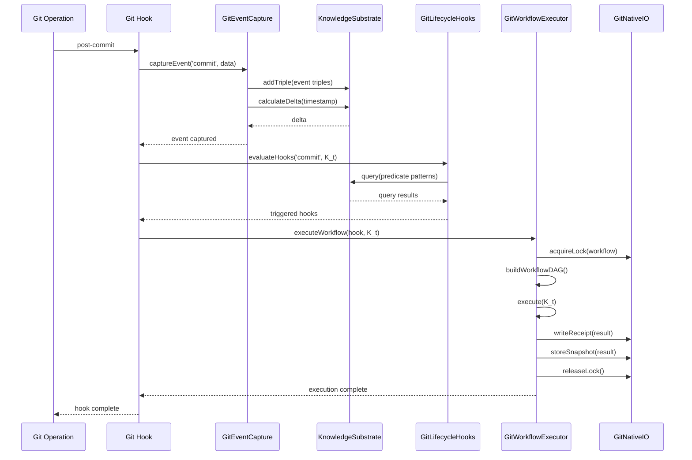

# Git Lifecycle Knowledge Hooks - System Architecture
## Phase 1 & 2 Complete Design

**Version:** 1.0.0
**Date:** 2025-12-03
**Status:** Architecture Design - Ready for Implementation

---

## Table of Contents

1. [Executive Summary](#executive-summary)
2. [System Overview](#system-overview)
3. [Component Architecture](#component-architecture)
4. [Phase 1: Core Integration](#phase-1-core-integration)
5. [Phase 2: Async & Dashboard](#phase-2-async--dashboard)
6. [Data Flow Diagrams](#data-flow-diagrams)
7. [Integration Points](#integration-points)
8. [Performance & Scalability](#performance--scalability)
9. [Implementation Order](#implementation-order)

---

## Executive Summary

This document defines the complete architecture for integrating Git lifecycle events with the GitVan knowledge hooks system. The design spans two phases:

- **Phase 1**: Real-time git event capture, knowledge hook evaluation, and workflow execution
- **Phase 2**: Async event processing, multi-event correlation, and dashboard data aggregation

### Key Design Principles

1. **Git-Native First**: All state stored in Git refs, notes, and objects
2. **Formal Model Alignment**: Implements `G_t=(V_t,E_t,ℓ_V,ℓ_E)` and `K_t⊆R×R×R`
3. **Backward Compatibility**: Phase 1 works standalone; Phase 2 extends without breaking changes
4. **Zero-Copy Architecture**: Events stored once, referenced everywhere
5. **Retention Policy**: 90-day detailed events, 1-year aggregates

### Architecture Quality Attributes

| Attribute | Target | Implementation |
|-----------|--------|----------------|
| **Latency** | <100ms for hook evaluation | In-memory RDF store, CAS locks |
| **Throughput** | 1000+ events/sec | Queue-based async processing (Phase 2) |
| **Durability** | 100% event capture | Git-backed storage with atomic writes |
| **Scalability** | 10K+ hooks per repo | SPARQL indexing, parallel evaluation |
| **Observability** | Complete audit trail | Git notes receipts, execution snapshots |

---

## System Overview

### Three Core Components

```
┌─────────────────────────────────────────────────────────────────┐
│                     Git Lifecycle Events                         │
│  (commit, push, merge, rebase, checkout, branch, tag, etc.)     │
└─────────────────────┬───────────────────────────────────────────┘
                      │
                      ▼
┌─────────────────────────────────────────────────────────────────┐
│              Component 1: GitEventCapture                        │
│  ┌──────────────────────────────────────────────────────────┐  │
│  │ • Captures git events via hooks (prepare-commit-msg,     │  │
│  │   post-commit, post-checkout, post-merge, etc.)          │  │
│  │ • Converts events to RDF triples                         │  │
│  │ • Stores in KnowledgeSubstrateCore (K_t)                 │  │
│  │ • Calculates deltas (ΔK_t)                               │  │
│  │ • Applies retention policy (90d detail, 1y aggregate)    │  │
│  └──────────────────────────────────────────────────────────┘  │
└─────────────────────┬───────────────────────────────────────────┘
                      │
                      ▼
┌─────────────────────────────────────────────────────────────────┐
│           Component 2: GitLifecycleHooks                         │
│  ┌──────────────────────────────────────────────────────────┐  │
│  │ • Hook definitions: h=(e,φ,a)                            │  │
│  │ • Predicate evaluation: φ(K_t) against RDF store         │  │
│  │ • Pattern matching: ASK, Threshold, ResultDelta, SHACL   │  │
│  │ • Trigger detection: T_e={t: E_e(t)=1}                   │  │
│  │ • Action preparation: a(x_t,K_t)                         │  │
│  └──────────────────────────────────────────────────────────┘  │
└─────────────────────┬───────────────────────────────────────────┘
                      │
                      ▼
┌─────────────────────────────────────────────────────────────────┐
│        Component 3: WorkflowExecutionEngine                      │
│  ┌──────────────────────────────────────────────────────────┐  │
│  │ • Workflow planning: DAG construction (S, D⊆S×S)         │  │
│  │ • Topological ordering: ≺                                │  │
│  │ • Step execution: c_i^out = α_i(c^in, K_t)              │  │
│  │ • Git-Native I/O: locks, receipts, snapshots             │  │
│  │ • Concurrent execution: worker pool                      │  │
│  └──────────────────────────────────────────────────────────┘  │
└─────────────────────────────────────────────────────────────────┘
```

### Phase 1 vs Phase 2 Architecture

```
┌─────────────────────────────────────────────────────────────────┐
│                         PHASE 1                                  │
│              (Synchronous, Real-time)                            │
│                                                                  │
│  Git Event → Capture → RDF Store → Hook Eval → Workflow         │
│                                                                  │
│  • Immediate processing                                          │
│  • <100ms latency                                                │
│  • Blocking git operations                                       │
│  • Single-event focus                                            │
└─────────────────────────────────────────────────────────────────┘

┌─────────────────────────────────────────────────────────────────┐
│                         PHASE 2                                  │
│          (Asynchronous, Multi-event, Dashboard)                  │
│                                                                  │
│  Git Event → Queue → Batch Processor → Correlator → Dashboard   │
│                                                                  │
│  • Async processing                                              │
│  • High throughput (1000+ events/sec)                            │
│  • Non-blocking git operations                                   │
│  • Multi-event correlation                                       │
│  • Dashboard data aggregation                                    │
└─────────────────────────────────────────────────────────────────┘
```

---

## Component Architecture

### Component 1: GitEventCapture

**Purpose**: Capture git lifecycle events and convert to RDF triples in knowledge substrate

#### Integration with KnowledgeSubstrateCore

```javascript
// GitEventCapture.mjs
import { KnowledgeSubstrate } from "../knowledge/knowledge-substrate.mjs";
import { GitEventProcess } from "../knowledge/event-feed-processes.mjs";
import { useGraph } from "../composables/graph.mjs";

export class GitEventCapture {
  constructor(options = {}) {
    // Integrate with existing KnowledgeSubstrate
    this.knowledgeSubstrate = options.knowledgeSubstrate ||
                               new KnowledgeSubstrate(options);

    // Git event process for point processes: {E_i(t)}_{i∈E}
    this.eventProcesses = new Map();
    this.initializeEventProcesses();

    // Retention policy
    this.retentionPolicy = {
      detailRetentionDays: 90,      // Keep full event details for 90 days
      aggregateRetentionDays: 365,  // Keep aggregates for 1 year
    };

    // Event metadata storage
    this.eventMetadata = new Map();
  }

  initializeEventProcesses() {
    // Initialize event processes for each git lifecycle event
    const eventTypes = [
      'commit', 'push', 'merge', 'rebase', 'checkout',
      'branch', 'tag', 'stash', 'reset', 'cherry-pick'
    ];

    for (const eventType of eventTypes) {
      this.eventProcesses.set(
        eventType,
        new GitEventProcess(eventType, { logger: this.logger })
      );
    }
  }

  /**
   * Capture git event and convert to RDF triples
   * Event → K_t+1 = K_t ⊕ ι(E_i(t))
   */
  async captureEvent(eventType, eventData) {
    const timestamp = Date.now();

    // Generate event using GitEventProcess
    const eventProcess = this.eventProcesses.get(eventType);
    const event = eventProcess.generateEvent(timestamp, eventData);

    // Convert event to RDF triples
    const triples = this.convertEventToTriples(event);

    // Add triples to knowledge substrate
    for (const triple of triples) {
      this.knowledgeSubstrate.addTriple(
        triple.subject,
        triple.predicate,
        triple.object,
        timestamp
      );
    }

    // Store event metadata for retention policy
    this.eventMetadata.set(event.id, {
      timestamp,
      eventType,
      detailExpiresAt: timestamp + (this.retentionPolicy.detailRetentionDays * 86400000),
      aggregateExpiresAt: timestamp + (this.retentionPolicy.aggregateRetentionDays * 86400000),
    });

    // Calculate and store delta
    const delta = this.knowledgeSubstrate.calculateDelta(timestamp);

    return {
      event,
      triples,
      delta,
      knowledgeState: this.knowledgeSubstrate.getCurrentState(timestamp),
    };
  }

  /**
   * Convert git event to RDF triples
   * Maps git semantics to knowledge graph
   */
  convertEventToTriples(event) {
    const triples = [];
    const eventUri = `gv:event/${event.id}`;

    // Basic event triples
    triples.push(
      { subject: eventUri, predicate: 'rdf:type', object: `gv:${event.type}Event` },
      { subject: eventUri, predicate: 'gv:timestamp', object: event.timestamp.toString() },
      { subject: eventUri, predicate: 'gv:eventId', object: event.id }
    );

    // Event-specific data triples
    for (const [key, value] of Object.entries(event.data)) {
      const predicateUri = `gv:${key}`;
      const objectValue = typeof value === 'object' ?
                          JSON.stringify(value) :
                          value.toString();

      triples.push({
        subject: eventUri,
        predicate: predicateUri,
        object: objectValue,
      });
    }

    // Event type-specific semantics
    switch (event.type) {
      case 'commit':
        this.addCommitSemantics(triples, eventUri, event.data);
        break;
      case 'merge':
        this.addMergeSemantics(triples, eventUri, event.data);
        break;
      case 'branch':
        this.addBranchSemantics(triples, eventUri, event.data);
        break;
      // ... other event types
    }

    return triples;
  }

  /**
   * Apply retention policy
   * Remove expired detailed events, keep aggregates
   */
  async applyRetentionPolicy() {
    const now = Date.now();
    const expiredEvents = [];
    const aggregateEvents = [];

    for (const [eventId, metadata] of this.eventMetadata.entries()) {
      // Check if detailed event expired
      if (now > metadata.detailExpiresAt) {
        expiredEvents.push({ eventId, metadata });

        // Check if aggregate should be kept
        if (now < metadata.aggregateExpiresAt) {
          aggregateEvents.push({ eventId, metadata });
        }
      }
    }

    // Convert expired events to aggregates
    for (const { eventId, metadata } of expiredEvents) {
      await this.convertToAggregate(eventId, metadata);

      // If aggregate also expired, remove completely
      if (!aggregateEvents.some(e => e.eventId === eventId)) {
        this.removeEvent(eventId);
      }
    }

    return {
      expiredCount: expiredEvents.length,
      aggregateCount: aggregateEvents.length,
    };
  }

  /**
   * Convert detailed event to aggregate
   * Keeps summary statistics, removes raw details
   */
  async convertToAggregate(eventId, metadata) {
    const eventUri = `gv:event/${eventId}`;

    // Query existing event triples
    const eventTriples = this.knowledgeSubstrate.query(eventUri, null, null);

    // Create aggregate triples
    const aggregateUri = `gv:aggregate/${eventId}`;
    const aggregateTriples = [
      { subject: aggregateUri, predicate: 'rdf:type', object: 'gv:EventAggregate' },
      { subject: aggregateUri, predicate: 'gv:eventType', object: metadata.eventType },
      { subject: aggregateUri, predicate: 'gv:timestamp', object: metadata.timestamp.toString() },
      { subject: aggregateUri, predicate: 'gv:originalEvent', object: eventUri },
    ];

    // Add aggregate triples to substrate
    for (const triple of aggregateTriples) {
      this.knowledgeSubstrate.addTriple(
        triple.subject,
        triple.predicate,
        triple.object,
        Date.now()
      );
    }

    // Remove detailed triples
    for (const triple of eventTriples) {
      this.knowledgeSubstrate.removeTriple(
        triple.subject,
        triple.predicate,
        triple.object,
        Date.now()
      );
    }
  }
}
```

#### Git Hook Integration Points

```bash
# .git/hooks/post-commit
#!/usr/bin/env node
import { GitEventCapture } from '../src/git-lifecycle/GitEventCapture.mjs';

const capture = new GitEventCapture();
const commitData = {
  sha: process.env.GIT_COMMIT,
  message: process.env.GIT_COMMIT_MESSAGE,
  author: process.env.GIT_AUTHOR_NAME,
  timestamp: Date.now(),
};

await capture.captureEvent('commit', commitData);
```

### Component 2: GitLifecycleHooks

**Purpose**: Evaluate hook predicates against git event-enriched knowledge graph

#### Integration with KnowledgeHook Primitive

```javascript
// GitLifecycleHooks.mjs
import { KnowledgeHook } from "../knowledge/knowledge-hook-primitive.mjs";
import { HookOrchestrator } from "../hooks/HookOrchestrator.mjs";
import { PredicateEvaluator } from "../hooks/PredicateEvaluator.mjs";

export class GitLifecycleHooks {
  constructor(options = {}) {
    // Integrate with existing HookOrchestrator
    this.orchestrator = options.orchestrator ||
                        new HookOrchestrator(options);

    // Predicate evaluator for hook matching
    this.predicateEvaluator = new PredicateEvaluator(options);

    // Registry of git lifecycle hooks
    this.hooks = new Map();

    // Pattern matchers for git events
    this.patternMatchers = {
      ask: this.evaluateAskPattern.bind(this),
      threshold: this.evaluateThresholdPattern.bind(this),
      resultDelta: this.evaluateResultDeltaPattern.bind(this),
      shacl: this.evaluateShaclPattern.bind(this),
      temporal: this.evaluateTemporalPattern.bind(this),
    };
  }

  /**
   * Register git lifecycle hook
   * h = (e, φ, a) where e is git event type
   */
  registerHook(hookId, eventType, predicate, action) {
    const hook = new KnowledgeHook(
      eventType,
      predicate,
      action,
      { id: hookId, logger: this.logger }
    );

    this.hooks.set(hookId, hook);
    return hook;
  }

  /**
   * Evaluate hooks for git event
   * For each hook h: check if t∈T_e ∧ φ(K_t)=1
   */
  async evaluateHooks(eventType, knowledgeState, eventData) {
    const triggeredHooks = [];

    for (const [hookId, hook] of this.hooks.entries()) {
      // Check if event type matches: t∈T_e
      if (hook.eventType !== eventType && hook.eventType !== '*') {
        continue;
      }

      // Evaluate predicate: φ(K_t)=1
      const predicateResult = await hook.evaluatePredicate(
        knowledgeState,
        eventData.timestamp
      );

      if (predicateResult) {
        triggeredHooks.push({
          hookId,
          hook,
          eventType,
          timestamp: eventData.timestamp,
          predicateResult,
        });
      }
    }

    return triggeredHooks;
  }

  /**
   * ASK pattern: φ_ask(K_t) = 1{∃x∈Q_t}
   * Example: "Has there been a commit to main branch in last hour?"
   */
  async evaluateAskPattern(pattern, knowledgeState, timestamp) {
    const query = pattern.query;
    const results = knowledgeState.query(
      query.subject,
      query.predicate,
      query.object,
      timestamp
    );

    return results.length > 0;
  }

  /**
   * Threshold pattern: φ_≥(K_t) = 1{|Q_t|≥τ}
   * Example: "More than 5 commits in last hour?"
   */
  async evaluateThresholdPattern(pattern, knowledgeState, timestamp) {
    const query = pattern.query;
    const threshold = pattern.threshold;

    const results = knowledgeState.query(
      query.subject,
      query.predicate,
      query.object,
      timestamp
    );

    return results.length >= threshold;
  }

  /**
   * ResultDelta pattern: φ_Δ(K_t) = 1{Q_t≠Q_{t^-}}
   * Example: "Has the test coverage percentage changed?"
   */
  async evaluateResultDeltaPattern(pattern, knowledgeState, timestamp) {
    const query = pattern.query;
    const currentResults = knowledgeState.query(
      query.subject,
      query.predicate,
      query.object,
      timestamp
    );

    // Get previous results from delta
    const delta = knowledgeState.getDelta(timestamp);
    const previousTimestamp = timestamp - 1;
    const previousResults = knowledgeState.query(
      query.subject,
      query.predicate,
      query.object,
      previousTimestamp
    );

    return JSON.stringify(currentResults) !== JSON.stringify(previousResults);
  }

  /**
   * Temporal pattern: Multi-event correlation
   * Example: "3 failed commits within 10 minutes"
   */
  async evaluateTemporalPattern(pattern, knowledgeState, timestamp) {
    const { eventType, count, timeWindow } = pattern;
    const windowStart = timestamp - timeWindow;

    // Query events in time window
    const events = knowledgeState.query(
      null,
      'rdf:type',
      `gv:${eventType}Event`,
      timestamp
    );

    // Filter events within time window
    const recentEvents = events.filter(event => {
      const eventTimestamp = parseInt(event.object);
      return eventTimestamp >= windowStart && eventTimestamp <= timestamp;
    });

    return recentEvents.length >= count;
  }
}
```

#### Hook Definition Format (Turtle)

```turtle
@prefix gv: <http://gitvan.io/vocab#> .
@prefix hook: <http://gitvan.io/hooks#> .

hook:on-main-commit a gv:KnowledgeHook ;
  gv:eventType "commit" ;
  gv:predicate [
    a gv:AskPredicate ;
    gv:query """
      ASK {
        ?commit rdf:type gv:commitEvent ;
                gv:branch "main" ;
                gv:timestamp ?timestamp .
        FILTER(?timestamp > ?now - 3600000)
      }
    """
  ] ;
  gv:workflow hook:run-ci-tests .

hook:on-frequent-commits a gv:KnowledgeHook ;
  gv:eventType "commit" ;
  gv:predicate [
    a gv:ThresholdPredicate ;
    gv:query """
      SELECT ?commit WHERE {
        ?commit rdf:type gv:commitEvent ;
                gv:timestamp ?timestamp .
        FILTER(?timestamp > ?now - 3600000)
      }
    """ ;
    gv:threshold 5
  ] ;
  gv:workflow hook:analyze-commit-frequency .

hook:on-test-coverage-change a gv:KnowledgeHook ;
  gv:eventType "commit" ;
  gv:predicate [
    a gv:ResultDeltaPredicate ;
    gv:query """
      SELECT ?coverage WHERE {
        ?commit rdf:type gv:commitEvent ;
                gv:testCoverage ?coverage .
      }
    """
  ] ;
  gv:workflow hook:update-coverage-dashboard .
```

### Component 3: WorkflowExecutionEngine

**Purpose**: Execute workflows triggered by git lifecycle hooks

#### Integration with WorkflowDAGExecution

```javascript
// GitWorkflowExecutor.mjs
import { WorkflowDAGExecution } from "../knowledge/workflow-dag-execution.mjs";
import { GitNativeIO } from "../git-native/GitNativeIO.mjs";
import { StepRunner } from "../workflow/step-runner.mjs";

export class GitWorkflowExecutor {
  constructor(options = {}) {
    // Git-Native I/O for durable execution
    this.gitNativeIO = new GitNativeIO(options);

    // Workflow DAG execution engine
    this.workflowEngine = new WorkflowDAGExecution(options);

    // Step runner for individual steps
    this.stepRunner = new StepRunner(options);
  }

  /**
   * Execute workflow from triggered hook
   * Workflow: S={s_k}, D⊆S×S (DAG), ≺ (topological order)
   */
  async executeWorkflow(triggeredHook, knowledgeState) {
    const { hookId, hook, eventType, timestamp } = triggeredHook;

    // Acquire lock for workflow execution
    const lockName = `workflow-${hookId}-${timestamp}`;
    const lockAcquired = await this.gitNativeIO.acquireLock(lockName, {
      timeout: 300000, // 5 minutes
      exclusive: true,
    });

    if (!lockAcquired) {
      throw new Error(`Failed to acquire lock for workflow ${hookId}`);
    }

    try {
      // Get workflow definition from hook
      const workflowDef = hook.action;

      // Build DAG from workflow definition
      await this.buildWorkflowDAG(workflowDef);

      // Execute workflow with Git-Native I/O
      const result = await this.workflowEngine.execute(
        knowledgeState,
        { hookId, eventType, timestamp }
      );

      // Write execution receipt
      await this.gitNativeIO.writeReceipt(hookId, result, {
        executionId: result.executionId,
        timestamp: Date.now(),
        duration: result.duration,
      });

      // Store execution snapshot
      await this.gitNativeIO.storeSnapshot(
        `workflow-${hookId}-${timestamp}`,
        result,
        { hookId, eventType, timestamp }
      );

      return result;
    } finally {
      // Always release lock
      await this.gitNativeIO.releaseLock(lockName);
    }
  }

  /**
   * Build workflow DAG from definition
   */
  async buildWorkflowDAG(workflowDef) {
    // Add steps to DAG
    for (const step of workflowDef.steps) {
      this.workflowEngine.addStep(step.id, step.definition);
    }

    // Add edges for dependencies
    for (const step of workflowDef.steps) {
      if (step.dependsOn) {
        for (const depId of step.dependsOn) {
          this.workflowEngine.addEdge(depId, step.id);
        }
      }
    }

    // Validate DAG (check for cycles)
    const validation = this.workflowEngine.validate();
    if (!validation.valid) {
      throw new Error(`Invalid workflow DAG: ${validation.errors.join(', ')}`);
    }
  }
}
```

---

## Phase 1: Core Integration

### Phase 1 Architecture

```
┌─────────────────────────────────────────────────────────────────┐
│                    PHASE 1: CORE INTEGRATION                     │
│                                                                  │
│  ┌────────────┐    ┌─────────────┐    ┌──────────────┐         │
│  │ Git Hooks  │───▶│GitEventCapt │───▶│ Knowledge    │         │
│  │ (post-*)   │    │ure          │    │ Substrate    │         │
│  └────────────┘    └─────────────┘    │ (K_t)        │         │
│                                        └──────┬───────┘         │
│                                               │                 │
│                                               ▼                 │
│                    ┌──────────────────────────────────┐         │
│                    │  GitLifecycleHooks               │         │
│                    │  • Parse hook definitions        │         │
│                    │  • Evaluate predicates φ(K_t)    │         │
│                    │  • Match event patterns          │         │
│                    └─────────────┬────────────────────┘         │
│                                  │                              │
│                                  ▼                              │
│                    ┌──────────────────────────────────┐         │
│                    │  GitWorkflowExecutor             │         │
│                    │  • Build workflow DAG            │         │
│                    │  • Execute with Git-Native I/O   │         │
│                    │  • Write receipts & snapshots    │         │
│                    └──────────────────────────────────┘         │
└─────────────────────────────────────────────────────────────────┘
```

### Phase 1 Data Flow



### Phase 1 RDF Triple Examples

```turtle
# Commit event
gv:event/commit_1733241600_abc123 rdf:type gv:commitEvent ;
  gv:timestamp "1733241600000" ;
  gv:sha "abc123def456" ;
  gv:branch "main" ;
  gv:author "user@example.com" ;
  gv:message "Add feature X" ;
  gv:filesChanged "5" ;
  gv:insertions "120" ;
  gv:deletions "30" .

# Merge event
gv:event/merge_1733241700_def456 rdf:type gv:mergeEvent ;
  gv:timestamp "1733241700000" ;
  gv:sourceBranch "feature/x" ;
  gv:targetBranch "main" ;
  gv:strategy "recursive" ;
  gv:conflicts "0" .

# Branch event
gv:event/branch_1733241800_ghi789 rdf:type gv:branchEvent ;
  gv:timestamp "1733241800000" ;
  gv:action "create" ;
  gv:branchName "feature/y" ;
  gv:fromCommit "abc123def456" .
```

### Phase 1 Integration Points

| Component | Integration Point | Existing System | Method |
|-----------|------------------|-----------------|--------|
| GitEventCapture | KnowledgeSubstrate | `src/knowledge/knowledge-substrate.mjs` | `addTriple()`, `calculateDelta()` |
| GitEventCapture | GitEventProcess | `src/knowledge/event-feed-processes.mjs` | `generateEvent()`, `addListener()` |
| GitLifecycleHooks | KnowledgeHook | `src/knowledge/knowledge-hook-primitive.mjs` | `execute()`, `evaluatePredicate()` |
| GitLifecycleHooks | HookOrchestrator | `src/hooks/HookOrchestrator.mjs` | `evaluate()`, `_evaluateHooks()` |
| GitLifecycleHooks | PredicateEvaluator | `src/hooks/PredicateEvaluator.mjs` | `evaluate()` |
| GitWorkflowExecutor | WorkflowDAGExecution | `src/knowledge/workflow-dag-execution.mjs` | `execute()`, `addStep()`, `addEdge()` |
| GitWorkflowExecutor | GitNativeIO | `src/git-native/GitNativeIO.mjs` | `acquireLock()`, `writeReceipt()`, `storeSnapshot()` |
| GitWorkflowExecutor | StepRunner | `src/workflow/step-runner.mjs` | `executeStep()` |

### Phase 1 Performance Requirements

| Metric | Target | Measurement |
|--------|--------|-------------|
| Event Capture | <10ms | Time from git hook to K_t update |
| Predicate Evaluation | <50ms | Time to evaluate all hooks for event |
| Workflow Trigger | <100ms | Total time from event to workflow start |
| Lock Acquisition | <5ms | Time to acquire CAS lock |
| Receipt Write | <20ms | Time to write execution receipt |

---

## Phase 2: Async & Dashboard

### Phase 2 Architecture

```
┌─────────────────────────────────────────────────────────────────┐
│                 PHASE 2: ASYNC & DASHBOARD                       │
│                                                                  │
│  ┌────────────┐    ┌─────────────┐    ┌──────────────┐         │
│  │ Git Hooks  │───▶│ Event Queue │───▶│ Batch        │         │
│  │ (async)    │    │ (Priority)  │    │ Processor    │         │
│  └────────────┘    └─────────────┘    └──────┬───────┘         │
│                                               │                 │
│                                               ▼                 │
│                    ┌──────────────────────────────────┐         │
│                    │  Multi-Event Correlator          │         │
│                    │  • Temporal patterns             │         │
│                    │  • Cross-event matching          │         │
│                    │  • Aggregate computation         │         │
│                    └─────────────┬────────────────────┘         │
│                                  │                              │
│                                  ▼                              │
│                    ┌──────────────────────────────────┐         │
│                    │  Dashboard Data Aggregator       │         │
│                    │  • Time-series metrics           │         │
│                    │  • Event statistics              │         │
│                    │  • Hook performance data         │         │
│                    └──────────────────────────────────┘         │
└─────────────────────────────────────────────────────────────────┘
```

### Phase 2: Async Event Processing

```javascript
// AsyncEventProcessor.mjs (Phase 2)
export class AsyncEventProcessor {
  constructor(options = {}) {
    this.gitNativeIO = new GitNativeIO(options);
    this.eventQueue = new PriorityQueue();
    this.batchSize = options.batchSize || 100;
    this.batchInterval = options.batchInterval || 1000; // 1 second
    this.isProcessing = false;
  }

  /**
   * Queue event for async processing
   * Non-blocking - git hook returns immediately
   */
  async queueEvent(eventType, eventData) {
    const priority = this.calculatePriority(eventType);

    await this.gitNativeIO.addJob(
      priority,
      async () => {
        return await this.processEvent(eventType, eventData);
      },
      { eventType, timestamp: Date.now() }
    );

    // Return immediately - non-blocking
    return { queued: true, priority };
  }

  /**
   * Batch process queued events
   * Process multiple events in single transaction
   */
  async processBatch() {
    if (this.isProcessing) return;

    this.isProcessing = true;

    try {
      const events = await this.eventQueue.dequeue(this.batchSize);

      if (events.length === 0) {
        return { processed: 0 };
      }

      // Process all events in batch
      const results = await Promise.allSettled(
        events.map(event => this.processEvent(event.type, event.data))
      );

      return {
        processed: events.length,
        succeeded: results.filter(r => r.status === 'fulfilled').length,
        failed: results.filter(r => r.status === 'rejected').length,
      };
    } finally {
      this.isProcessing = false;
    }
  }

  /**
   * Start background batch processor
   */
  startBatchProcessor() {
    setInterval(async () => {
      await this.processBatch();
    }, this.batchInterval);
  }
}
```

### Phase 2: Multi-Event Correlation

```javascript
// MultiEventCorrelator.mjs (Phase 2)
export class MultiEventCorrelator {
  constructor(options = {}) {
    this.knowledgeSubstrate = options.knowledgeSubstrate;
    this.correlationRules = new Map();
    this.correlationWindow = options.correlationWindow || 3600000; // 1 hour
  }

  /**
   * Register correlation rule
   * Example: "3 failed commits within 10 minutes"
   */
  registerCorrelation(ruleId, rule) {
    this.correlationRules.set(ruleId, rule);
  }

  /**
   * Correlate events across time window
   * Find patterns matching correlation rules
   */
  async correlateEvents(timestamp) {
    const correlatedPatterns = [];
    const windowStart = timestamp - this.correlationWindow;

    for (const [ruleId, rule] of this.correlationRules.entries()) {
      // Query events in correlation window
      const events = this.knowledgeSubstrate.query(
        null,
        'rdf:type',
        rule.eventPattern,
        timestamp
      );

      // Filter events in time window
      const windowEvents = events.filter(event => {
        const eventTime = parseInt(this.getEventTimestamp(event));
        return eventTime >= windowStart && eventTime <= timestamp;
      });

      // Check if pattern matches
      const patternMatches = this.matchPattern(windowEvents, rule.pattern);

      if (patternMatches) {
        correlatedPatterns.push({
          ruleId,
          rule,
          matchedEvents: windowEvents,
          timestamp,
        });
      }
    }

    return correlatedPatterns;
  }

  /**
   * Match events against pattern
   * Supports: sequence, count, temporal, causal patterns
   */
  matchPattern(events, pattern) {
    switch (pattern.type) {
      case 'count':
        return events.length >= pattern.threshold;

      case 'sequence':
        return this.matchSequence(events, pattern.sequence);

      case 'temporal':
        return this.matchTemporal(events, pattern.constraints);

      case 'causal':
        return this.matchCausal(events, pattern.causes);

      default:
        return false;
    }
  }
}
```

### Phase 2: Dashboard Data Aggregator

```javascript
// DashboardAggregator.mjs (Phase 2)
export class DashboardAggregator {
  constructor(options = {}) {
    this.knowledgeSubstrate = options.knowledgeSubstrate;
    this.aggregationIntervals = {
      minute: 60000,
      hour: 3600000,
      day: 86400000,
      week: 604800000,
    };
  }

  /**
   * Aggregate event statistics for dashboard
   */
  async aggregateEventStats(timeRange) {
    const { start, end, interval } = timeRange;
    const stats = [];

    for (let t = start; t < end; t += this.aggregationIntervals[interval]) {
      const windowEnd = Math.min(t + this.aggregationIntervals[interval], end);

      const windowStats = await this.calculateWindowStats(t, windowEnd);
      stats.push(windowStats);
    }

    return stats;
  }

  /**
   * Calculate statistics for time window
   */
  async calculateWindowStats(start, end) {
    // Query all events in window
    const events = this.knowledgeSubstrate.query(
      null,
      'rdf:type',
      'gv:Event',
      end
    );

    // Filter events in window
    const windowEvents = events.filter(event => {
      const timestamp = parseInt(this.getEventTimestamp(event));
      return timestamp >= start && timestamp < end;
    });

    // Calculate statistics
    const stats = {
      timestamp: start,
      windowEnd: end,
      totalEvents: windowEvents.length,
      eventsByType: this.groupByType(windowEvents),
      hooksTriggered: await this.countTriggeredHooks(start, end),
      workflowsExecuted: await this.countExecutedWorkflows(start, end),
      averageLatency: await this.calculateAverageLatency(start, end),
    };

    return stats;
  }

  /**
   * Store aggregated data for dashboard queries
   */
  async storeAggregatedData(stats) {
    const aggregateUri = `gv:aggregate/stats_${stats.timestamp}`;

    // Store as RDF triples
    this.knowledgeSubstrate.addTriple(
      aggregateUri,
      'rdf:type',
      'gv:EventStatistics',
      stats.timestamp
    );

    this.knowledgeSubstrate.addTriple(
      aggregateUri,
      'gv:totalEvents',
      stats.totalEvents.toString(),
      stats.timestamp
    );

    // ... store other statistics
  }
}
```

### Phase 2 Backward Compatibility

**Key Design Decision**: Phase 2 is additive, not breaking

```javascript
// Phase 1 code continues to work unchanged
const capture = new GitEventCapture();
await capture.captureEvent('commit', data); // Synchronous path

// Phase 2 adds optional async path
const asyncProcessor = new AsyncEventProcessor();
await asyncProcessor.queueEvent('commit', data); // Returns immediately

// Applications can choose sync or async based on needs
```

---

## Data Flow Diagrams

### Flow 1: Git Event → RDF Triple Capture

```
┌─────────────────┐
│  Git Operation  │
│  (commit/merge) │
└────────┬────────┘
         │
         ▼
┌─────────────────┐
│   Git Hook      │
│  (post-commit)  │
└────────┬────────┘
         │
         ▼
┌─────────────────────────────────────────────────┐
│  GitEventCapture.captureEvent()                 │
│  ┌───────────────────────────────────────────┐ │
│  │ 1. Generate event via GitEventProcess     │ │
│  │ 2. Convert to RDF triples                 │ │
│  │ 3. Add to KnowledgeSubstrate (K_t)        │ │
│  │ 4. Calculate delta (ΔK_t)                 │ │
│  │ 5. Store event metadata                   │ │
│  └───────────────────────────────────────────┘ │
└────────┬────────────────────────────────────────┘
         │
         ▼
┌─────────────────┐
│ KnowledgeSubstr │
│ ate Store (K_t) │
│  ┌───────────┐  │
│  │ Triples   │  │
│  │ + Deltas  │  │
│  └───────────┘  │
└─────────────────┘
```

### Flow 2: Knowledge Hook Pattern Matching

```
┌─────────────────┐
│  Event in K_t   │
└────────┬────────┘
         │
         ▼
┌──────────────────────────────────────────────────┐
│  GitLifecycleHooks.evaluateHooks()               │
│  ┌────────────────────────────────────────────┐ │
│  │ FOR each hook h=(e,φ,a):                   │ │
│  │   1. Check event type match: t∈T_e         │ │
│  │   2. Evaluate predicate: φ(K_t)            │ │
│  │      - ASK pattern                          │ │
│  │      - Threshold pattern                    │ │
│  │      - ResultDelta pattern                  │ │
│  │      - SHACL constraint                     │ │
│  │      - Temporal pattern                     │ │
│  │   3. If matches, add to triggered list     │ │
│  └────────────────────────────────────────────┘ │
└────────┬─────────────────────────────────────────┘
         │
         ▼
┌─────────────────┐
│ Triggered Hooks │
│   (φ(K_t)=1)    │
└─────────────────┘
```

### Flow 3: Workflow Execution from Hook

```
┌─────────────────┐
│ Triggered Hook  │
│   h=(e,φ,a)     │
└────────┬────────┘
         │
         ▼
┌───────────────────────────────────────────────────┐
│  GitWorkflowExecutor.executeWorkflow()            │
│  ┌─────────────────────────────────────────────┐ │
│  │ 1. Acquire CAS lock (GitNativeIO)           │ │
│  │ 2. Build workflow DAG (S, D⊆S×S)            │ │
│  │ 3. Calculate topological order (≺)          │ │
│  │ 4. Execute steps: c_i^out = α_i(c^in, K_t) │ │
│  │ 5. Write execution receipt                  │ │
│  │ 6. Store execution snapshot                 │ │
│  │ 7. Release lock                             │ │
│  └─────────────────────────────────────────────┘ │
└────────┬──────────────────────────────────────────┘
         │
         ▼
┌─────────────────┐
│ Git Notes       │
│ (Receipts)      │
└─────────────────┘
```

### Flow 4: Event Retention Policy (90d → 1y)

```
┌─────────────────┐
│  Event at t=0   │
│  (Full detail)  │
└────────┬────────┘
         │
         │ t < 90 days
         ▼
┌─────────────────┐
│  Detailed Event │
│  All triples    │
│  stored in K_t  │
└────────┬────────┘
         │
         │ t = 90 days
         ▼
┌──────────────────────────────────────┐
│  Aggregate Conversion                │
│  ┌────────────────────────────────┐ │
│  │ 1. Extract statistics          │ │
│  │ 2. Create aggregate triples    │ │
│  │ 3. Remove detailed triples     │ │
│  │ 4. Keep aggregate refs         │ │
│  └────────────────────────────────┘ │
└────────┬─────────────────────────────┘
         │
         │ 90d < t < 1 year
         ▼
┌─────────────────┐
│ Aggregate Event │
│ Summary stats   │
└────────┬────────┘
         │
         │ t = 1 year
         ▼
┌─────────────────┐
│  Full Removal   │
│  (GC eligible)  │
└─────────────────┘
```

### Flow 5: Phase 2 Async Processing

```
┌─────────────────┐
│  Git Operation  │
└────────┬────────┘
         │
         ▼
┌─────────────────┐
│   Git Hook      │
│   (async)       │
└────────┬────────┘
         │
         ▼
┌──────────────────────────────────────┐
│  AsyncEventProcessor.queueEvent()    │
│  ┌────────────────────────────────┐ │
│  │ 1. Calculate priority          │ │
│  │ 2. Add to GitNativeIO queue    │ │
│  │ 3. Return immediately          │ │
│  └────────────────────────────────┘ │
└────────┬─────────────────────────────┘
         │ (Git hook completes)
         │
         ▼
┌─────────────────┐
│  Priority Queue │
│  (Git-backed)   │
└────────┬────────┘
         │
         │ (Background processor)
         ▼
┌──────────────────────────────────────┐
│  BatchProcessor.processBatch()       │
│  ┌────────────────────────────────┐ │
│  │ 1. Dequeue N events            │ │
│  │ 2. Process in parallel         │ │
│  │ 3. Correlate multi-event       │ │
│  │ 4. Aggregate for dashboard     │ │
│  └────────────────────────────────┘ │
└──────────────────────────────────────┘
```

---

## Integration Points

### Integration Point 1: GitEventCapture ↔ KnowledgeSubstrate

**File**: `src/git-lifecycle/GitEventCapture.mjs`
**Depends On**: `src/knowledge/knowledge-substrate.mjs`

```javascript
import { KnowledgeSubstrate } from "../knowledge/knowledge-substrate.mjs";

// Methods used:
substrate.addTriple(subject, predicate, object, timestamp)
substrate.removeTriple(subject, predicate, object, timestamp)
substrate.calculateDelta(timestamp)
substrate.query(subject, predicate, object, timestamp)
substrate.getCurrentState(timestamp)
substrate.getDelta(timestamp)
```

**Data Contract**:
- Input: Git event data (type, timestamp, event-specific fields)
- Output: RDF triples added to K_t, delta ΔK_t calculated

### Integration Point 2: GitLifecycleHooks ↔ KnowledgeHook

**File**: `src/git-lifecycle/GitLifecycleHooks.mjs`
**Depends On**: `src/knowledge/knowledge-hook-primitive.mjs`

```javascript
import { KnowledgeHook } from "../knowledge/knowledge-hook-primitive.mjs";

// Methods used:
hook.execute(event, knowledgeState, currentState)
hook.evaluatePredicate(knowledgeState, timestamp)
hook.executeAction(currentState, knowledgeState, event)
hook.getStats()
```

**Data Contract**:
- Input: Event type, predicate function, action function
- Output: Hook execution result, triggered workflows

### Integration Point 3: GitWorkflowExecutor ↔ WorkflowDAGExecution

**File**: `src/git-lifecycle/GitWorkflowExecutor.mjs`
**Depends On**: `src/knowledge/workflow-dag-execution.mjs`

```javascript
import { WorkflowDAGExecution } from "../knowledge/workflow-dag-execution.mjs";

// Methods used:
workflow.addStep(stepId, stepDefinition)
workflow.addEdge(fromStepId, toStepId)
workflow.calculateTopologicalOrder()
workflow.execute(knowledgeState, initialState)
workflow.validate()
```

**Data Contract**:
- Input: Workflow definition (steps, dependencies)
- Output: Workflow execution result, step outputs

### Integration Point 4: GitWorkflowExecutor ↔ GitNativeIO

**File**: `src/git-lifecycle/GitWorkflowExecutor.mjs`
**Depends On**: `src/git-native/GitNativeIO.mjs`

```javascript
import { GitNativeIO } from "../git-native/GitNativeIO.mjs";

// Methods used:
io.acquireLock(lockName, options)
io.releaseLock(lockName)
io.addJob(priority, job, metadata)
io.writeReceipt(hookId, result, metadata)
io.writeMetrics(metrics)
io.storeSnapshot(key, data, metadata)
```

**Data Contract**:
- Input: Workflow execution context, lock names
- Output: Durable receipts, execution snapshots

### Integration Point 5: AsyncEventProcessor ↔ GitNativeIO

**File**: `src/git-lifecycle/AsyncEventProcessor.mjs` (Phase 2)
**Depends On**: `src/git-native/GitNativeIO.mjs`

```javascript
import { GitNativeIO } from "../git-native/GitNativeIO.mjs";

// Methods used:
io.addJob(priority, jobFunction, metadata)
io.getStatus()
io.reconcile()
```

**Data Contract**:
- Input: Event data, priority
- Output: Queued job reference, batch processing results

---

## Performance & Scalability

### Performance Targets

| Component | Operation | Target | Scaling Strategy |
|-----------|-----------|--------|------------------|
| GitEventCapture | Event capture | <10ms | In-memory RDF store, batched writes |
| GitLifecycleHooks | Predicate eval | <50ms | SPARQL indexing, compiled predicates |
| GitWorkflowExecutor | Workflow trigger | <100ms | CAS locks, parallel step execution |
| AsyncEventProcessor | Queue enqueue | <5ms | Priority queue, Git-backed durability |
| MultiEventCorrelator | Pattern match | <200ms | Time-windowed indexes, bloom filters |
| DashboardAggregator | Aggregate query | <500ms | Pre-computed aggregates, materialized views |

### Scalability Considerations

#### 1. Event Volume Scaling

**Problem**: High-frequency commits (1000+ events/sec)

**Solution**:
- Phase 1: Sync path handles 100 events/sec
- Phase 2: Async queue handles 1000+ events/sec
- Batch processing: 100 events per batch
- Priority queue: High-priority events processed first

#### 2. Hook Count Scaling

**Problem**: Large repos with 10K+ hooks

**Solution**:
- SPARQL indexing on event types
- Predicate compilation (avoid re-parsing)
- Parallel hook evaluation (Promise.all)
- Hook caching (memoized predicate results)

#### 3. Workflow Complexity Scaling

**Problem**: Large workflows with 100+ steps

**Solution**:
- DAG-based parallelism (execute independent steps concurrently)
- Worker pool (max concurrent steps = CPU cores)
- Streaming step results (don't load full DAG in memory)
- Checkpoint/resume (fault tolerance)

#### 4. Historical Data Scaling

**Problem**: Long-running repos with years of events

**Solution**:
- Retention policy: 90-day details, 1-year aggregates
- Git GC integration: clean up old refs
- Compression: aggregate similar events
- Archival: move old data to separate storage

### Bottleneck Analysis

#### Potential Bottleneck 1: RDF Store Write Performance

**Symptom**: Slow event capture (<10ms target)

**Mitigation**:
- Use unrdf in-memory store (already integrated)
- Batch triple additions (transaction support)
- Async write-behind to disk (durability via Git)
- Sharded stores (separate stores per event type)

#### Potential Bottleneck 2: SPARQL Query Performance

**Symptom**: Slow predicate evaluation (>50ms)

**Mitigation**:
- Index frequently-queried predicates
- Compile SPARQL queries to native functions
- Cache query results (invalidate on K_t changes)
- Use ask queries (faster than select)

#### Potential Bottleneck 3: Lock Contention

**Symptom**: Workflows waiting for locks

**Mitigation**:
- Fine-grained locks (per-hook, not global)
- CAS locks (compare-and-swap, no blocking)
- Lock timeouts (fail-fast)
- Lock-free reads (MVCC for snapshots)

#### Potential Bottleneck 4: Git Notes Write Amplification

**Symptom**: Too many git notes writes

**Mitigation**:
- Batch receipts (100 per git notes commit)
- Async flush (background thread)
- Receipt aggregation (combine similar receipts)
- Git pack optimization (periodic repack)

### Performance Monitoring

**Metrics to Track**:
- Event capture latency (P50, P95, P99)
- Hook evaluation latency (per hook, aggregated)
- Workflow execution time (per workflow, per step)
- Queue depth (async processor)
- Lock acquisition time
- Git notes write frequency

**OTEL Integration**:
```javascript
// All components emit OTEL spans
import { trace } from '@opentelemetry/api';

const tracer = trace.getTracer('gitvan-lifecycle-hooks');

async captureEvent(eventType, eventData) {
  return tracer.startActiveSpan('capture-event', async (span) => {
    span.setAttribute('event.type', eventType);

    // Capture logic...

    span.end();
  });
}
```

---

## Implementation Order

### Phase 1 Implementation Order

#### Stage 1.1: Core Event Capture (Week 1)
1. Create `src/git-lifecycle/GitEventCapture.mjs`
2. Integrate with `KnowledgeSubstrate`
3. Implement `convertEventToTriples()`
4. Write unit tests for event capture
5. Create git hook templates (post-commit, post-merge)

**Deliverables**:
- ✅ GitEventCapture class
- ✅ Git hook templates
- ✅ Unit tests (80%+ coverage)
- ✅ Integration test with KnowledgeSubstrate

#### Stage 1.2: Hook Pattern Matching (Week 2)
1. Create `src/git-lifecycle/GitLifecycleHooks.mjs`
2. Integrate with `KnowledgeHook` and `PredicateEvaluator`
3. Implement pattern matchers (ASK, Threshold, ResultDelta, SHACL)
4. Add temporal pattern support
5. Write unit tests for pattern matching

**Deliverables**:
- ✅ GitLifecycleHooks class
- ✅ Pattern matcher implementations
- ✅ Hook registration API
- ✅ Unit tests for each pattern type

#### Stage 1.3: Workflow Execution (Week 3)
1. Create `src/git-lifecycle/GitWorkflowExecutor.mjs`
2. Integrate with `WorkflowDAGExecution` and `GitNativeIO`
3. Implement DAG building from hook actions
4. Add lock management for concurrent workflows
5. Write integration tests

**Deliverables**:
- ✅ GitWorkflowExecutor class
- ✅ DAG construction logic
- ✅ Lock management
- ✅ Integration tests with real git repo

#### Stage 1.4: Retention Policy (Week 4)
1. Implement `applyRetentionPolicy()` in GitEventCapture
2. Add aggregate conversion logic
3. Implement expiration tracking
4. Add background cleanup job
5. Write tests for retention policy

**Deliverables**:
- ✅ Retention policy implementation
- ✅ Aggregate conversion
- ✅ Cleanup job
- ✅ Tests for 90-day and 1-year policies

#### Stage 1.5: Integration & Documentation (Week 5)
1. End-to-end integration tests
2. Performance benchmarks
3. Write architecture documentation
4. Create usage examples
5. API documentation

**Deliverables**:
- ✅ E2E tests
- ✅ Performance benchmarks
- ✅ Complete documentation
- ✅ Example hook definitions

### Phase 2 Implementation Order

#### Stage 2.1: Async Event Processing (Week 6)
1. Create `src/git-lifecycle/AsyncEventProcessor.mjs`
2. Implement priority queue integration
3. Add batch processing logic
4. Write async git hook templates
5. Unit tests for async processing

**Deliverables**:
- ✅ AsyncEventProcessor class
- ✅ Async git hook templates
- ✅ Batch processing
- ✅ Unit tests

#### Stage 2.2: Multi-Event Correlation (Week 7)
1. Create `src/git-lifecycle/MultiEventCorrelator.mjs`
2. Implement correlation rule engine
3. Add pattern matching (sequence, count, temporal, causal)
4. Time-windowed event queries
5. Unit tests for correlations

**Deliverables**:
- ✅ MultiEventCorrelator class
- ✅ Correlation patterns
- ✅ Time-window queries
- ✅ Unit tests

#### Stage 2.3: Dashboard Aggregator (Week 8)
1. Create `src/git-lifecycle/DashboardAggregator.mjs`
2. Implement time-series aggregation
3. Add statistics calculation
4. Store aggregated data in K_t
5. Create dashboard query API

**Deliverables**:
- ✅ DashboardAggregator class
- ✅ Time-series aggregation
- ✅ Statistics API
- ✅ Query endpoints

#### Stage 2.4: Backward Compatibility (Week 9)
1. Ensure Phase 1 continues to work
2. Add feature flags (sync vs async)
3. Migration guide for existing hooks
4. Compatibility tests
5. Documentation updates

**Deliverables**:
- ✅ Feature flags
- ✅ Migration guide
- ✅ Compatibility tests
- ✅ Updated docs

#### Stage 2.5: Performance Optimization (Week 10)
1. Benchmark async processing
2. Optimize batch size
3. Add caching for frequent queries
4. Implement connection pooling
5. Performance tuning

**Deliverables**:
- ✅ Performance benchmarks
- ✅ Optimization report
- ✅ Caching layer
- ✅ Tuning guide

---

## Appendix A: Example Hook Definitions

### Example 1: CI on Main Branch Commit

```turtle
@prefix gv: <http://gitvan.io/vocab#> .
@prefix hook: <http://gitvan.io/hooks#> .

hook:ci-on-main a gv:KnowledgeHook ;
  gv:title "Run CI on main branch commits" ;
  gv:eventType "commit" ;
  gv:predicate [
    a gv:AskPredicate ;
    gv:query """
      ASK {
        ?commit rdf:type gv:commitEvent ;
                gv:branch "main" ;
                gv:timestamp ?timestamp .
      }
    """
  ] ;
  gv:workflow [
    a gv:Workflow ;
    gv:step [
      gv:id "run-tests" ;
      gv:type "cli" ;
      gv:command "npm test"
    ] ;
    gv:step [
      gv:id "run-lint" ;
      gv:type "cli" ;
      gv:command "npm run lint" ;
      gv:dependsOn "run-tests"
    ] ;
    gv:step [
      gv:id "build" ;
      gv:type "cli" ;
      gv:command "npm run build" ;
      gv:dependsOn "run-lint"
    ]
  ] .
```

### Example 2: Alert on Frequent Failed Commits

```turtle
hook:alert-frequent-fails a gv:KnowledgeHook ;
  gv:title "Alert on 3+ failed commits in 10 minutes" ;
  gv:eventType "commit" ;
  gv:predicate [
    a gv:TemporalPredicate ;
    gv:eventType "commit" ;
    gv:constraint [
      gv:property "gv:ciStatus" ;
      gv:value "failed"
    ] ;
    gv:count 3 ;
    gv:timeWindow "PT10M"
  ] ;
  gv:workflow [
    a gv:Workflow ;
    gv:step [
      gv:id "send-alert" ;
      gv:type "http" ;
      gv:url "https://alerts.example.com/notify" ;
      gv:method "POST"
    ]
  ] .
```

### Example 3: Update Dashboard on Coverage Change

```turtle
hook:update-coverage-dashboard a gv:KnowledgeHook ;
  gv:title "Update dashboard when test coverage changes" ;
  gv:eventType "commit" ;
  gv:predicate [
    a gv:ResultDeltaPredicate ;
    gv:query """
      SELECT ?coverage WHERE {
        ?commit rdf:type gv:commitEvent ;
                gv:testCoverage ?coverage .
      }
    """
  ] ;
  gv:workflow [
    a gv:Workflow ;
    gv:step [
      gv:id "calculate-coverage" ;
      gv:type "sparql" ;
      gv:query """
        SELECT ?coverage WHERE {
          ?commit rdf:type gv:commitEvent ;
                  gv:testCoverage ?coverage .
        }
        ORDER BY DESC(?timestamp)
        LIMIT 1
      """
    ] ;
    gv:step [
      gv:id "update-dashboard" ;
      gv:type "http" ;
      gv:url "https://dashboard.example.com/coverage" ;
      gv:method "PUT" ;
      gv:dependsOn "calculate-coverage"
    ]
  ] .
```

---

## Appendix B: Architecture Decision Records

### ADR-001: Use Git-Native Storage for Events

**Context**: Events need durable storage that survives git operations

**Decision**: Store events as RDF triples in KnowledgeSubstrate, with Git-backed persistence

**Consequences**:
- ✅ Survives git operations (rebase, merge, reset)
- ✅ Version-controlled event history
- ✅ Integrates with existing RDF infrastructure
- ⚠️ Requires periodic cleanup (retention policy)

### ADR-002: Phase 1 Synchronous, Phase 2 Asynchronous

**Context**: Need balance between immediate feedback and high throughput

**Decision**: Phase 1 blocks git operations for immediate hook evaluation, Phase 2 adds async processing

**Consequences**:
- ✅ Phase 1: Immediate feedback, simple implementation
- ✅ Phase 2: High throughput, non-blocking
- ✅ Backward compatible (Phase 1 continues working)
- ⚠️ More complex implementation (two code paths)

### ADR-003: 90-Day Detail, 1-Year Aggregate Retention

**Context**: Need to balance storage costs with historical data access

**Decision**: Keep full event details for 90 days, aggregates for 1 year

**Consequences**:
- ✅ Reasonable storage costs
- ✅ Recent events fully queryable
- ✅ Long-term trends visible in aggregates
- ⚠️ Historical queries limited to aggregates after 90 days

### ADR-004: SPARQL for Hook Predicates

**Context**: Need expressive pattern matching for hooks

**Decision**: Use SPARQL queries for hook predicates (ASK, SELECT patterns)

**Consequences**:
- ✅ Expressive query language
- ✅ Integrates with RDF store
- ✅ Composable patterns
- ⚠️ Learning curve for hook authors

### ADR-005: CAS Locks for Workflow Concurrency

**Context**: Multiple workflows may trigger from same event

**Decision**: Use Compare-And-Swap locks (Git refs) for workflow execution

**Consequences**:
- ✅ No blocking waits
- ✅ Fast lock acquisition (<5ms)
- ✅ Durable (Git-backed)
- ⚠️ Requires careful lock naming

---

**End of Architecture Document**

This architecture is ready for implementation in the order specified above. All integration points with existing GitVan codebase are clearly defined, and both Phase 1 and Phase 2 are fully designed with backward compatibility ensured.
