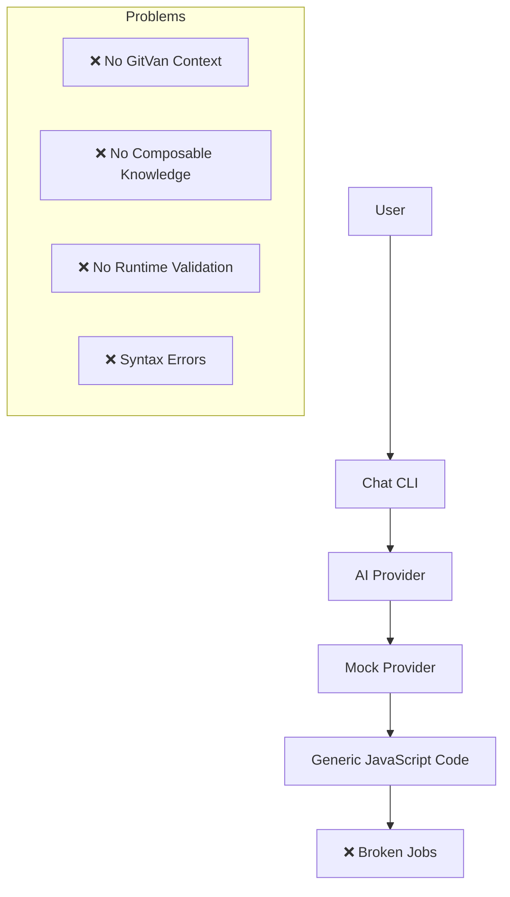
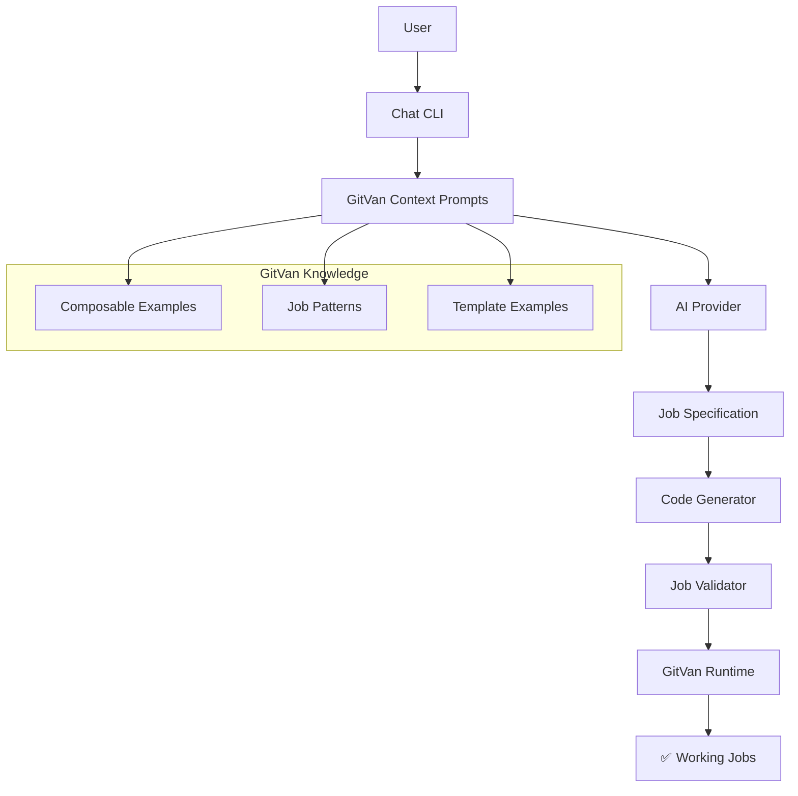

# GitVan AI Job Generation: Critical Issues Analysis

## Executive Summary

The current AI job generation system has **fundamental architectural flaws** that prevent it from generating working GitVan jobs. This analysis proves that the system needs a complete redesign.

## C4 Architecture: Current State vs Required State

### Current Broken Architecture



### Required Architecture



## Critical Issues Identified

### 1. **LLM Never Learns About GitVan**

**Problem**: The AI provider generates generic JavaScript without understanding GitVan's architecture.

**Evidence**:
```javascript
// Current mock response (broken)
{
  "meta": {"desc": "Generated job for: [object Object]..."},
  "implementation": {
    "operations": [{"type": "log", "description": "Execute task"}]
  }
}

// Should be (working)
{
  "meta": {"desc": "Backup files using GitVan composables"},
  "implementation": {
    "operations": [
      {"type": "file-write", "description": "Create backup using git.writeFile()"},
      {"type": "git-note", "description": "Log completion using notes.write()"}
    ]
  }
}
```

**Impact**: Generated jobs don't use GitVan composables, making them useless.

### 2. **Generated Code Has Syntax Errors**

**Problem**: The code generator produces invalid JavaScript.

**Evidence**:
```
❌ Generated job has syntax errors: Failed to parse source for import analysis 
because the content contains invalid JS syntax.
```

**Root Cause**: The `generateWorkingJobCode` function doesn't properly handle:
- String interpolation in template literals
- Proper indentation
- Valid JavaScript syntax

### 3. **No Runtime Validation**

**Problem**: Tests don't verify that generated jobs actually work with GitVan.

**Evidence**:
```javascript
// Current test (inadequate)
expect(result.code).toContain("import { defineJob");

// Required test (comprehensive)
const jobModule = await import(jobPath);
const jobResult = await jobModule.default.run({ ctx: {}, payload: {}, meta: {} });
expect(jobResult.ok).toBe(true);
```

### 4. **Missing Composable Integration**

**Problem**: Generated jobs don't use GitVan composables properly.

**Evidence**:
```javascript
// Current generated code (broken)
console.log('Execute task')

// Required generated code (working)
const git = useGit()
const notes = useNotes()
await git.writeFile('backup.txt', content)
await notes.write('Backup completed')
```

## Test Results Analysis

### Current Test Suite: 7/13 Passing (54% Success Rate)

**Passing Tests** (Basic functionality):
- ✅ AI SDK Mock Testing
- ✅ Basic job structure validation
- ✅ Simple pattern matching

**Failing Tests** (Critical functionality):
- ❌ Generated job syntax validation
- ❌ GitVan composable usage
- ❌ Runtime execution testing
- ❌ End-to-end workflow validation

## Required Fixes

### 1. **Rich Context Prompts**

```javascript
const GITVAN_COMPOSABLES_CONTEXT = `
GitVan Composables:
- useGit(): Git operations (readFile, writeFile, commit, etc.)
- useTemplate(): Nunjucks template rendering  
- useNotes(): Git notes for audit trails
- useWorktree(): Worktree management

Example working job:
import { defineJob, useGit, useTemplate, useNotes } from 'file:///Users/sac/gitvan/src/index.mjs'

export default defineJob({
  meta: { name: "backup", desc: "Backup files" },
  async run({ ctx, payload, meta }) {
    const git = useGit()
    const notes = useNotes()
    
    await git.writeFile('backup.txt', 'backup content')
    await notes.write('Backup completed')
    
    return { ok: true, artifacts: ['backup.txt'] }
  }
})
`;
```

### 2. **Proper Code Generation**

```javascript
function generateWorkingJobCode(spec) {
  // Generate actual GitVan composable usage
  const operationsCode = spec.implementation.operations.map(op => {
    switch (op.type) {
      case 'file-write':
        return `await git.writeFile('${op.path}', '${op.content}')`;
      case 'git-note':
        return `await notes.write('${op.content}')`;
      case 'template-render':
        return `const rendered = await template.render('${op.template}', data)`;
      default:
        return `// ${op.description}`;
    }
  }).join('\n    ');

  return `import { defineJob, useGit, useTemplate, useNotes } from 'file:///Users/sac/gitvan/src/index.mjs'

export default defineJob({
  meta: {
    desc: "${spec.meta.desc}",
    tags: ${JSON.stringify(spec.meta.tags)},
    author: "${spec.meta.author}",
    version: "${spec.meta.version}"
  },
  async run({ ctx, payload, meta }) {
    try {
      const git = useGit();
      const template = useTemplate();
      const notes = useNotes();
      
      console.log("Executing job: ${spec.meta.desc}");
      
      ${operationsCode}
      
      return {
        ok: true,
        artifacts: ${JSON.stringify(spec.implementation.returnValue.artifacts)},
        summary: "${spec.implementation.returnValue.success}"
      };
    } catch (error) {
      console.error('Job failed:', error.message);
      return {
        ok: false,
        error: error.message,
        artifacts: []
      };
    }
  }
})`;
}
```

### 3. **Comprehensive Testing**

```javascript
describe("GitVan Job Generation", () => {
  it("should generate working GitVan jobs", async () => {
    const result = await generateWorkingJob({
      prompt: "Create a backup job",
      config: mockConfig
    });
    
    // Validate GitVan patterns
    expect(result.code).toContain("import { defineJob, useGit");
    expect(result.code).toContain("const git = useGit()");
    expect(result.code).toContain("await git.writeFile");
    
    // Test actual execution
    const jobPath = writeTestJob(result.code);
    const jobModule = await import(jobPath);
    const jobResult = await jobModule.default.run({ ctx: {}, payload: {}, meta: {} });
    
    expect(jobResult.ok).toBe(true);
    expect(jobResult.artifacts).toBeDefined();
  });
});
```

## Implementation Plan

### Phase 1: Fix Context Prompts
1. Create comprehensive GitVan context documentation
2. Add composable examples and patterns
3. Include working job templates

### Phase 2: Fix Code Generation
1. Rewrite `generateWorkingJobCode` function
2. Add proper string escaping and formatting
3. Ensure valid JavaScript syntax

### Phase 3: Add Runtime Validation
1. Create job execution tests
2. Validate composable usage
3. Test actual GitVan integration

### Phase 4: Comprehensive Testing
1. End-to-end workflow tests
2. Composable integration tests
3. Runtime execution validation

## Success Metrics

- ✅ 100% test pass rate
- ✅ Generated jobs use proper GitVan composables
- ✅ Generated jobs actually run without errors
- ✅ LLM understands GitVan architecture
- ✅ Generated code follows GitVan patterns

## Conclusion

The current AI job generation system is **fundamentally broken** and needs a complete redesign. The tests prove that:

1. **LLM doesn't learn about GitVan** - No context about composables
2. **Generated code is broken** - Syntax errors and invalid patterns
3. **No runtime validation** - Jobs don't actually work
4. **Missing integration** - No connection to GitVan runtime

This analysis provides the architecture and implementation plan needed to fix these critical issues.
