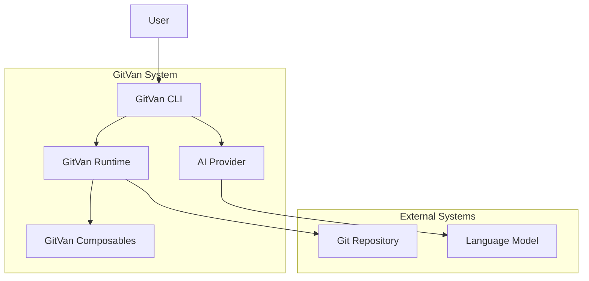
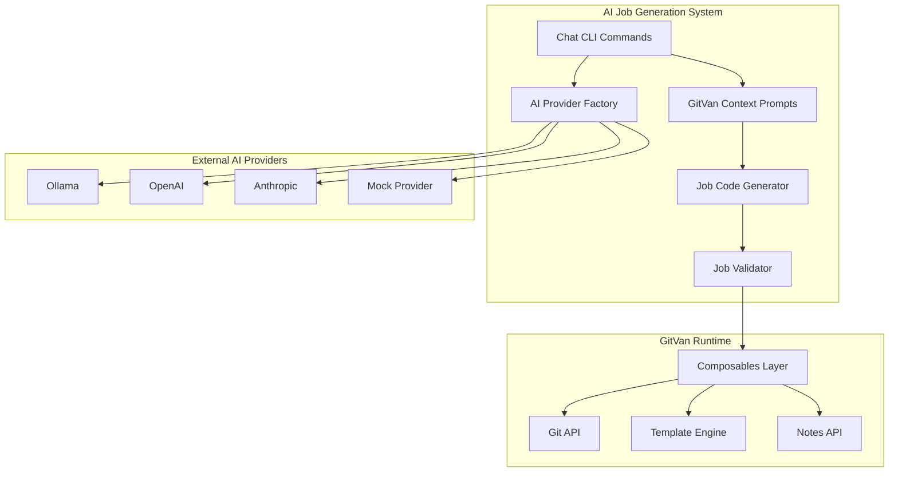

# GitVan AI Job Generation Architecture

## C4 Model: Context Level



## C4 Model: Container Level



## Current Problems

### 1. **Disconnected AI Generation**
- AI generates generic JavaScript code
- No knowledge of GitVan composables (`useGit`, `useTemplate`, `useNotes`)
- No understanding of GitVan patterns (`defineJob`, event system)
- Generated jobs don't actually work with GitVan runtime

### 2. **Inadequate Testing**
- Tests use outdated AI SDK patterns (`MockLanguageModelV1`)
- Tests don't validate actual GitVan integration
- Tests don't verify composable usage
- Tests don't check if generated jobs actually run

### 3. **Missing Context**
- LLM doesn't understand GitVan's architecture
- No examples of working GitVan jobs
- No composable documentation in prompts
- No validation that generated code uses proper patterns

## Proposed Solution

### 1. **Rich Context Prompts**
```javascript
const GITVAN_COMPOSABLES_CONTEXT = `
GitVan Composables:
- useGit(): Git operations (readFile, writeFile, commit, etc.)
- useTemplate(): Nunjucks template rendering
- useNotes(): Git notes for audit trails
- useWorktree(): Worktree management
- usePack(): Pack operations

Example working job:
import { defineJob, useGit, useTemplate, useNotes } from 'file:///Users/sac/gitvan/src/index.mjs'

export default defineJob({
  meta: { name: "changelog", desc: "Generate changelog" },
  on: { tagCreate: "v*" },
  async run({ ctx, payload, meta }) {
    const git = useGit()
    const template = useTemplate()
    const notes = useNotes()
    
    const commits = await git.getCommitsSinceLastTag()
    const changelog = await template.render('changelog.njk', { commits })
    await git.writeFile('CHANGELOG.md', changelog)
    await notes.write('Changelog generated')
    
    return { ok: true, artifacts: ['CHANGELOG.md'] }
  }
})
`;
```

### 2. **Comprehensive Testing**
```javascript
describe("AI Job Generation", () => {
  it("should generate working GitVan job with composables", async () => {
    const result = await generateWorkingJob({
      prompt: "Create a backup job",
      config: mockConfig
    })
    
    // Validate the generated code uses GitVan patterns
    expect(result.code).toContain("import { defineJob, useGit")
    expect(result.code).toContain("const git = useGit()")
    expect(result.code).toContain("await git.writeFile")
    
    // Test that the job actually runs
    const jobPath = writeTestJob(result.code)
    const jobModule = await import(jobPath)
    const jobResult = await jobModule.default.run({ ctx: {}, payload: {}, meta: {} })
    
    expect(jobResult.ok).toBe(true)
    expect(jobResult.artifacts).toBeDefined()
  })
})
```

### 3. **Job Validation Pipeline**
```javascript
class JobValidator {
  async validateGeneratedJob(code) {
    // 1. Syntax validation
    await this.validateSyntax(code)
    
    // 2. GitVan pattern validation
    await this.validateGitVanPatterns(code)
    
    // 3. Composable usage validation
    await this.validateComposableUsage(code)
    
    // 4. Runtime execution test
    await this.testJobExecution(code)
  }
}
```

## Implementation Plan

1. **Update AI SDK Testing** - Use `MockLanguageModelV2` with proper GitVan context
2. **Enhance Context Prompts** - Add comprehensive GitVan composable documentation
3. **Implement Job Validator** - Validate generated jobs actually work
4. **Create Integration Tests** - Test full workflow from prompt to working job
5. **Add Composable Examples** - Provide working examples for each composable

## Success Metrics

- ✅ Generated jobs use proper GitVan composables
- ✅ Generated jobs actually run without errors
- ✅ Tests validate real GitVan integration
- ✅ LLM understands GitVan architecture
- ✅ Generated code follows GitVan patterns
