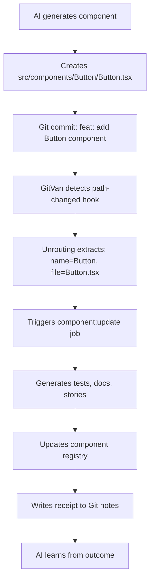

# GitVan Hooks Architecture - Autonomous Intelligence Interface

## 🧠 For Hyper-Intelligence Swarms

This document provides the **80/20 architecture** for autonomous AI systems to understand and leverage GitVan's hook-driven automation platform. Focus on the **essential patterns** that enable intelligent automation without complexity overhead.

---

## 🎯 Core Concept: Git as Runtime Environment

**GitVan transforms Git into a runtime environment** where:
- **Hooks** = Triggers (WHEN to act)
- **Jobs** = Actions (WHAT to do)  
- **Git** = State management, audit trails, coordination
- **Unrouting** = File-based intelligence routing

---

## 🔄 Git Lifecycle Integration

### Phase 1: Development → Commit
```
Developer Workflow:
├── Edit files (src/components/Button.tsx)
├── git add .
├── git commit -m "feat: add button component"
└── git push origin main
```

**GitVan Hook Detection:**
```
GitVan Daemon:
├── Detects commit SHA: abc123
├── Scans hooks/ directory
├── Matches patterns against changed files
└── Triggers appropriate jobs
```

### Phase 2: Hook Matching Engine
```
Hook Pattern Matching:
├── path-changed/src/components/[name]/[file].tsx
│   └── Matches: src/components/Button/Button.tsx
│   └── Extracts: { name: "Button", file: "Button.tsx" }
├── push-to/main
│   └── Matches: branch "main"
└── tag/semver  
    └── Matches: v1.2.3, v2.0.0-beta.1
```

### Phase 3: Job Execution Pipeline
```
Job Execution:
├── Acquire atomic lock (prevents race conditions)
├── Execute job with extracted parameters
├── Generate artifacts (files, reports, deployments)
├── Write receipt to Git notes (audit trail)
└── Release lock
```

---

## 🏗️ Hook Architecture Patterns

### 1. File-Based Hooks (80% of use cases)

**Pattern**: `hooks/path-changed/{pattern}.mjs`

```javascript
// hooks/path-changed/src/components/[name]/[file].tsx
export default {
  name: "Component Change Handler",
  job: "component:update",
  payload: {
    source: "path-change",
    patterns: ["src/components/**"]
  }
}
```

**AI Swarm Usage:**
- **Detect**: File changes in specific directories
- **Extract**: Component name, file type, path context
- **Route**: To appropriate automation jobs
- **Scale**: Works across any file structure

### 2. Branch-Based Hooks (Deployment & CI)

**Pattern**: `hooks/push-to/{branch}.mjs`

```javascript
// hooks/push-to/main.mjs
export default {
  name: "Main Branch Deploy",
  job: "deploy:production",
  payload: {
    environment: "production",
    branch: "main"
  }
}
```

**AI Swarm Usage:**
- **Trigger**: On branch pushes
- **Context**: Branch name, commit history, changed files
- **Action**: Deploy, test, notify, document

### 3. Tag-Based Hooks (Releases)

**Pattern**: `hooks/tag/{pattern}.mjs`

```javascript
// hooks/tag/semver.mjs
export default {
  name: "Semantic Release",
  job: "release:publish",
  payload: {
    tagType: "semver",
    version: ":tag"
  }
}
```

**AI Swarm Usage:**
- **Detect**: Version tags (v1.2.3, v2.0.0-beta.1)
- **Extract**: Version number, release type
- **Action**: Publish, document, notify stakeholders

### 4. Message-Based Hooks (Commit Intelligence)

**Pattern**: `hooks/message/{regex}.mjs`

```javascript
// hooks/message/^feat:/.mjs
export default {
  name: "Feature Detection",
  job: "feature:track",
  payload: {
    type: "feature",
    message: ":message"
  }
}
```

**AI Swarm Usage:**
- **Parse**: Commit messages for semantic meaning
- **Classify**: Features, fixes, docs, refactors
- **Track**: Development patterns, team behavior

---

## 🤖 Autonomous Intelligence Interfaces

### 1. Pattern Discovery API

```javascript
// For AI systems to discover available patterns
const hooks = discoverHooks('./hooks');
const patterns = hooks.map(h => ({
  id: h.id,
  type: h.type,
  pattern: h.pattern,
  job: h.job
}));
```

**AI Swarm Benefits:**
- **Self-discovery**: AI can find existing automation patterns
- **Pattern reuse**: Leverage existing hooks across projects
- **Adaptation**: Modify patterns based on project structure

### 2. Dynamic Hook Generation

```javascript
// AI can generate hooks programmatically
const generateHook = (pattern, job, payload) => ({
  name: `AI Generated: ${pattern}`,
  job: job,
  payload: payload
});
```

**AI Swarm Benefits:**
- **Adaptive automation**: Generate hooks based on project analysis
- **Learning**: Improve patterns based on usage data
- **Evolution**: Automatically optimize hook patterns

### 3. Job Composition API

```javascript
// AI can compose complex workflows
const composeWorkflow = (triggers, actions) => ({
  triggers: triggers.map(t => `hooks/${t}`),
  actions: actions.map(a => `jobs/${a}`),
  dependencies: calculateDependencies(triggers, actions)
});
```

**AI Swarm Benefits:**
- **Workflow orchestration**: Chain multiple jobs intelligently
- **Dependency management**: Handle complex automation dependencies
- **Optimization**: Minimize redundant operations

---

## 🧩 Unrouting Integration (File Intelligence)

### Pattern-Based File Routing

```javascript
// Unrouting enables intelligent file-based automation
const routes = [
  {
    pattern: "src/components/[name]/[file].tsx",
    job: "component:update",
    payload: { name: ":name", file: ":file" }
  },
  {
    pattern: "src/pages/[page]/[file].tsx", 
    job: "page:update",
    payload: { page: ":page", file: ":file" }
  }
];
```

**AI Swarm Benefits:**
- **Semantic understanding**: Extract meaning from file structure
- **Context awareness**: Understand project architecture
- **Intelligent routing**: Route files to appropriate automation

### Dynamic Pattern Learning

```javascript
// AI can learn and adapt patterns
const learnPattern = (fileChanges, outcomes) => {
  const patterns = extractCommonPatterns(fileChanges);
  const effectiveness = measureOutcomeEffectiveness(outcomes);
  return optimizePatterns(patterns, effectiveness);
};
```

**AI Swarm Benefits:**
- **Pattern evolution**: Improve automation based on results
- **Project adaptation**: Adapt to different project structures
- **Continuous learning**: Get better over time

---

## 🔄 Complete Lifecycle Example

### Scenario: AI-Driven Component Development



### Hook Configuration

```javascript
// hooks/path-changed/src/components/[name]/[file].tsx
export default {
  name: "Component Intelligence",
  job: "component:ai-process",
  payload: {
    source: "ai-generation",
    patterns: ["src/components/**"],
    intelligence: {
      generateTests: true,
      generateDocs: true,
      updateRegistry: true,
      learnPatterns: true
    }
  }
}
```

### Job Implementation

```javascript
// jobs/component:ai-process.mjs
export default defineJob({
  meta: { name: "component:ai-process", desc: "AI-driven component processing" },
  async run({ payload }) {
    const { name, file, intelligence } = payload;
    
    // AI generates comprehensive component ecosystem
    await generateTests(name, file);
    await generateDocumentation(name, file);
    await updateComponentRegistry(name);
    await learnFromPattern(name, file);
    
    return {
      ok: true,
      artifacts: [`tests/${name}.test.tsx`, `docs/${name}.md`],
      intelligence: { learned: true, patterns: extractPatterns(file) }
    };
  }
});
```

---

## 🎯 80/20 Patterns for AI Swarms

### Essential Hook Types (80% of automation)

1. **Path Changes** - File-based triggers
2. **Branch Pushes** - Deployment triggers  
3. **Tag Creation** - Release triggers
4. **Message Patterns** - Semantic triggers

### Essential Job Patterns (80% of work)

1. **Generate** - Create files, docs, tests
2. **Update** - Modify existing files
3. **Deploy** - Push to environments
4. **Notify** - Alert stakeholders

### Essential Integration Points (80% of value)

1. **Unrouting** - File intelligence routing
2. **Git Notes** - Audit trails and state
3. **Atomic Locks** - Race condition prevention
4. **Receipt System** - Execution tracking

---

## 🚀 AI Swarm Implementation Guide

### Phase 1: Discovery
```javascript
// Discover existing automation
const hooks = discoverHooks('./hooks');
const jobs = scanJobs('./jobs');
const patterns = analyzePatterns(hooks, jobs);
```

### Phase 2: Adaptation
```javascript
// Adapt to project structure
const projectStructure = analyzeProjectStructure();
const adaptedHooks = adaptHooksToStructure(hooks, projectStructure);
const optimizedJobs = optimizeJobsForStructure(jobs, projectStructure);
```

### Phase 3: Evolution
```javascript
// Continuously improve
const outcomes = analyzeJobOutcomes();
const effectiveness = measureEffectiveness(outcomes);
const evolvedPatterns = evolvePatterns(patterns, effectiveness);
```

### Phase 4: Orchestration
```javascript
// Orchestrate complex workflows
const workflows = composeWorkflows(evolvedPatterns);
const orchestration = optimizeOrchestration(workflows);
const execution = executeOrchestration(orchestration);
```

---

## 🔧 Technical Implementation

### Hook Discovery Engine
```javascript
export function discoverHooks(hooksDir) {
  // Scans hooks/ directory
  // Parses file paths into patterns
  // Returns structured hook definitions
}
```

### Pattern Matching Engine
```javascript
export function hookMatches(hook, context) {
  // Matches Git operations to hook patterns
  // Extracts parameters from context
  // Returns match results with payload
}
```

### Job Execution Engine
```javascript
export async function executeJob(job, payload) {
  // Acquires atomic lock
  // Executes job with payload
  // Writes receipt to Git notes
  // Releases lock
}
```

---

## 📊 Intelligence Metrics

### Automation Effectiveness
- **Pattern Coverage**: % of file changes covered by hooks
- **Job Success Rate**: % of successful job executions
- **Time to Automation**: Time from change to automation
- **Learning Velocity**: Rate of pattern improvement

### System Health
- **Hook Discovery Time**: Time to discover all hooks
- **Job Execution Time**: Average job execution duration
- **Lock Contention**: Frequency of lock conflicts
- **Receipt Integrity**: % of successful receipt writes

---

## 🎯 Summary for AI Swarms

**GitVan provides a Git-native automation platform** where:

1. **Hooks** define WHEN automation should trigger
2. **Jobs** define WHAT automation should do
3. **Unrouting** provides intelligent file-based routing
4. **Git** provides state management and audit trails

**For autonomous intelligence systems**, this means:
- **Self-discovery** of automation patterns
- **Adaptive** automation based on project structure
- **Evolutionary** improvement through learning
- **Orchestrated** complex workflows

**The 80/20 rule**: Focus on path-based hooks, generation jobs, and unrouting patterns for maximum automation value with minimal complexity.

---

*This architecture enables hyper-intelligence swarms to build sophisticated, self-evolving automation systems that integrate seamlessly with Git workflows while maintaining full audit trails and deterministic behavior.*
