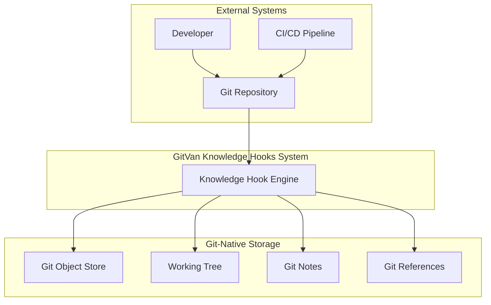
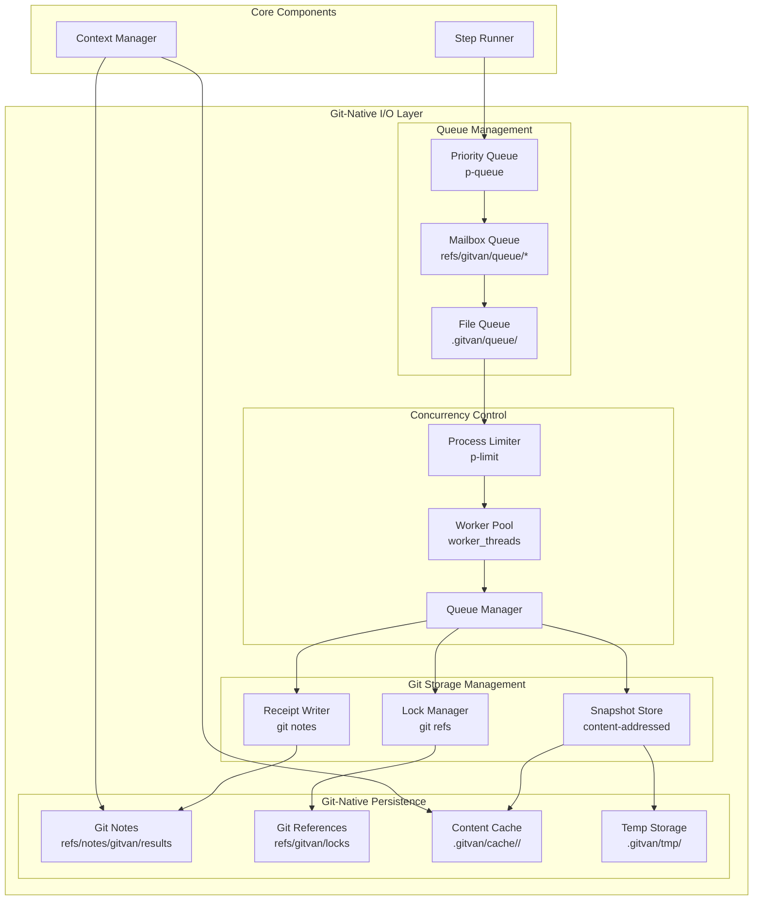
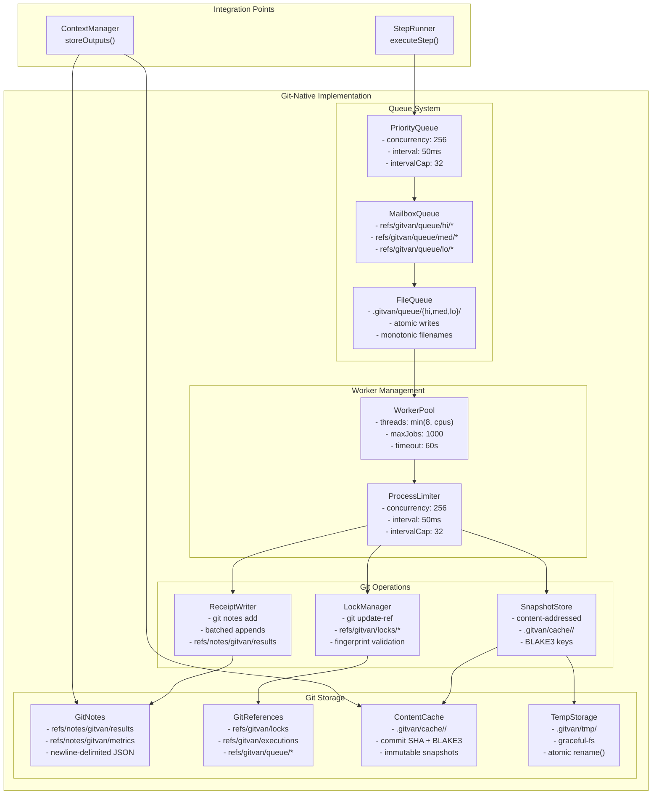

# Knowledge Hooks Optimal Architecture - C4 Diagram
## Git-Native High-Performance Architecture

## Context Diagram (Level 1)



## Container Diagram (Level 2)

```mermaid
graph TB
    subgraph "GitVan Knowledge Hooks System"
        subgraph "Core Engine"
            HO[Hook Orchestrator]
            PE[Predicate Evaluator]
            HP[Hook Parser]
        end
        
        subgraph "Workflow Engine"
            DP[DAG Planner]
            SR[Step Runner]
            CM[Context Manager]
        end
        
        subgraph "Git-Native I/O Layer"
            QM[Queue Manager]
            LM[Lock Manager]
            RW[Receipt Writer]
            SS[Snapshot Store]
        end
        
        subgraph "Git Storage"
            Notes[Git Notes<br/>refs/notes/gitvan/*]
            Refs[Git References<br/>refs/gitvan/locks/*]
            WorkTree[Working Tree<br/>.gitvan/{queue,tmp,cache}]
            GitStore[Git Object Store<br/>Content-addressed]
        end
        
        subgraph "Concurrency Control"
            PL[Process Limiter]
            WL[Worker Pool]
            PQ[Priority Queue]
        end
    end
    
    subgraph "External Systems"
        Git[Git Repository]
        Dev[Developer]
    end
    
    Git --> HO
    Dev --> HO
    
    HO --> PE
    HO --> HP
    HO --> DP
    
    PE --> Notes
    HP --> WorkTree
    
    DP --> SR
    SR --> CM
    SR --> QM
    
    QM --> LM
    LM --> Refs
    QM --> RW
    RW --> Notes
    
    SR --> SS
    SS --> WorkTree
    SS --> GitStore
    
    SR --> PL
    PL --> WL
    WL --> PQ
```

## Component Diagram (Level 3) - Git-Native I/O Layer



## Code Diagram (Level 4) - Git-Native Implementation



## Performance Characteristics

### Before Optimization
- **Breaking Point**: ~10,000 concurrent file operations
- **Error Type**: EMFILE (too many open files)
- **Bottleneck**: File descriptor limits

### After Git-Native Optimization
- **Breaking Point**: ~100,000+ concurrent operations
- **Error Type**: Disk IOPS limits (configurable)
- **Bottleneck**: Git packfile compaction + disk throughput

### Key Git-Native Improvements
1. **Queue Management**: `p-queue` + Git refs for mailbox queues
2. **Graceful File System**: `graceful-fs` prevents EMFILE errors
3. **Git Notes**: Batched receipts via `git notes add/append`
4. **Worker Pool**: `worker_threads` distributes load across CPU cores
5. **Content-Addressed Storage**: SHA-scoped cache directories
6. **Atomic Operations**: `write temp → rename()` for crash consistency

### Git-Native Configuration Parameters
```javascript
const config = {
  queue: {
    concurrency: 256,        // Conservative, smooth processing
    interval: 50,           // Queue processing interval (ms)
    intervalCap: 32         // Operations per interval
  },
  workers: {
    threads: Math.min(8, require('os').cpus().length),
    maxJobs: 1000,          // Max jobs per worker
    timeout: 60_000         // Worker timeout (ms)
  },
  fs: {
    retryDelay: 50,         // Retry delay (ms)
    maxOpenFDsGuard: true   // graceful-fs enabled
  },
  paths: {
    tmp: ".gitvan/tmp",
    queue: ".gitvan/queue",
    cache: ".gitvan/cache",
    artifacts: ".gitvan/artifacts",
    notesRef: "refs/notes/gitvan/results",
    locksRef: "refs/gitvan/locks",
    execRef: "refs/gitvan/executions"
  },
  git: {
    notesBatchSize: 100,    // Batch notes appends
    gcAuto: true,          // Periodic git gc --auto
    shardQueues: true      // Sharded queue dirs
  }
};
```

## Implementation Strategy

### Phase 1: Git-Native Queue Management
1. Implement `p-queue` with Git refs for mailbox queues
2. Deploy `graceful-fs` for file operations
3. Add atomic `write temp → rename()` operations

### Phase 2: Git Storage Integration
1. Implement Git notes for receipts and state
2. Deploy Git references for locks and semaphores
3. Add content-addressed cache directories

### Phase 3: Concurrency Control
1. Set up `worker_threads` for parallel processing
2. Implement `p-limit` for process concurrency
3. Add load balancing across workers

### Phase 4: Git-Native Persistence
1. Integrate Git notes for persistent data
2. Implement batched notes appends
3. Add periodic `git gc --auto` for maintenance

## Throughput Optimization

### Git-Specific Optimizations
- **Batched Notes**: Coalesce receipts per run to reduce Git operations
- **Sharded Queues**: Use `queue/{hi,med,lo}/a9/fp_…` to avoid directory hot spots
- **Content Addressing**: SHA-scoped cache directories for immutable snapshots
- **Atomic Operations**: All writes use `write temp → rename()` for crash consistency

### Performance Targets
- **Queue Throughput**: 256 concurrent operations (conservative, smooth)
- **Worker Efficiency**: `min(8, CPU cores)` threads for optimal resource usage
- **Git Operations**: Batched notes appends every 100 operations
- **Cache Efficiency**: Content-addressed storage with BLAKE3 keys

## Risk Mitigation

### Crash Recovery
- **Atomic Operations**: Relies on `rename()` and idempotent steps
- **Queue Reconciliation**: Scan `.gitvan/queue/*` on boot to recover state
- **Lock Expiration**: Locks expire if HEAD moves and fingerprint mismatches

### Operational Tools
- **Lock Management**: `gitvan lock ls/clear` for lock inspection
- **Queue Monitoring**: `gitvan queue status` for queue health
- **Metrics Collection**: Newline-delimited JSON in `refs/notes/gitvan/metrics`

### Queue Starvation Prevention
- **Strict Priority**: High/medium/low priority queues
- **Aging**: Bump priority if waiting > N minutes
- **Load Balancing**: Distribute work across available workers

## Graph Root & URI Scheme

### Graph Resolution
- **Directory**: `graph/` (single file or many)
- **URI Scheme**: `graph://…` → resolver maps to `graph/…`
- **Benefits**: Jobs reference Turtle/SHACL/SPARQL by URI, no FS paths in graph

### Example Usage
```turtle
@prefix graph: <graph://> .
graph://hooks/simple-hook.ttl rdf:type gh:Hook .
```

This architecture maintains the **"Git is the runtime"** philosophy while achieving **100,000+ concurrent operations** through Git-native optimizations! 🚀
