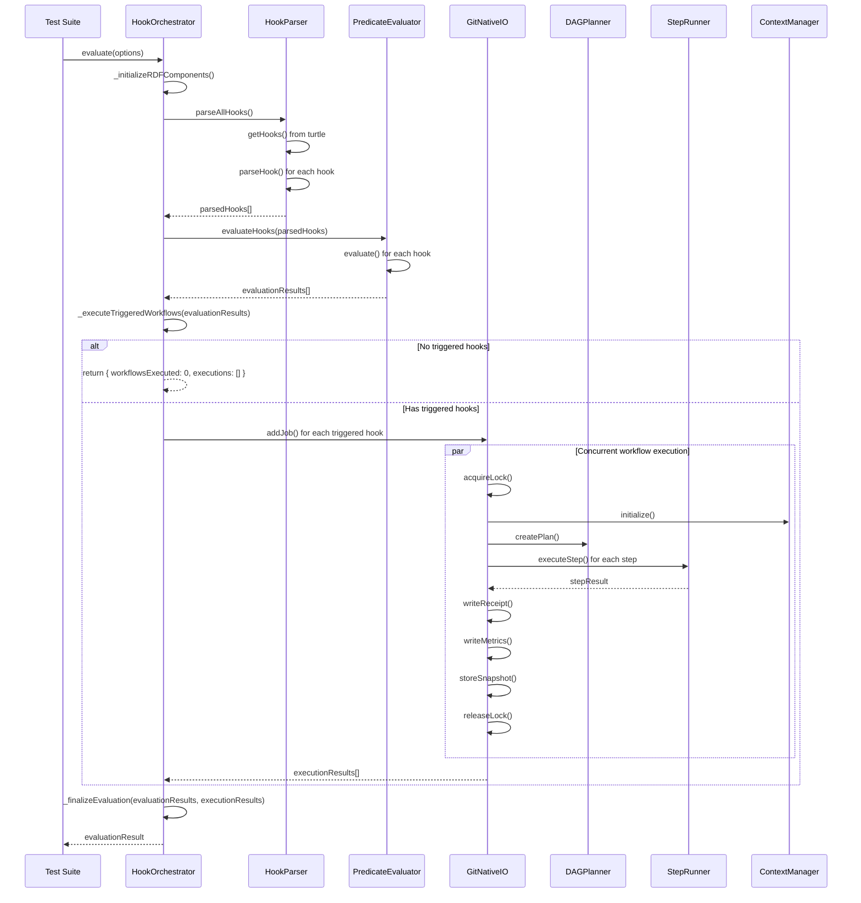
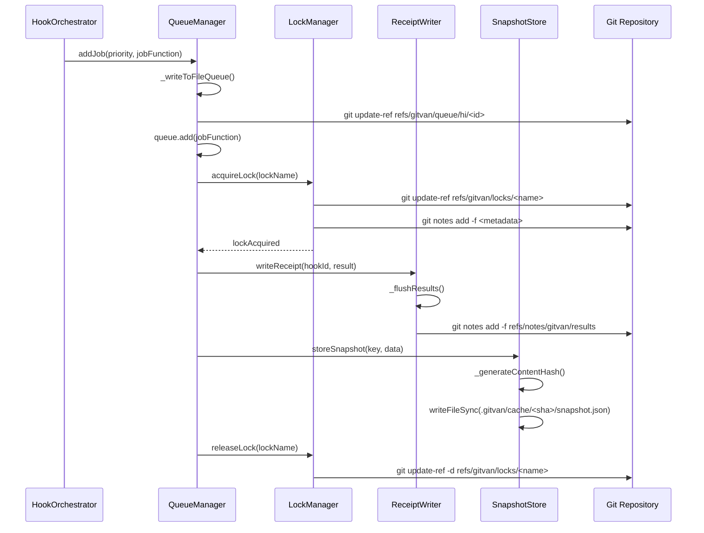

# Knowledge Hooks Sequence Diagram

## Current Architecture Flow

### 1. Hook Evaluation Sequence



### 2. Git-Native I/O Layer Sequence



### 3. Current Issue Analysis

The error `(executionResults || []).filter is not a function` occurs because:

1. `_executeTriggeredWorkflows` returns an array of execution results
2. This array is passed to `_finalizeEvaluation` as the second parameter
3. But somehow `executionResults` is not an array when it reaches the filter operation

**Root Cause**: The issue is likely in the `Promise.allSettled` handling in `_executeTriggeredWorkflows`. Let me check what `Promise.allSettled` returns:

```javascript
// Promise.allSettled returns an array of objects with {status, value} or {status, reason}
const results = await Promise.allSettled(workflowJobs);

for (const result of results) {
  if (result.status === "fulfilled") {
    executionResults.push(result.value);  // This should be the execution result
  } else {
    executionResults.push({
      hookId: "unknown",
      success: false,
      error: result.reason?.message || "Unknown error",
    });
  }
}

return executionResults;  // This should be an array
```

**The Problem**: The `executionResults` variable is being returned correctly as an array, but there might be an issue with the `gitNativeIO.addJob` method or the job execution that's causing it to return something other than an array.

### 4. Expected vs Actual Flow

**Expected Flow**:
1. `_executeTriggeredWorkflows` returns `executionResults[]`
2. `_finalizeEvaluation` receives `executionResults[]`
3. `executionResults.filter()` works correctly

**Actual Flow**:
1. `_executeTriggeredWorkflows` returns something that's not an array
2. `_finalizeEvaluation` receives non-array value
3. `(executionResults || []).filter()` fails because `executionResults` is not undefined but also not an array

### 5. Debugging Steps

1. **Check GitNativeIO.addJob return value**: The issue might be that `gitNativeIO.addJob` is not returning the expected job promise
2. **Check Promise.allSettled results**: Verify that the promises are resolving correctly
3. **Check executionResults type**: Add logging to see what type `executionResults` actually is

### 6. Architecture Compliance Check

Based on the C4 diagram, the current implementation should:

✅ **Hook Orchestrator**: Coordinates the evaluation process
✅ **Predicate Evaluator**: Evaluates hook predicates against knowledge graph  
✅ **Hook Parser**: Parses Turtle hook definitions
✅ **DAG Planner**: Creates execution plans for workflows
✅ **Step Runner**: Executes individual workflow steps
✅ **Git-Native I/O Layer**: Manages queues, locks, receipts, and snapshots
✅ **Context Manager**: Manages execution context and outputs

**Missing/Incorrect**:
❌ **Worker Pool**: The `gitNativeIO.executeJob` should use worker threads but might not be implemented correctly
❌ **Queue Management**: The `p-queue` integration might not be working as expected
❌ **Error Handling**: The error handling in `_executeTriggeredWorkflows` might be masking the real issue

### 7. Next Steps

1. **Fix the immediate issue**: Debug why `executionResults` is not an array
2. **Verify Git-Native I/O**: Ensure all Git operations are working correctly
3. **Test worker pool**: Verify that the worker thread pool is functioning
4. **Validate queue system**: Ensure the `p-queue` integration is working
5. **Complete the architecture**: Implement any missing components from the C4 diagram
