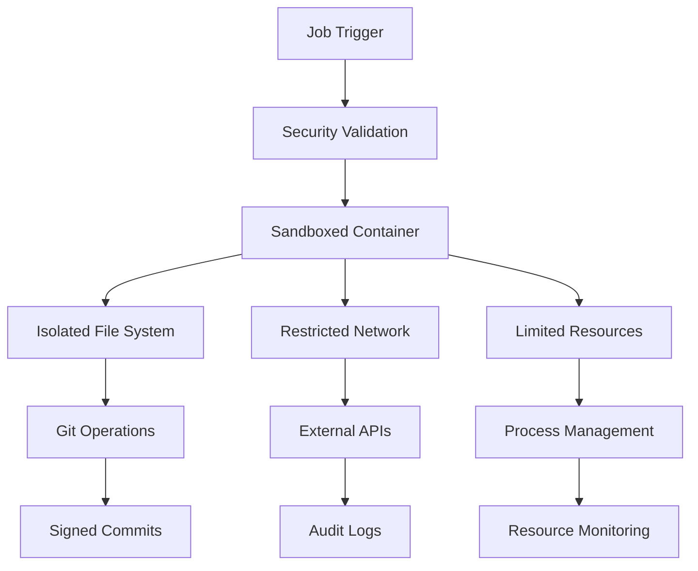

# GitVan v2 Security Model

GitVan v2 is built with security-first principles, providing enterprise-grade protection for automated workflows and AI-powered development operations.

## Core Security Principles

### 1. Zero-Trust Architecture
- **Sandboxed Execution**: All job execution happens in isolated, ephemeral containers
- **Minimal Permissions**: Jobs run with least-privilege access patterns
- **Network Isolation**: Controlled network access with explicit allow-lists
- **Resource Constraints**: CPU, memory, and storage limits prevent resource exhaustion

### 2. Cryptographic Integrity
- **Signed Commits**: All automated commits are cryptographically signed
- **Receipt Generation**: Immutable execution receipts stored in Git notes
- **Chain of Custody**: Verifiable audit trail from trigger to completion
- **Content Verification**: Checksums and signatures for all artifacts

### 3. Secure-by-Default Configuration
- **Environment Isolation**: Secrets never exposed to job environments
- **Secure Defaults**: Conservative security settings out-of-the-box
- **Explicit Permissions**: All capabilities must be explicitly granted
- **Defense in Depth**: Multiple security layers with fail-safe mechanisms

## Security Architecture

### Execution Environment



### Secret Management

GitVan v2 implements a sophisticated secret management system:

- **Encrypted Storage**: Secrets encrypted at rest using AES-256
- **Runtime Injection**: Secrets injected only at job execution time
- **Scope Isolation**: Secrets scoped to specific repositories/workflows
- **Rotation Support**: Automated secret rotation with zero-downtime
- **Audit Trail**: Complete log of secret access and usage

### Access Control Model

```yaml
# Repository-level access control
repository:
  permissions:
    read: [team:developers, user:ci-bot]
    write: [team:maintainers]
    admin: [team:security, user:repo-owner]

# Job-level access control
job:
  permissions:
    execute: [role:ci-runner]
    debug: [role:developer]
    cancel: [role:maintainer]

# Secret-level access control
secrets:
  permissions:
    read: [job:production-deploy]
    write: [role:admin]
    rotate: [role:security]
```

## Sandboxed Execution

### Container Security
- **Rootless Containers**: Jobs run as non-root users
- **Read-only File System**: Immutable base container image
- **No Privileged Access**: No elevated permissions or capabilities
- **Network Segmentation**: Isolated network namespace per job

### Resource Limits
```yaml
sandbox:
  resources:
    cpu: "1000m"        # 1 CPU core maximum
    memory: "2Gi"       # 2GB RAM maximum
    storage: "10Gi"     # 10GB disk maximum
    network: "100Mbps"  # Bandwidth limit

  timeouts:
    execution: "30m"    # Maximum job runtime
    idle: "5m"          # Idle timeout
    cleanup: "2m"       # Cleanup timeout
```

### File System Isolation
- **Temporary Workspace**: Ephemeral file systems destroyed after execution
- **No Host Access**: Cannot access host file system
- **Secure Mounts**: Only necessary directories mounted read-only
- **Content Scanning**: All file operations scanned for malicious content

## Audit Trails with Git Notes

GitVan v2 maintains comprehensive audit trails using Git's native notes feature:

### Execution Receipts
```json
{
  "execution_id": "exec_2024_001",
  "timestamp": "2024-01-15T14:30:00Z",
  "trigger": {
    "type": "schedule",
    "source": "main:workflows/ci.yml",
    "user": "system"
  },
  "environment": {
    "container_id": "sha256:abc123...",
    "runtime_version": "gitvan-v2.1.0",
    "resource_usage": {
      "cpu_time": "120s",
      "memory_peak": "1.2GB",
      "disk_usage": "45MB"
    }
  },
  "changes": [
    {
      "file": "src/components/Button.tsx",
      "action": "modified",
      "lines_added": 12,
      "lines_removed": 3,
      "checksum": "sha256:def456..."
    }
  ],
  "signature": {
    "algorithm": "Ed25519",
    "public_key": "gitvan-runner-key-001",
    "signature": "base64-encoded-signature"
  }
}
```

### Audit Note Structure
```bash
# Git notes namespace for audit trails
refs/notes/gitvan/executions    # Execution receipts
refs/notes/gitvan/security      # Security events
refs/notes/gitvan/compliance    # Compliance records
refs/notes/gitvan/approvals     # Human approvals
```

## Signed Commits and Receipts

### Commit Signing
All automated commits are cryptographically signed:

```bash
# Example signed commit
commit 1a2b3c4d5e6f7a8b9c0d1e2f3a4b5c6d7e8f9a0b
Author: GitVan Runner <runner@gitvan.dev>
Date: Mon Jan 15 14:30:00 2024 +0000
Signature: -----BEGIN PGP SIGNATURE-----
 iQIzBAABCAAdFiEE...
 -----END PGP SIGNATURE-----

    feat: auto-generated component updates

    Execution ID: exec_2024_001
    Receipt: refs/notes/gitvan/executions
    Verified: ✓ Sandboxed execution
    Verified: ✓ Resource limits enforced
    Verified: ✓ Security scan passed
```

### Receipt Verification
```bash
# Verify execution receipt
gitvan verify --execution-id exec_2024_001
✓ Signature valid
✓ Execution environment verified
✓ Resource usage within limits
✓ No security violations detected
✓ Compliance requirements met
```

## Security Monitoring

### Real-time Monitoring
- **Behavioral Analysis**: Detect anomalous job behavior
- **Resource Monitoring**: Track CPU, memory, network usage
- **Access Patterns**: Monitor file and network access
- **Threat Detection**: Identify potential security threats

### Security Metrics
```yaml
metrics:
  security:
    - execution_time_anomalies
    - resource_usage_spikes
    - network_connection_attempts
    - file_access_violations
    - failed_authentication_attempts
    - suspicious_command_patterns
```

### Incident Response
1. **Automatic Containment**: Suspicious jobs automatically terminated
2. **Evidence Preservation**: Complete execution logs preserved
3. **Alert Generation**: Security team notified immediately
4. **Forensic Analysis**: Detailed investigation capabilities
5. **Recovery Procedures**: Automated rollback and remediation

## Compliance Framework

GitVan v2 supports multiple compliance frameworks:

- **SOC 2**: System and Organization Controls
- **ISO 27001**: Information Security Management
- **PCI DSS**: Payment Card Industry Data Security Standard
- **GDPR**: General Data Protection Regulation
- **HIPAA**: Health Insurance Portability and Accountability Act

### Compliance Features
- **Audit Log Retention**: Configurable retention periods
- **Data Classification**: Automatic data sensitivity detection
- **Access Reviews**: Periodic access right reviews
- **Change Management**: Controlled change approval processes
- **Documentation**: Automated compliance documentation

## Getting Started

### Security Configuration
```yaml
# .gitvan/security.yml
security:
  execution:
    sandbox: strict
    network: restricted
    resources: limited

  secrets:
    encryption: aes-256-gcm
    rotation: automatic
    scope: repository

  audit:
    retention: 2555  # 7 years
    compression: gzip
    encryption: true

  compliance:
    frameworks: [soc2, iso27001]
    reporting: monthly
    notifications: security-team@company.com
```

### Security Best Practices
1. **Enable Multi-Factor Authentication** for all administrative accounts
2. **Use Least-Privilege Access** for all integrations
3. **Regularly Rotate Secrets** and API keys
4. **Monitor Audit Logs** for suspicious activity
5. **Keep GitVan Updated** with latest security patches
6. **Implement Security Reviews** for workflow changes
7. **Use Branch Protection** rules for critical repositories

## Security Contact

For security issues or questions:
- **Security Team**: security@gitvan.dev
- **Bug Bounty**: bounty@gitvan.dev
- **Emergency**: emergency@gitvan.dev (24/7)

## Resources

- [Compliance Documentation](./compliance.md)
- [Security Best Practices](./best-practices.md)
- [Incident Response Playbook](./incident-response.md)
- [Security Architecture Guide](./architecture.md)