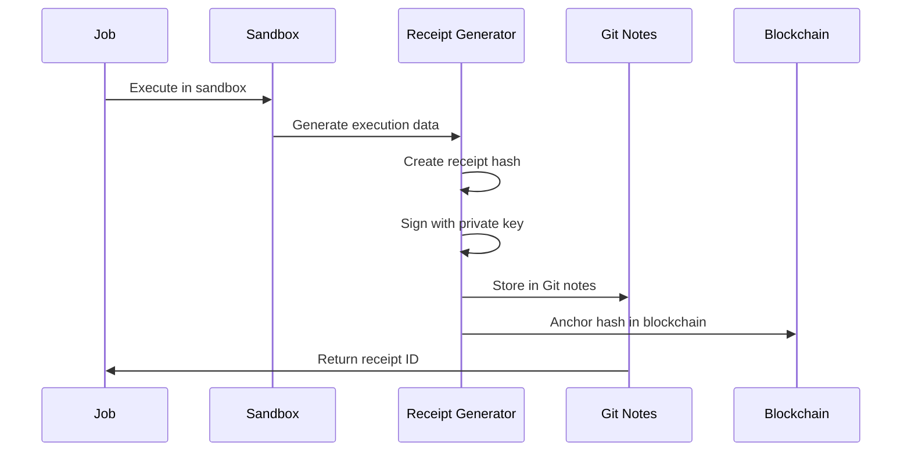

# GitVan v2 Compliance Framework

GitVan v2 provides comprehensive compliance capabilities to meet enterprise regulatory requirements and industry standards.

## SOC 2 Compliance

GitVan v2 implements SOC 2 Type II controls across all five trust service criteria:

### Security (Common Criteria)
- **Access Controls**: Multi-factor authentication and role-based access
- **Logical Access**: Automated provisioning and deprovisioning
- **System Operations**: Comprehensive logging and monitoring
- **Change Management**: Controlled deployment processes

### Availability
- **System Monitoring**: 24/7 uptime monitoring with automated alerting
- **Backup Procedures**: Automated backups with point-in-time recovery
- **Disaster Recovery**: Multi-region deployment with failover capabilities
- **Capacity Management**: Auto-scaling based on demand

### Processing Integrity
- **Data Validation**: Input validation and sanitization
- **Error Handling**: Comprehensive error detection and correction
- **Authorized Processing**: All operations require explicit authorization
- **Completeness**: Transaction logging ensures no data loss

### Confidentiality
- **Data Classification**: Automatic sensitivity classification
- **Encryption**: End-to-end encryption for data in transit and at rest
- **Access Restrictions**: Need-to-know access principles
- **Secure Disposal**: Cryptographic erasure of sensitive data

### Privacy
- **Data Minimization**: Collect only necessary data
- **Consent Management**: Explicit consent for data processing
- **Data Subject Rights**: Automated data portability and deletion
- **Cross-Border Transfers**: GDPR-compliant international transfers

## Audit Log Generation

### Comprehensive Logging Strategy

GitVan v2 maintains detailed audit logs for all system activities:

```yaml
# Audit log configuration
audit:
  categories:
    - authentication
    - authorization
    - data_access
    - system_changes
    - job_execution
    - secret_access
    - compliance_events

  retention:
    standard: 2555 days    # 7 years
    compliance: 3650 days  # 10 years for regulated industries

  format: json
  encryption: true
  immutability: blockchain-anchored
```

### Audit Log Structure

```json
{
  "event_id": "audit_2024_001_456",
  "timestamp": "2024-01-15T14:30:00.123Z",
  "event_type": "job_execution",
  "severity": "info",
  "actor": {
    "type": "user",
    "id": "user_123",
    "email": "developer@company.com",
    "session_id": "sess_abc123"
  },
  "resource": {
    "type": "repository",
    "id": "repo_456",
    "name": "company/api-service",
    "branch": "main"
  },
  "action": {
    "operation": "job_execute",
    "job_id": "job_789",
    "workflow": "ci-cd-pipeline",
    "duration": "00:05:23",
    "status": "success"
  },
  "context": {
    "ip_address": "192.168.1.100",
    "user_agent": "GitVan-CLI/2.1.0",
    "geo_location": "US-CA-SF",
    "risk_score": 0.1
  },
  "changes": [
    {
      "file_path": "src/api/users.ts",
      "operation": "modify",
      "lines_changed": 15,
      "checksum": "sha256:abc123..."
    }
  ],
  "compliance": {
    "frameworks": ["soc2", "gdpr"],
    "data_classification": "internal",
    "retention_period": 2555,
    "legal_hold": false
  },
  "signature": {
    "algorithm": "Ed25519",
    "public_key": "audit-key-001",
    "signature": "base64-signature"
  }
}
```

### Audit Event Types

| Event Type | Description | Retention |
|------------|-------------|-----------|
| `authentication` | Login/logout events | 1 year |
| `authorization` | Permission grants/denials | 2 years |
| `data_access` | File and secret access | 7 years |
| `system_changes` | Configuration modifications | 7 years |
| `job_execution` | Workflow execution | 3 years |
| `compliance_events` | Regulatory actions | 10 years |
| `security_incidents` | Security violations | Permanent |

## Receipt Verification

GitVan v2 provides cryptographic verification of all execution receipts:

### Receipt Generation Process



### Receipt Verification Commands

```bash
# Verify individual receipt
gitvan verify receipt --id exec_2024_001
✓ Receipt found in Git notes
✓ Cryptographic signature valid
✓ Blockchain anchor confirmed
✓ Execution environment verified
✓ Resource usage within limits
✓ No tampering detected

# Verify receipt chain
gitvan verify chain --from exec_2024_001 --to exec_2024_100
✓ All 100 receipts verified
✓ Chain integrity maintained
✓ No gaps in sequence
✓ Timestamps consistent

# Bulk verification
gitvan verify bulk --repository company/api-service --since 2024-01-01
✓ 1,247 receipts verified
✓ 0 verification failures
✓ Compliance report generated
```

### Receipt Immutability

GitVan v2 ensures receipt immutability through multiple mechanisms:

1. **Git Notes**: Receipts stored in append-only Git notes
2. **Cryptographic Signatures**: Ed25519 signatures prevent tampering
3. **Blockchain Anchoring**: Hash commitments to public blockchains
4. **Timestamp Servers**: RFC 3161 compliant timestamping
5. **Distributed Storage**: Replicated across multiple secure locations

## Deterministic Execution

### Reproducible Builds
GitVan v2 ensures deterministic, reproducible execution:

```yaml
# Deterministic execution configuration
execution:
  deterministic: true

  environment:
    timezone: UTC
    locale: C.UTF-8
    random_seed: fixed

  container:
    base_image: "gitvan/deterministic:2.1.0"
    build_timestamp: "2024-01-01T00:00:00Z"
    package_versions: locked

  filesystem:
    timestamps: normalized
    permissions: consistent
    ordering: sorted
```

### Reproducibility Verification

```bash
# Verify job reproducibility
gitvan reproduce --job-id exec_2024_001
✓ Environment recreated
✓ Dependencies locked
✓ Random seed fixed
✓ Execution identical
✓ Output hash matches: sha256:abc123...

# Compliance report
gitvan compliance-report --format pdf --period 2024-Q1
✓ Generated compliance-2024-Q1.pdf
✓ SOC 2 controls validated
✓ GDPR requirements met
✓ Audit trail complete
✓ Digital signatures valid
```

## Redaction and Privacy

### Data Redaction Capabilities

GitVan v2 provides sophisticated data redaction for privacy compliance:

```yaml
# Redaction configuration
redaction:
  enabled: true

  patterns:
    # PII patterns
    - type: email
      regex: '\b[A-Za-z0-9._%+-]+@[A-Za-z0-9.-]+\.[A-Z|a-z]{2,}\b'
      replacement: '[EMAIL_REDACTED]'

    - type: ssn
      regex: '\b\d{3}-\d{2}-\d{4}\b'
      replacement: '[SSN_REDACTED]'

    - type: credit_card
      regex: '\b\d{4}[\s-]?\d{4}[\s-]?\d{4}[\s-]?\d{4}\b'
      replacement: '[CC_REDACTED]'

    # Custom patterns
    - type: api_key
      regex: 'sk-[a-zA-Z0-9]{32}'
      replacement: '[API_KEY_REDACTED]'

  scope:
    - audit_logs
    - execution_output
    - error_messages
    - debug_traces
```

### Privacy Controls

```yaml
privacy:
  data_minimization: true
  purpose_limitation: true
  retention_limits: true

  consent:
    required: true
    granular: true
    withdrawable: true

  rights:
    access: enabled      # GDPR Article 15
    rectification: enabled   # GDPR Article 16
    erasure: enabled     # GDPR Article 17
    portability: enabled     # GDPR Article 20
    objection: enabled   # GDPR Article 21
```

### Privacy-Preserving Analytics

```bash
# Generate privacy-safe analytics
gitvan analytics --privacy-safe \
  --anonymize-users \
  --aggregate-data \
  --min-group-size 5

# Privacy impact assessment
gitvan privacy-assessment --repository company/api-service
✓ Data flows mapped
✓ Privacy risks identified
✓ Mitigation measures recommended
✓ Compliance status: COMPLIANT
```

## Compliance Reporting

### Automated Report Generation

GitVan v2 automatically generates compliance reports:

```yaml
# Compliance reporting configuration
reporting:
  schedules:
    - type: soc2
      frequency: quarterly
      recipients: [compliance@company.com]
      format: pdf

    - type: gdpr
      frequency: monthly
      recipients: [dpo@company.com]
      format: json

    - type: security
      frequency: weekly
      recipients: [security@company.com]
      format: dashboard

  templates:
    soc2: reports/templates/soc2-template.yml
    gdpr: reports/templates/gdpr-template.yml
    custom: reports/templates/custom-template.yml
```

### Report Contents

#### SOC 2 Report
- Control effectiveness testing results
- Exception reports and remediation
- Security incident summaries
- Access review results
- Change management compliance

#### GDPR Report
- Data processing activities
- Consent management status
- Data subject rights requests
- Cross-border transfer logs
- Privacy impact assessments

#### Security Report
- Vulnerability scan results
- Penetration test findings
- Security training completion
- Incident response metrics
- Risk assessment updates

### Compliance Dashboards

```bash
# Launch compliance dashboard
gitvan dashboard compliance
📊 Compliance Dashboard (http://localhost:8080)

SOC 2 Controls Status:
✓ Access Controls: 100% compliant
✓ Change Management: 100% compliant
✓ Logical Access: 98% compliant (2 pending reviews)
✓ System Operations: 100% compliant

GDPR Compliance Status:
✓ Data Mapping: Complete
✓ Consent Records: 99.8% valid
✓ Retention Policies: Active
⚠ Data Subject Requests: 2 pending (within SLA)

Recent Audit Events:
• 15:30 - User access granted (john.doe@company.com)
• 15:25 - Job execution completed (job_789)
• 15:20 - Configuration change approved (config_456)
```

## Industry-Specific Compliance

### Financial Services (PCI DSS)
- Secure cardholder data handling
- Network segmentation controls
- Regular security testing
- Access control measures

### Healthcare (HIPAA)
- Protected health information safeguards
- Administrative safeguards
- Physical safeguards
- Technical safeguards

### Government (FedRAMP)
- Federal security requirements
- Continuous monitoring
- Incident response procedures
- Security assessment reports

## Compliance Automation

### Continuous Compliance Monitoring

```yaml
# Continuous compliance configuration
compliance:
  monitoring:
    enabled: true
    frequency: hourly

  checks:
    - access_reviews
    - configuration_drift
    - certificate_expiry
    - policy_violations
    - data_retention

  remediation:
    automatic: true
    notifications: true
    escalation: true
```

### Compliance CI/CD Pipeline

```yaml
# .gitvan/compliance-pipeline.yml
name: Compliance Validation
triggers:
  - schedule: daily
  - configuration_change

steps:
  - name: Policy Validation
    action: validate-policies

  - name: Access Review
    action: review-access

  - name: Vulnerability Scan
    action: security-scan

  - name: Compliance Report
    action: generate-report

  - name: Notification
    action: notify-stakeholders
```

## Getting Started with Compliance

### Initial Setup
```bash
# Initialize compliance framework
gitvan compliance init --framework soc2,gdpr

# Configure audit logging
gitvan compliance configure audit \
  --retention 2555 \
  --encryption true \
  --blockchain-anchor true

# Set up reporting
gitvan compliance reporting setup \
  --schedule quarterly \
  --recipients compliance@company.com
```

### Compliance Validation
```bash
# Run compliance check
gitvan compliance check
✓ SOC 2 controls implemented
✓ GDPR requirements met
✓ Audit logs properly configured
✓ Access controls in place
✓ Data retention policies active

# Generate compliance report
gitvan compliance report --framework soc2 --period Q1-2024
📊 Report generated: compliance-soc2-Q1-2024.pdf
```

For detailed compliance implementation guidance, see our [Compliance Implementation Guide](./compliance-implementation.md).