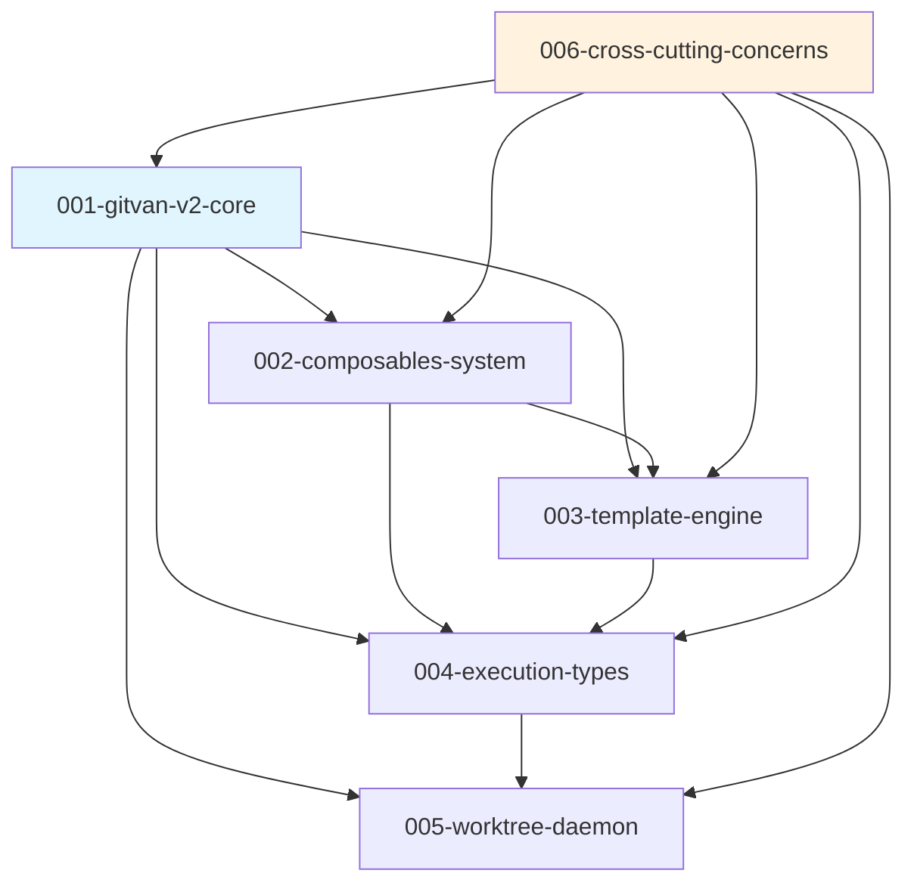

# GitVan v2 Specifications

This directory contains the complete specifications for GitVan v2, following GitHub's spec-kit methodology. Each specification defines WHAT and WHY, not HOW, focusing on clear acceptance criteria and measurable outcomes.

## 📋 Specification Index

### [001-gitvan-v2-core](./001-gitvan-v2-core/)
**Core System Architecture and Foundation**

- **Intent**: Transform GitVan to a lean, single-package JavaScript solution
- **Key Features**: Five execution types, composables system, Git-native automation
- **Dependencies**: Node.js runtime, Git repository, external npm packages
- **Status**: Foundation specification - All other specs depend on this

### [002-composables-system](./002-composables-system/)
**unctx-based Composables for Ergonomic API Design**

- **Intent**: Provide Vue-inspired composables API with automatic dependency injection
- **Key Features**: useGit(), useTemplate(), useExec(), context management
- **Dependencies**: 001-gitvan-v2-core, unctx library
- **Status**: Core API specification - Required for job authoring

### [003-template-engine](./003-template-engine/)
**Nunjucks Template Integration with Git Context**

- **Intent**: First-class template rendering with deterministic helpers
- **Key Features**: Template execution type, Git context injection, file output
- **Dependencies**: 001-gitvan-v2-core, 002-composables-system, Nunjucks
- **Status**: Template specification - Enables content generation

### [004-execution-types](./004-execution-types/)
**Five-Type Unified Execution Engine**

- **Intent**: Support cli, js, llm, job, tmpl execution with consistent interfaces
- **Key Features**: Unified result format, timeout handling, environment control
- **Dependencies**: 001-gitvan-v2-core, 003-template-engine
- **Status**: Execution specification - Core runtime capability

### [005-worktree-daemon](./005-worktree-daemon/)
**Worktree-Scoped Daemon with Distributed Locking**

- **Intent**: Monitor Git repositories with worktree isolation and concurrency control
- **Key Features**: Commit polling, distributed locks, rate limiting, process management
- **Dependencies**: 001-gitvan-v2-core, 004-execution-types
- **Status**: Daemon specification - Enables continuous automation

### [006-cross-cutting-concerns](./006-cross-cutting-concerns/)
**Error Handling, Logging, Security, and Performance**

- **Intent**: System-wide concerns spanning all components
- **Key Features**: Structured logging, security measures, performance monitoring
- **Dependencies**: All other specifications
- **Status**: Quality specification - Ensures production readiness

## 🔗 Specification Dependencies



## 📐 Architecture Overview

GitVan v2 implements a layered architecture with clear separation of concerns:

```
┌─────────────────────────────────────────────────────────────┐
│                        CLI Layer                             │
│  gitvan run • gitvan daemon • gitvan list • gitvan worktree │
├─────────────────────────────────────────────────────────────┤
│                    Composables Layer                        │
│     useGit() • useTemplate() • useExec() • useGitVan()     │
├─────────────────────────────────────────────────────────────┤
│                   Job Definition Layer                      │
│        defineJob() • Job Discovery • Metadata Extraction    │
├─────────────────────────────────────────────────────────────┤
│                    Execution Engine                         │
│       cli exec • js exec • llm exec • job exec • tmpl exec │
├─────────────────────────────────────────────────────────────┤
│                      Runtime Layer                          │
│         Context • Daemon • Locks • Worktree Management      │
├─────────────────────────────────────────────────────────────┤
│                       Git Layer                             │
│     refs • notes • worktree list • commit scanning          │
└─────────────────────────────────────────────────────────────┘
```

## 🎯 Key Design Principles

### Single Package Philosophy
- **NO monorepo** - All functionality in one npm package
- Clear module boundaries with proper encapsulation
- Simplified distribution and dependency management

### Git-Native Storage
- Use Git refs for distributed locking
- Store execution metadata in Git notes
- No external databases or storage dependencies

### Happy-Path Implementation
- Focus on common use cases with minimal error handling surface
- Fail fast with clear error messages
- Deterministic execution with predictable behavior

### Composables-First API
- unctx-based automatic dependency injection
- Vue-inspired ergonomic patterns
- Context isolation for concurrent execution

### Worktree-Aware Design
- Support multiple worktrees within single repository
- Isolate execution context per worktree
- Distributed locking with worktree scoping

## 📊 Success Metrics

### Performance Targets
- Job execution: < 100ms for simple tasks
- Template rendering: > 1000 templates/second
- Daemon memory: < 50MB baseline usage
- Lock contention: < 1 second resolution
- Context initialization: < 50ms

### Quality Targets
- Test coverage: > 80% for all specifications
- Error recovery: 95%+ of recoverable errors handled
- Security incidents: 0 code injection vulnerabilities
- Daemon uptime: 99%+ availability
- Documentation completeness: 100% public API coverage

## 🧪 Implementation Phases

### Phase 1: Foundation (Weeks 1-2)
- **001-gitvan-v2-core**: Context management, basic execution
- **002-composables-system**: unctx integration, core composables
- **Milestone**: Basic job execution with composables

### Phase 2: Core Features (Weeks 3-4)
- **003-template-engine**: Nunjucks integration and template execution
- **004-execution-types**: All five execution types implemented
- **Milestone**: Complete execution engine with templates

### Phase 3: Advanced Features (Weeks 5-6)
- **005-worktree-daemon**: Daemon process with locking
- **006-cross-cutting-concerns**: Production-ready error handling and monitoring
- **Milestone**: Production-ready system with daemon

## 📋 Validation Checklist

Each specification includes detailed validation checklists covering:

- ✅ **Functional Validation**: Core capabilities and interfaces
- ✅ **Performance Validation**: Latency, throughput, resource usage
- ✅ **Security Validation**: Input validation, access control, credential management
- ✅ **Integration Validation**: Cross-component interaction and compatibility
- ✅ **Reliability Validation**: Error recovery, state consistency, idempotency
- ✅ **Documentation Validation**: API docs, user guides, troubleshooting
- ✅ **Deployment Validation**: Installation, configuration, operations

## 🔄 Cross-References

### Template Engine ↔ Execution Types
- Template engine provides `tmpl` execution type implementation
- Execution engine provides consistent result format for templates
- Shared timeout and error handling patterns

### Composables ↔ Daemon
- Composables provide ergonomic API for job authors
- Daemon injects context through composables system
- Context isolation ensures concurrent execution safety

### Worktree Daemon ↔ Cross-Cutting Concerns
- Daemon implements logging, error handling, and performance monitoring
- Security measures apply to daemon process management
- Resource management prevents daemon resource leaks

## 📚 Additional Resources

- [GitVan v1 Documentation](../docs/) - Legacy system reference
- [v2.md](../v2.md) - Original requirements and implementation notes
- [CLAUDE.md](../CLAUDE.md) - Development environment configuration
- [Architecture Decision Records](./ADRs/) - Design decision history (coming soon)

---

**Note**: These specifications follow GitHub's spec-kit methodology, focusing on WHAT and WHY rather than HOW. Implementation details are intentionally abstract to allow flexibility in the actual coding phase while maintaining clear acceptance criteria and success metrics.