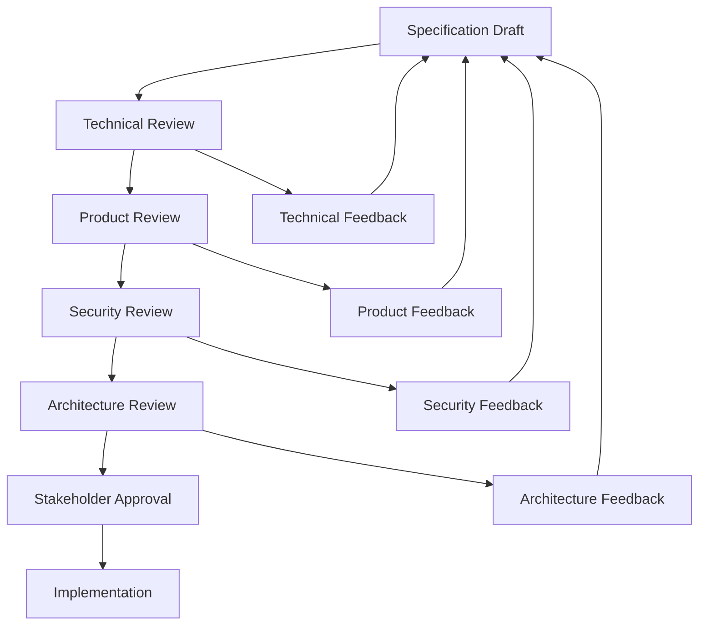
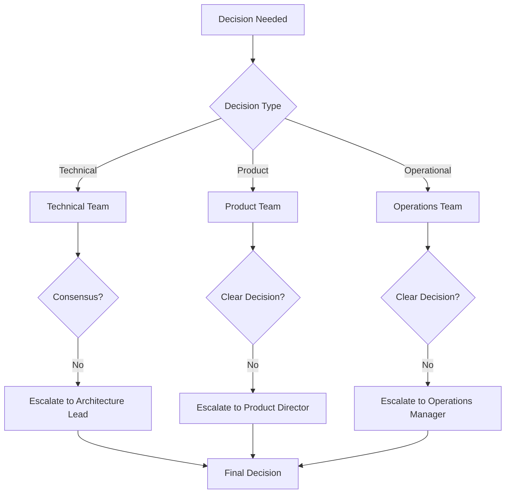

# Stakeholder Collaboration Guide

## Overview

This document defines how GitVan v2 specifications should be structured to facilitate effective collaboration between developers, product managers, system administrators, and other stakeholders.

## Specification Structure for Collaboration

### 1. Executive Summary

Each specification should start with an executive summary that answers:
- **What**: What is being built?
- **Why**: Why is this needed?
- **Impact**: What business value does this provide?
- **Timeline**: When will this be delivered?

```markdown
## Executive Summary

**What**: GitVan v2 Core System - A lean, single-package JavaScript solution for Git-native automation

**Why**: The current monorepo approach adds unnecessary complexity and deployment overhead for a tool that operates as a unified runtime

**Impact**: 
- 50% reduction in deployment complexity
- 80% faster startup times
- Simplified dependency management
- Better developer experience

**Timeline**: 2 weeks for core implementation, 4 weeks for full system
```

### 2. Stakeholder-Specific Sections

#### For Product Managers

```markdown
## Product Impact

### User Stories
- **As a developer**: I want to write automation jobs using familiar JavaScript patterns
- **As a repository maintainer**: I want Git-native automation that doesn't pollute my repository
- **As a system administrator**: I want worktree-scoped daemons with proper locking

### Success Metrics
- Developer adoption: 90% of teams using GitVan v1 migrate to v2 within 6 months
- Performance improvement: 50% faster job execution
- User satisfaction: 4.5+ stars on npm

### Business Value
- Reduced support burden through simplified architecture
- Increased adoption through better developer experience
- Lower operational costs through reduced complexity
```

#### For System Administrators

```markdown
## Operational Considerations

### Deployment
- Single npm package installation
- No external database dependencies
- Git-native storage using refs and notes

### Monitoring
- Structured logging with configurable levels
- Performance metrics collection
- Health check endpoints

### Security
- No code injection vulnerabilities
- Signed commit verification
- Command execution constraints

### Maintenance
- Automatic lock cleanup
- Graceful shutdown procedures
- Resource limit enforcement
```

#### For Developers

```markdown
## Technical Implementation

### Architecture
- Single package with clear module boundaries
- Composables-based API using unctx
- Five execution types: cli, js, llm, job, tmpl

### API Design
```javascript
// Clean, composable API
const git = useGit()
const template = useTemplate()
const exec = useExec()

// Job definition
export default defineJob({
  kind: 'atomic',
  meta: { desc: 'Generate changelog' },
  run: async () => {
    const commits = git.run('log --oneline -50').split('\n')
    template.renderToFile('changelog.njk', 'CHANGELOG.md', { commits })
    return { ok: true, artifact: 'CHANGELOG.md' }
  }
})
```

### Testing Strategy
- Executable specifications with Jest
- Contract testing for API compliance
- Performance testing with Artillery
- Security testing with OWASP ZAP
```

## Collaboration Workflows

### 1. Specification Review Process



### 2. Stakeholder Review Templates

#### Product Manager Review Template

```markdown
## Product Manager Review

### Business Value Assessment
- [ ] Clear business value proposition
- [ ] User stories cover key use cases
- [ ] Success metrics are measurable
- [ ] Timeline is realistic

### User Experience
- [ ] API is intuitive for target users
- [ ] Error messages are user-friendly
- [ ] Documentation is comprehensive
- [ ] Migration path is clear

### Risk Assessment
- [ ] Technical risks are identified
- [ ] Mitigation strategies are defined
- [ ] Rollback plan exists
- [ ] Dependencies are managed

### Recommendations
[Space for feedback and recommendations]
```

#### System Administrator Review Template

```markdown
## System Administrator Review

### Operational Readiness
- [ ] Deployment process is documented
- [ ] Monitoring and alerting are defined
- [ ] Backup and recovery procedures exist
- [ ] Security considerations are addressed

### Performance Requirements
- [ ] Performance targets are realistic
- [ ] Resource usage is acceptable
- [ ] Scalability is considered
- [ ] Load testing is planned

### Maintenance
- [ ] Update procedures are defined
- [ ] Troubleshooting guides exist
- [ ] Support escalation paths are clear
- [ ] Documentation is complete

### Recommendations
[Space for feedback and recommendations]
```

#### Developer Review Template

```markdown
## Developer Review

### Technical Feasibility
- [ ] Architecture is sound
- [ ] Dependencies are manageable
- [ ] Performance requirements are achievable
- [ ] Security requirements are implementable

### Code Quality
- [ ] API design is clean and consistent
- [ ] Error handling is comprehensive
- [ ] Testing strategy is adequate
- [ ] Documentation is complete

### Implementation Plan
- [ ] Tasks are well-defined
- [ ] Dependencies are clear
- [ ] Timeline is realistic
- [ ] Resources are available

### Recommendations
[Space for feedback and recommendations]
```

## Communication Patterns

### 1. Specification Updates

```markdown
## Specification Update Notification

**Specification**: [Spec Name]
**Version**: [Version Number]
**Date**: [Date]
**Author**: [Author Name]

### Changes Made
- [List of changes]

### Impact Assessment
- **Breaking Changes**: [List any breaking changes]
- **Migration Required**: [Yes/No and details]
- **Timeline Impact**: [Any timeline changes]

### Stakeholder Actions Required
- **Product Managers**: [Actions needed]
- **System Administrators**: [Actions needed]
- **Developers**: [Actions needed]

### Review Deadline
[Date by which feedback is needed]
```

### 2. Status Updates

```markdown
## Implementation Status Update

**Specification**: [Spec Name]
**Status**: [In Progress/Complete/Blocked]
**Progress**: [Percentage complete]

### Completed This Week
- [List of completed items]

### Planned Next Week
- [List of planned items]

### Blockers
- [List any blockers and resolution plans]

### Risks
- [List any risks and mitigation strategies]

### Stakeholder Updates
- **Product**: [Updates for product managers]
- **Operations**: [Updates for system administrators]
- **Development**: [Updates for developers]
```

## Decision Making Framework

### 1. Decision Categories

#### Technical Decisions
- **Who**: Lead Developer + Architecture Team
- **When**: During technical review
- **Process**: Technical discussion + consensus
- **Documentation**: Architecture Decision Record (ADR)

#### Product Decisions
- **Who**: Product Manager + Stakeholders
- **When**: During product review
- **Process**: Stakeholder discussion + Product Manager decision
- **Documentation**: Product Decision Record (PDR)

#### Operational Decisions
- **Who**: System Administrator + Operations Team
- **When**: During operational review
- **Process**: Operations discussion + System Administrator decision
- **Documentation**: Operational Decision Record (ODR)

### 2. Decision Escalation Process



## Collaboration Tools

### 1. Specification Management

```yaml
# .github/ISSUE_TEMPLATE/specification-review.yml
name: Specification Review
description: Review a GitVan v2 specification
title: "[SPEC REVIEW] "
labels: ["specification", "review"]
assignees: []

body:
  - type: markdown
    attributes:
      value: |
        ## Specification Review
        
        Please review the following specification and provide feedback.
        
  - type: input
    id: spec-path
    attributes:
      label: Specification Path
      description: Path to the specification file
      placeholder: "specs/001-gitvan-v2-core/SPECIFICATION.md"
    validations:
      required: true
      
  - type: dropdown
    id: review-type
    attributes:
      label: Review Type
      description: Type of review needed
      options:
        - Technical Review
        - Product Review
        - Security Review
        - Architecture Review
        - Complete Review
    validations:
      required: true
      
  - type: textarea
    id: feedback
    attributes:
      label: Feedback
      description: Your feedback on the specification
      placeholder: "Please provide your feedback here..."
    validations:
      required: true
```

### 2. Stakeholder Notifications

```javascript
// .github/workflows/stakeholder-notifications.yml
name: Stakeholder Notifications

on:
  issues:
    types: [opened, labeled]
  pull_request:
    types: [opened, labeled]

jobs:
  notify-stakeholders:
    runs-on: ubuntu-latest
    steps:
      - name: Notify Product Team
        if: contains(github.event.issue.labels.*.name, 'product')
        run: |
          curl -X POST -H 'Content-type: application/json' \
            --data '{"text":"New product review needed: ${{ github.event.issue.html_url }}"}' \
            ${{ secrets.SLACK_WEBHOOK_URL }}
            
      - name: Notify Operations Team
        if: contains(github.event.issue.labels.*.name, 'operations')
        run: |
          curl -X POST -H 'Content-type: application/json' \
            --data '{"text":"New operations review needed: ${{ github.event.issue.html_url }}"}' \
            ${{ secrets.SLACK_WEBHOOK_URL }}
```

## Best Practices

### 1. Clear Communication
- Use plain language for business requirements
- Include examples and scenarios
- Provide context for technical decisions
- Document assumptions and constraints

### 2. Inclusive Review Process
- Include all relevant stakeholders
- Provide adequate review time
- Use structured review templates
- Document all feedback and decisions

### 3. Continuous Collaboration
- Regular status updates
- Proactive communication of changes
- Clear escalation paths
- Documented decision-making process

### 4. Stakeholder Education
- Provide context for technical decisions
- Explain business impact of technical choices
- Share knowledge and expertise
- Build understanding across teams

### 5. Feedback Integration
- Acknowledge all feedback
- Explain decisions and trade-offs
- Update specifications based on feedback
- Communicate changes clearly
