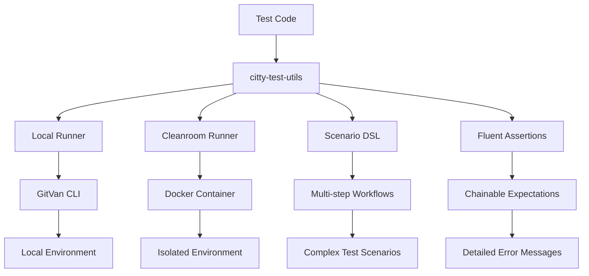

# Citty Test Utils Documentation

Welcome to the comprehensive documentation for `citty-test-utils` - the testing utilities for GitVan CLI applications.

## 📚 Documentation Index

### Getting Started
- [**Getting Started Guide**](guides/getting-started.md) - Quick start and basic usage
- [**Installation**](guides/getting-started.md#installation) - How to install and verify
- [**First Test**](guides/getting-started.md#first-test) - Your first test with citty-test-utils

### API Reference
- [**Complete API Reference**](api/README.md) - Full API documentation
- [**Core Functions**](api/README.md#core-functions) - Main testing functions
- [**Fluent Assertions**](api/README.md#fluent-assertions) - All assertion methods
- [**Scenario DSL**](api/README.md#scenario-dsl) - Multi-step test workflows
- [**TypeScript Types**](api/README.md#typescript-types) - Complete type definitions

### Cookbooks & Patterns
- [**Cookbooks**](cookbooks/README.md) - Ready-to-use testing patterns
- [**Basic CLI Testing**](cookbooks/README.md#basic-cli-testing) - Common CLI test patterns
- [**Error Handling Tests**](cookbooks/README.md#error-handling-tests) - Testing error scenarios
- [**Performance Testing**](cookbooks/README.md#performance-testing) - Performance and load testing
- [**Cross-Environment Testing**](cookbooks/README.md#cross-environment-testing) - Local vs cleanroom testing

### Advanced Examples
- [**Advanced Examples**](examples/README.md) - Complex testing scenarios
- [**Enterprise Patterns**](examples/README.md#enterprise-testing-patterns) - Large-scale testing
- [**Custom Frameworks**](examples/README.md#custom-test-frameworks) - Building custom test frameworks
- [**Performance Benchmarking**](examples/README.md#performance-benchmarking) - Profiling and optimization
- [**Security Testing**](examples/README.md#security-testing) - Security-focused testing

### Guides
- [**Troubleshooting**](guides/troubleshooting.md) - Common issues and solutions
- [**Migration Guide**](guides/migration.md) - Migrating from other testing approaches
- [**Best Practices**](guides/best-practices.md) - Recommended testing patterns

## 🚀 Quick Start

```javascript
import { runLocalCitty } from 'citty-test-utils'

// Test GitVan CLI locally
const result = await runLocalCitty(['--help'])
result.expectSuccess().expectOutput('USAGE').expectNoStderr()
```

## 🏗️ Architecture Overview



## 📋 Features

### 🔍 Smart Project Detection
- Automatically finds GitVan project root
- Validates CLI path and configuration
- Works from any subdirectory

### 🏃 Local Runner
- Execute CLI commands locally
- Timeout and environment support
- Safe JSON parsing with fallback

### 🐳 Docker Cleanroom
- Isolated testing environment
- Consistent results across systems
- Automatic container management

### 🔗 Fluent Assertions
- Chainable expectation API
- Detailed error messages
- 15+ assertion methods

### 📝 Scenario DSL
- Multi-step test workflows
- Custom actions and expectations
- Pre-built scenario templates

### 🛠️ Test Utilities
- Retry logic for flaky tests
- Temporary file management
- Wait conditions and timeouts

## 🎯 Use Cases

### Basic CLI Testing
```javascript
// Test help and version commands
const helpResult = await runLocalCitty(['--help'])
helpResult.expectSuccess().expectOutput('USAGE')

const versionResult = await runLocalCitty(['--version'])
versionResult.expectSuccess().expectOutput(/\d+\.\d+\.\d+/)
```

### Error Handling
```javascript
// Test invalid commands
const errorResult = await runLocalCitty(['invalid-command'])
errorResult.expectFailure().expectStderr(/Unknown command/)
```

### Complex Workflows
```javascript
// Multi-step scenario
const result = await scenario('Project Setup')
  .step('Initialize project')
  .run('init', 'my-project')
  .expectSuccess()
  .step('Check status')
  .run('status')
  .expectSuccess()
  .execute('local')
```

### Cross-Environment Testing
```javascript
// Test in both local and cleanroom
await setupCleanroom({ rootDir: '.' })

const localResult = await runLocalCitty(['--help'])
const cleanroomResult = await runCitty(['--help'])

// Compare results
expect(localResult.result.stdout).toBe(cleanroomResult.result.stdout)

await teardownCleanroom()
```

## 🔧 Configuration

### Package.json
```json
{
  "name": "gitvan",
  "type": "module",
  "scripts": {
    "test": "vitest",
    "test:cli": "vitest tests/cli-tests.mjs"
  },
  "devDependencies": {
    "citty-test-utils": "^0.2.1",
    "vitest": "^1.0.0"
  }
}
```

### Vitest Configuration
```javascript
// vitest.config.mjs
export default {
  test: {
    environment: 'node',
    timeout: 60000
  }
}
```

## 📊 Testing Patterns

### Unit Tests
```javascript
import { describe, it } from 'vitest'
import { runLocalCitty } from 'citty-test-utils'

describe('CLI Commands', () => {
  it('should show help', async () => {
    const result = await runLocalCitty(['--help'])
    result.expectSuccess().expectOutput('USAGE')
  })
})
```

### Integration Tests
```javascript
import { scenario } from 'citty-test-utils'

const result = await scenario('Integration Test')
  .step('Setup')
  .run('init', 'test-project')
  .expectSuccess()
  .step('Verify')
  .run('status')
  .expectSuccess()
  .execute('local')
```

### E2E Tests
```javascript
import { setupCleanroom, runCitty, teardownCleanroom } from 'citty-test-utils'

await setupCleanroom({ rootDir: '.' })

const result = await runCitty(['--help'])
result.expectSuccess().expectOutput('USAGE')

await teardownCleanroom()
```

## 🚨 Common Issues

### CLI Not Found
```bash
# Ensure GitVan project structure
your-project/
├── src/cli.mjs
├── package.json  # with "name": "gitvan"
```

### Docker Issues
```bash
# Check Docker installation
docker --version
docker ps
```

### Permission Errors
```bash
# Fix file permissions
chmod +x src/cli.mjs
```

## 📈 Performance

### Benchmarks
- **Local Runner**: ~50ms per command
- **Cleanroom Setup**: ~2-5 seconds
- **Command Execution**: ~100-500ms
- **Memory Usage**: ~50MB per test

### Optimization Tips
- Use local runner for simple tests
- Reuse cleanroom containers
- Run tests in parallel
- Set appropriate timeouts

## 🤝 Contributing

### Development Setup
```bash
git clone https://github.com/gitvan/gitvan.git
cd vendors/citty-test-utils
npm install
npm test
```

### Running Tests
```bash
# Unit tests
npm run test:unit

# Integration tests
npm run test:integration

# All tests
npm test
```

## 📄 License

MIT License - see [LICENSE](../LICENSE) for details.

## 🔗 Links

- **NPM Package**: [citty-test-utils](https://www.npmjs.com/package/citty-test-utils)
- **GitHub Repository**: [seanchatmangpt/gitvan](https://github.com/seanchatmangpt/gitvan)
- **Issues**: [GitHub Issues](https://github.com/seanchatmangpt/gitvan/issues)
- **Discussions**: [GitHub Discussions](https://github.com/seanchatmangpt/gitvan/discussions)

---

**Need help?** Check out the [Troubleshooting Guide](guides/troubleshooting.md) or [open an issue](https://github.com/seanchatmangpt/gitvan/issues).
